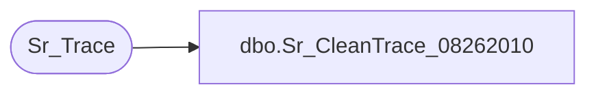

# dbo.Sr_CleanTrace_08262010

**Database:** foundation  
**Server:** bedrockdb01  

## Architecture Diagram



## Table Dependencies

| Referenced Table |
|---|
| Sr_Trace |

## Stored Procedure Code

```sql
create proc [dbo].[Sr_CleanTrace_08262010] 

 @from_arg varchar(14), @to_arg varchar(14)
AS
DECLARE
@errmsg            VARCHAR(255),  
@errno             int,  
@from_trace_id     numeric(14,0), 
@to_trace_id       numeric(14,0), 
@max_trace_id      numeric(14,0) 

/*

Author: Chris Carveth
Creation Date: 20-Dec-2000
Comments:

Modified by		Date		Reason
------------------------------------------------------------------------

*/

     /* Init variables */
    select @from_trace_id = convert(numeric, @from_arg), 
           @max_trace_id = convert(numeric, @to_arg) 
       
    WHILE (@from_trace_id <= @max_trace_id) 
    BEGIN
	
        select @to_trace_id = @from_trace_id + 2000 
	begin tran
		delete Sr_Trace 
		 where trace_id between @from_trace_id and @to_trace_id
		   and trace_id <= @max_trace_id  

		SELECT @errno = @@error
		IF @errno <> 0
		  BEGIN
		   SELECT @errmsg = 'Error deleting from Sr_Trace.'
		   GOTO error
		  END

        commit tran

        select @from_trace_id = @to_trace_id + 1 

	END /* End of Loop */ 

    return 1  

error:   /* Common error handler */

	IF @errno < 20000
		SELECT @errmsg = 'Sr_CleanTrace: ' + @errmsg,
			@errno = @errno + 100000

	RAISERROR @errno @errmsg
	RETURN 0
```

