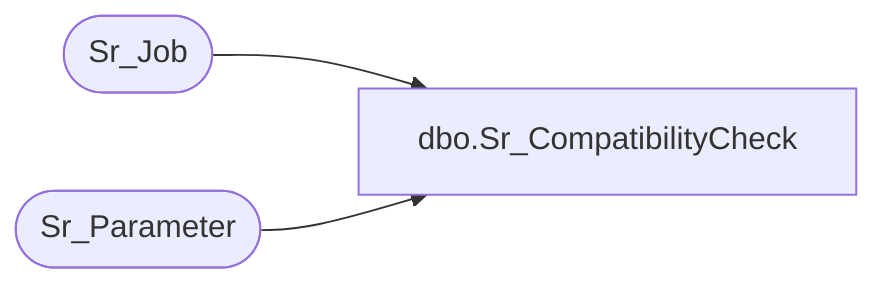

# dbo.Sr_CompatibilityCheck

**Database:** foundation  
**Server:** bedrockdb01  

## Architecture Diagram



## Table Dependencies

| Referenced Table |
|---|
| Sr_Job |
| Sr_Parameter |

## Stored Procedure Code

```sql
create proc dbo.Sr_CompatibilityCheck @ObjectID int, @Version varchar(2)

/*
Author: Chris Carveth
Creation Date: 18-April-2000 
Comments: 

Modified by		Date		Reason
------------------------------------------------------------------------

*/

AS 

DECLARE @errno int,
  	    @errmsg char(100),
        @return int 
        
select @return = 1

-- Check to see if @ObjectID is assigned to any Machine that has an SFSVersion less
-- than @Version. We do not want to allow someone to Re-generate with a front-end 
-- version that is higher than the version of the machine the job is assigned to.
if exists (Select tag
 	 from Sr_Parameter
	where (tag in 
	    (Select 'ExportVersion_' + convert(varchar, machine_id)
	      From Sr_Job
	     Where object_id = @ObjectID
	       and object_id <> 0
	       and machine_id >= 0)
	OR tag in 
	    (Select 'ExportVersion'
	      From Sr_Job
	     Where object_id = @ObjectID
	       and object_id <> 0
	       and machine_id = 0 ))
	and tag_value < @Version)

    select @return = -1
    
Else

	-- Check to see if any Machine has an SFSVersion less than @Version. 
	-- In this case the front-end will issue a Warning that the job may 
	-- not run on any or all machines.
	if exists (Select *
	     From Sr_Parameter
	    Where tag like 'ExportVersion%'
	      and tag_value < @Version)
	
	    select @return = -2

return @return
```

