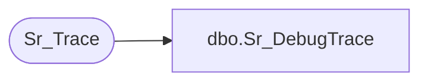

# dbo.Sr_DebugTrace

**Database:** foundation  
**Server:** bedrockdb01  

## Architecture Diagram



## Table Dependencies

| Referenced Table |
|---|
| Sr_Trace |

## Stored Procedure Code

```sql
create proc Sr_DebugTrace @ExecutionID int, @Severity int,@Indent_Level int, @ExeName varchar(30), @ClassName varchar(30), @FunctionName varchar(30), @Message varchar(255)
/*********************************************************/
/*	                                                 */
/*	    Author: Andrea Nagy              		 */
/*	    Creation Date: 12-April-1999                 */
/*	    Comments:                                    */
/*                                                       */
/*********************************************************/

AS 

        INSERT INTO Sr_Trace (execution_id, exe_name, class_name, function_name, message,
                              indent_level, trace_datetime, severity)
             VALUES (@ExecutionID, @ExeName, @ClassName, @FunctionName, @Message, @Indent_Level,
                  getdate(), @Severity)
             
RETURN @@identity
```

