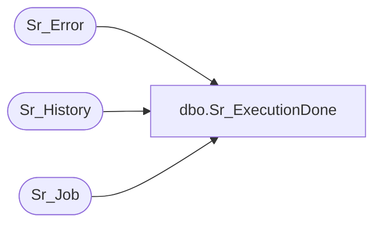

# dbo.Sr_ExecutionDone

**Database:** foundation  
**Server:** bedrockdb01  

## Architecture Diagram



## Table Dependencies

| Referenced Table |
|---|
| Sr_Error |
| Sr_History |
| Sr_Job |

## Stored Procedure Code

```sql
create proc Sr_ExecutionDone @JobID int, @ExecutionID int, @ExitCode int, @Locked int, @Parent_job_id int, @NextDateTime varchar(60) 

/*********************************************************/
/*	                                                 */
/*	    Author: Chris Carveth              		 */
/*	    Creation Date: 01-March-1999                 */
/*	    Comments: Updates Sr_History                 */
/*                    Updates Sr_Job avg_duration        */
/*                                                       */
/*********************************************************/
/*
Amendments
Modified by		Date		Reason
--------------------------------------------------------------------------
Andrea 			Jul-12-99 	Added the extra parameter @ExitCode
					Update the fields successful and exit_code
Andrea			06-Oct-99	Added "pid" to Sr_Job updates
Bing Zhu			31-Jan-05  Added new logic to deal with different exit-code of the job. -99 means the SRMain did not get
				the exit code of the job
*/

AS 
DECLARE @result int,
        @TopicID int,
        @DBGroupID int,
        @ObjectID int,
        @auto_execute bit, 
        @successful bit,
        @TmpDateTime datetime,
        @errno int,
        @errmsg varchar(255)
    
        SELECT @result = 0,  @successful = 1
        
        IF EXISTS(SELECT 1 FROM Sr_Error WHERE execution_id = @ExecutionID)
         BEGIN
        	SELECT @successful = 0
	 END  
        
        IF @ExitCode = -99
        	SELECT @Parent_job_id = a.job_id
        	FROM Sr_Job a, Sr_Job b
        	WHERE b.job_id = a.locked AND
        	      b.job_id = @JobID


        UPDATE Sr_History
           SET end_datetime = getdate(),
               duration = datediff(second, start_datetime, getdate()),
               sucessful = @successful,
               exit_code = @ExitCode,
               parent_job_id = @Parent_job_id
         WHERE execution_id = @ExecutionID 
         
	SELECT @TopicID = topic_id,
               @DBGroupID = db_group_id, 
               @ObjectID = object_id 
 	  FROM Sr_History 
 	 WHERE execution_id = @ExecutionID
 
	UPDATE Sr_Job
	   SET avg_duration = (SELECT AVG(duration)
		                 FROM Sr_History 
    			        WHERE topic_id = @TopicID AND 
    		 	  	      object_id = @ObjectID AND
		 	 	      db_group_id = @DBGroupID)
	 WHERE topic_id = @TopicID AND 
 	       object_id = @ObjectID AND
 	       db_group_id = @DBGroupID 

	SELECT @auto_execute = auto_execute
	  FROM Sr_Job
	 WHERE job_id = @JobID
	
	IF @NextDateTime = NULL
	    SELECT @TmpDateTime = NULL
	ELSE 
	    SELECT @TmpDateTime = @NextDateTime

	IF @ExitCode = -99
	BEGIN
		UPDATE Sr_Job
		SET 	execution_id = 0,
	       		pid = 0
	    	WHERE job_id = @JobID
	END
	ELSE
	BEGIN	
		IF @auto_execute = 0 
		UPDATE Sr_Job
	      	SET execution_id = 0, 
	          		next_date_time = @TmpDateTime ,
	          		done_executions = done_executions + 1,
	          		last_date_time = getdate(),
	          		locked = @Locked,
		  	pid = 0
	    	WHERE job_id = @JobID
		ELSE
	   	UPDATE Sr_Job
	     	 SET execution_id = 0,
	          		next_date_time = @TmpDateTime,
	          		last_date_time = getdate(),
	          		locked = @Locked,
           	  		pid = 0
	    	WHERE job_id = @JobID
	END
	    
	DELETE Sr_Job
	WHERE job_flags = 1 AND 
	                  job_id = @JobID

	
RETURN @result
```

