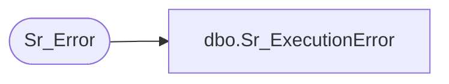

# dbo.Sr_ExecutionError

**Database:** foundation  
**Server:** bedrockdb01  

## Architecture Diagram



## Table Dependencies

| Referenced Table |
|---|
| Sr_Error |

## Stored Procedure Code

```sql
create proc Sr_ExecutionError  @ExecutionID int, @ErrorCode int,@ExeName varchar(30), @ClassName varchar(30), @FunctionName varchar(30), @Message varchar(255)
/*********************************************************/
/*	                                                 */
/*	    Author: Chris Carveth              		 */
/*	    Creation Date: 05-March-1999                 */
/*	    Comments:                                    */
/*                                                       */
/*********************************************************/

AS 

        INSERT INTO Sr_Error (execution_id, error_code, exe_name, class_name, function_name,
                              message, error_datetime)
             VALUES (@ExecutionID, @ErrorCode, @ExeName, @ClassName, @FunctionName, 
                              @Message, getdate())
             
RETURN @@identity
```

