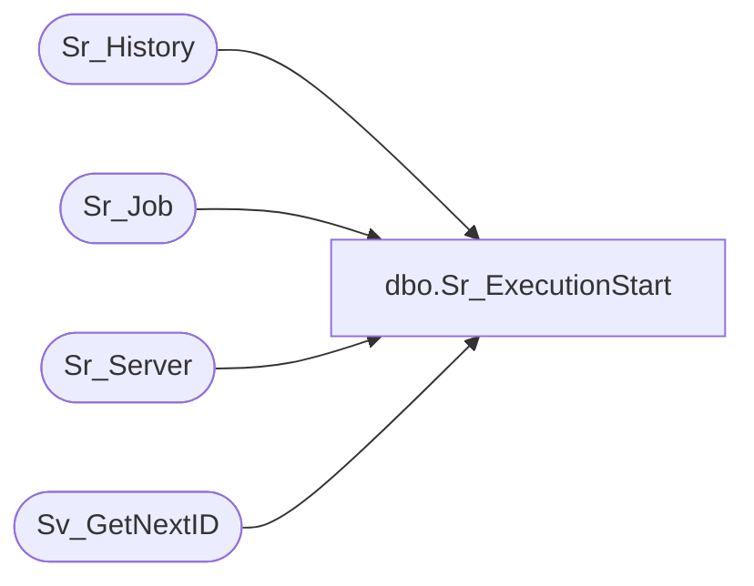

# dbo.Sr_ExecutionStart

**Database:** foundation  
**Server:** bedrockdb01  

## Architecture Diagram



## Table Dependencies

| Referenced Table |
|---|
| Sr_History |
| Sr_Job |
| Sr_Server |
| Sv_GetNextID |

## Stored Procedure Code

```sql
create proc dbo.Sr_ExecutionStart @JobID int, @ServerID int, @ThreadIndex int  
/*********************************************************/
/*	                                                 */
/*	    Author: Chris Carveth                        */
/*	    Creation Date: 01-March-1999                 */
/*	    Comments: Updates Sr_History                 */
/*                    Updates Sr_Job                     */
/*                                                       */
/*********************************************************/
/*
Amendments
Modified by		Date		Reason
------------------------------------------------------------------------
*/
AS 
DECLARE      @TopicID int,
	     @ExecutionID int, 
	     @ObjectID int, 
	     @DBGroupID int, 
	     @already_running int, 
	     @auto_execute bit, 
	     @scheduled_executions int,
 	     @done_executions int,
 	     @MachineID int,
 	     @trace int,
 	     @debug_level int
 	    
	SELECT @trace = 0
	
	SELECT @TopicID = topic_id, 
	       @ObjectID = object_id, 
	       @DBGroupID = db_group_id,
	       @ExecutionID = execution_id,
	       @debug_level = debug_level
	  FROM Sr_Job 
	 WHERE job_id = @JobID
      
        SELECT @MachineID = machine_id
          FROM Sr_Server
         WHERE server_id = @ServerID
         
	IF @ExecutionID > 0
	BEGIN
	   RETURN 0
	END 

	EXEC @ExecutionID = Sv_GetNextID 15 	

	UPDATE Sr_Job
	   SET execution_id = @ExecutionID, exit_code = null
	 WHERE job_id = @JobID
	
	IF (@debug_level & 32) > 0
        BEGIN
           SELECT @trace = 1
        END
	       
	INSERT INTO Sr_History (execution_id, job_id, server_id, thread_index, topic_id, db_group_id, 
			        object_id, start_datetime, sucessful, include_in_average, machine_id, parent_job_id, trace)
  	     VALUES (@ExecutionID, @JobID, @ServerID, @ThreadIndex, @TopicID, @DBGroupID, 
  	     			@ObjectID, getdate(), 0, 1, @MachineID, 0, @trace)
	
RETURN @ExecutionID
```

