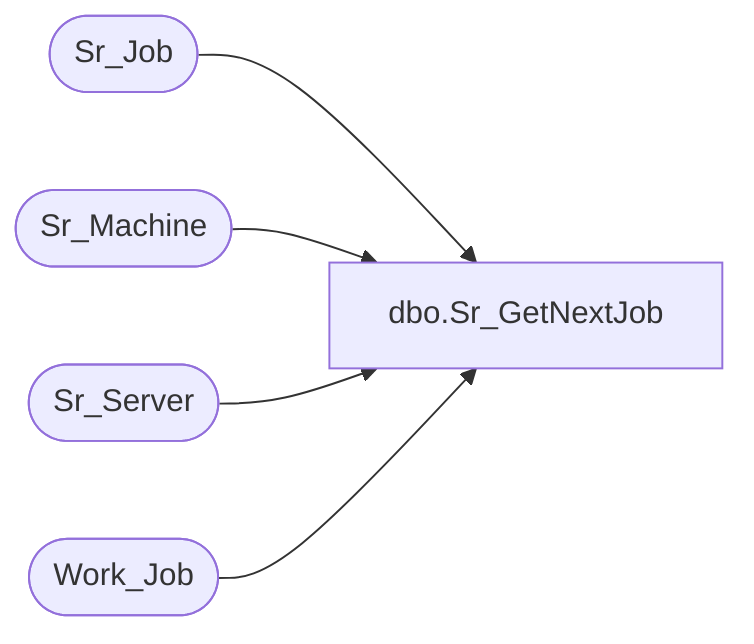

# dbo.Sr_GetNextJob

**Database:** foundation  
**Server:** bedrockdb01  

## Architecture Diagram



## Table Dependencies

| Referenced Table |
|---|
| Sr_Job |
| Sr_Machine |
| Sr_Server |
| Work_Job |

## Stored Procedure Code

```sql
create proc dbo.Sr_GetNextJob         
 @ServerID int  
 
/*********************************************************/
/*	                                                 */
/*	    Author: Chris Carveth                        */
/*	    Creation Date: 01-March-1999                 */
/*	    Comments: Updates Sr_History                 */
/*                     Updates Sr_Job                     */
/*                                                        */
/*********************************************************/
/*
Amendments
Modified by		Date		Reason
------------------------------------------------------------------------
Andrea Nagy		11-Aug-99	Added functionality of any jobs from any machine
           				    to be selected.
Chris Carveth   04-Oct-01   Changed initial delete and final select to include
                            machine_id in where clause.
*/ 

AS 
DECLARE  @AnyJobS bit,
	     @AnyJobM bit,
         @JobID  int,
         @MachineID int 
 
	SELECT @JobID = 0
	
	SELECT @MachineID = machine_id
	  FROM Sr_Server
	 WHERE server_id = @ServerID  

    DELETE Work_Job WHERE machine_id = @MachineID 
	
	SELECT @AnyJobS = any_job
	  FROM Sr_Server
	 WHERE server_id = @ServerID 

	IF @@RowCount = 0 
	BEGIN
	    GOTO EndOfProc
	END

    INSERT INTO Work_Job
	SELECT job_id, ISNULL(last_date_time, created_date_time),object_id, 
           object_type, db_group_id, @MachineID
 	  FROM Sr_Job
  	 WHERE server_id = @ServerID
  	   AND locked = 0
  	   AND execution_id = 0
  	   AND next_date_time <= getdate()
  	   AND next_date_time IS NOT NULL
	   AND active = 1
	   AND scheduling_mode = 3
   
	INSERT INTO Work_Job
 	SELECT job_id, ISNULL(last_date_time, created_date_time), object_id, 
	       object_type, db_group_id, @MachineID
  	  FROM Sr_Job
  	 WHERE server_id = @ServerID
  	   AND locked = 0
  	   AND execution_id = 0
  	   AND scheduled_executions > done_executions
  	   AND active = 1
  	   AND scheduling_mode = 2

	INSERT INTO Work_Job
 	SELECT job_id, ISNULL(last_date_time, created_date_time), object_id, 
	       object_type, db_group_id, @MachineID
  	  FROM Sr_Job
  	 WHERE server_id = @ServerID
  	   AND locked = 0
  	   AND execution_id = 0
  	   AND auto_execute = 1 
  	   AND active = 1
       AND scheduling_mode = 1
  	   
	IF @AnyJobS = 1
	BEGIN
	        /* ServerID -2 represents floating jobs. */
		INSERT INTO Work_Job
	 	SELECT job_id, ISNULL(last_date_time, created_date_time), object_id, 
	    	   object_type, db_group_id, @MachineID
	  	  FROM Sr_Job
	  	 WHERE server_id = -2 
	  	   AND machine_id = @MachineID 
	  	   AND locked = 0
	  	   AND execution_id = 0
	  	   AND next_date_time <= getdate()
	  	   AND next_date_time IS NOT NULL
	  	   AND active = 1
	       AND scheduling_mode = 3
	 
		INSERT INTO Work_Job
	 	SELECT job_id, ISNULL(last_date_time, created_date_time),object_id, 
	    	   object_type, db_group_id, @MachineID
	 	  FROM Sr_Job
	  	 WHERE server_id = -2
	  	   AND machine_id = @MachineID
	  	   AND locked = 0
	  	   AND execution_id = 0
	  	   AND scheduled_executions > done_executions
	       AND active = 1
	       AND scheduling_mode = 2
	           
		INSERT INTO Work_Job
	 	SELECT job_id, ISNULL(last_date_time, created_date_time),object_id, 
	           object_type, db_group_id, @MachineID
	  	  FROM Sr_Job
	  	 WHERE server_id = -2
	  	   AND machine_id = @MachineID
	  	   AND locked = 0
	  	   AND execution_id = 0
	  	   AND auto_execute = 1 
		   AND active = 1
		   AND scheduling_mode = 1
	       
	    SELECT @AnyJobM = any_job
     	  FROM Sr_Machine
	     WHERE machine_id = @MachineID 
	        
	        
	    IF @AnyJobM = 1
	    BEGIN
	        
	        INSERT INTO Work_Job
	 	    SELECT job_id, ISNULL(last_date_time, created_date_time),object_id, 
	    	       object_type, db_group_id, @MachineID
	  	      FROM Sr_Job
  	  	     WHERE server_id = -2 
	  	       AND machine_id = -2 
	  	       AND locked = 0
	  	       AND execution_id = 0
	  	       AND next_date_time <= getdate()
	  	       AND next_date_time IS NOT NULL
	  	       AND active = 1
	           AND scheduling_mode = 3
	 
		    INSERT INTO Work_Job
	 	    SELECT job_id, ISNULL(last_date_time, created_date_time),object_id, 
		          object_type, db_group_id, @MachineID
	 	     FROM Sr_Job
	  	    WHERE server_id = -2
	  	      AND machine_id = -2
	  	      AND locked = 0
	  	      AND execution_id = 0
	  	      AND scheduled_executions > done_executions
	          AND active = 1
	          AND scheduling_mode = 2
	           
		   INSERT INTO Work_Job
  	 	   SELECT job_id, ISNULL(last_date_time, created_date_time),object_id, 
		          object_type, db_group_id, @MachineID
	  	    FROM Sr_Job
	  	   WHERE server_id = -2
	  	     AND machine_id = -2
	  	     AND locked = 0
	  	     AND execution_id = 0
	  	     AND auto_execute = 1 
		     AND active = 1
		     AND scheduling_mode = 1
		   
	   END
	
    END
	
	SELECT @JobID = job_id
	  FROM Work_Job
     WHERE machine_id = @MachineID
       AND last_date_time = (SELECT MIN(last_date_time)
	                           FROM Work_Job)
         
	IF @JobID IS NULL 
	BEGIN
	   SELECT @JobID = 0
	END 


EndOfProc:
	
RETURN @JobID
```

