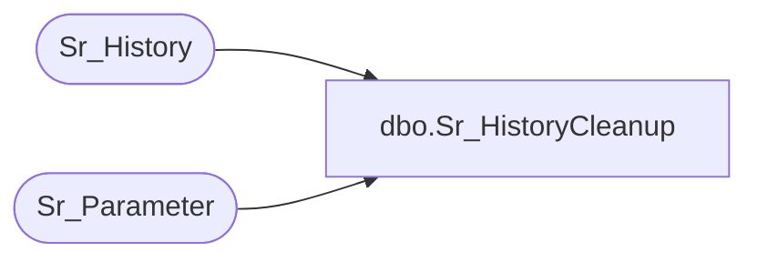

# dbo.Sr_HistoryCleanup

**Database:** foundation  
**Server:** bedrockdb01  

## Architecture Diagram



## Table Dependencies

| Referenced Table |
|---|
| Sr_History |
| Sr_Parameter |

## Stored Procedure Code

```sql
create proc Sr_HistoryCleanup   
/*********************************************************/
/*	                                                 */
/*	    Author: Andrea Nagy                          */
/*	    Creation Date: 07-April-99                   */
/*	    Comments: Deletes Sr_History                 */
/*                                                       */
/*                                                       */
/*********************************************************/
AS 
DECLARE   @HistoryDays int


	SELECT @HistoryDays = ABS(CONVERT(INT, tag_value))* -1 
	  FROM Sr_Parameter 
	 WHERE tag = 'HistoryDays'

	SELECT @HistoryDays = ISNULL(@HistoryDays, -7)

	DELETE Sr_History
	 WHERE start_datetime < dateadd(dd, @HistoryDays, getdate())
```

