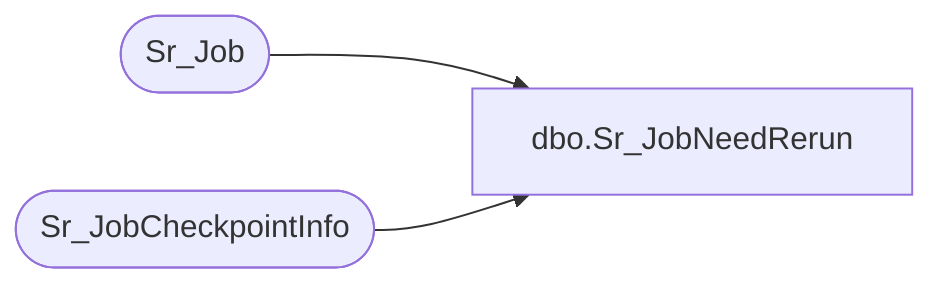

# dbo.Sr_JobNeedRerun

**Database:** foundation  
**Server:** bedrockdb01  

## Architecture Diagram



## Table Dependencies

| Referenced Table |
|---|
| Sr_Job |
| Sr_JobCheckpointInfo |

## Stored Procedure Code

```sql
create proc dbo.Sr_JobNeedRerun         
@i_job_id int  
 /*********************************************************/
/*	                                                 */
/*	    Author: Bing Zhu                        */
/*	    Creation Date: 26-Sept-2005                 */
/*	    Comments: Support clustering                 */
/*                                                       */
/*********************************************************/
/*
Amendments
Modified by		Date		Reason
------------------------------------------------------------------------
*/
AS 
DECLARE  @needToRerun int,
	 @i_schedule_mode int,
         @i_execution_id  int,
	 @need_auto_recovery bit

 
	SELECT @needToRerun = 0

	update Sr_Job 
 	set need_rerun = 0
 	where job_id = @i_job_id

 	SELECT @i_execution_id = execution_id, @i_schedule_mode = scheduling_mode,  @need_auto_recovery = auto_recovery
	FROM Sr_Job
	WHERE job_id = @i_job_id  


	If @i_execution_id = 0 
	Begin
		Goto EndOfProc
	End
	Else 
	begin
		If @need_auto_recovery = 0
		begin
			DELETE FROM Sr_JobCheckpointInfo
			WHERE job_id in
				(SELECT job_id
				 FROM Sr_Job
				WHERE   job_id = @i_job_id and
	      	      		auto_recovery = 0);	
		End		
		Else
		Begin
			
				
			SELECT @needToRerun = 1
			FROM Sr_Job a --, Sr_JobCheckpointInfo b
			WHERE  a. job_id = @i_job_id AND
				a.execution_id <> 0 AND
				a.pid <> 0 AND
				a.exit_code is  NULL AND
  				a.auto_recovery = 1 --AND
				--a.job_id = b.job_id AND
 				--a.execution_id = b.execution_id
 				
				update Sr_Job 
 				set need_rerun = @needToRerun,
			         	     exit_code = null
 				where job_id = @i_job_id
		END		 
	End 

EndOfProc:
	
RETURN @needToRerun
```

