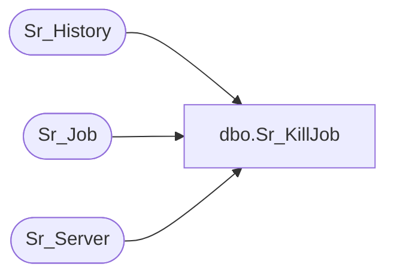

# dbo.Sr_KillJob

**Database:** foundation  
**Server:** bedrockdb01  

## Architecture Diagram



## Table Dependencies

| Referenced Table |
|---|
| Sr_History |
| Sr_Job |
| Sr_Server |

## Stored Procedure Code

```sql
create proc dbo.Sr_KillJob  @JobID int

/********************************************************************************

    Author	Michael Orsoni
    Creation Date: 26-October-2000
    Comments:	Sends command to kill job

*********************************************************************************/

AS 
DECLARE @ServerID int

        SELECT @ServerID = server_id
          FROM Sr_History
         WHERE execution_id = (SELECT execution_id
			        FROM Sr_Job
			       WHERE job_id = @JobID)

	Update Sr_Job set kill_job = 1 where job_id = @JobID
	
	Update Sr_Server set requested_status = 5 where server_id = @ServerID
```

