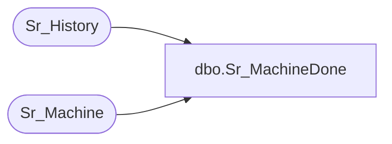

# dbo.Sr_MachineDone

**Database:** foundation  
**Server:** bedrockdb01  

## Architecture Diagram



## Table Dependencies

| Referenced Table |
|---|
| Sr_History |
| Sr_Machine |

## Stored Procedure Code

```sql
create proc Sr_MachineDone @ExecutionID int, @MachineID int, @ExitCode int
/*********************************************************/
/*	                                                 */
/*	    Author: Chris Carveth              		 */
/*	    Creation Date: 01-March-1999                 */
/*	    Comments: Updates Sr_History                 */
/*                                                       */
/*                                                       */
/*********************************************************/
/*
Amendments
Modified by		Date		Reason
------------------------------------------------------------------------
*/
AS 
DECLARE @result int
        
        SELECT @result = 0
        
        UPDATE Sr_History
           SET end_datetime = getdate(),
               duration = datediff(second, start_datetime, getdate()),
               exit_code = @ExitCode
         WHERE execution_id = @ExecutionID 
         
       
	UPDATE Sr_Machine
	   SET execution_id = 0
	 WHERE machine_id = @MachineID

RETURN @result
```

