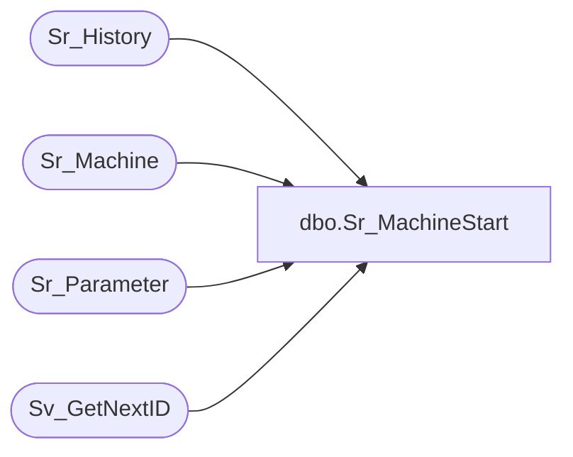

# dbo.Sr_MachineStart

**Database:** foundation  
**Server:** bedrockdb01  

## Architecture Diagram



## Table Dependencies

| Referenced Table |
|---|
| Sr_History |
| Sr_Machine |
| Sr_Parameter |
| Sv_GetNextID |

## Stored Procedure Code

```sql
create proc Sr_MachineStart @MachineID int
/*********************************************************/
/*	                                                 */
/*	    Author: Chris Carveth                        */
/*	    Creation Date: 01-March-1999                 */
/*	    Comments: Updates Sr_History                 */
/*                    Updates Sr_Job                     */
/*                                                       */
/*********************************************************/
/*
Amendments
Modified by		Date		Reason
------------------------------------------------------------------------
*/
AS 
DECLARE      @ExecutionID int, 
	     @HistoryDays int

	SELECT @HistoryDays = ABS(CONVERT(INT, tag_value))* -1 
	  FROM Sr_Parameter 
	 WHERE tag = 'HistoryDays'

	SELECT @HistoryDays = ISNULL(@HistoryDays, -7)

	DELETE Sr_History
	 WHERE start_datetime < dateadd(dd, @HistoryDays, getdate())

       	EXEC @ExecutionID = Sv_GetNextID 15 	

	UPDATE Sr_Machine
           SET execution_id = @ExecutionID
         WHERE machine_id = @MachineID
	  
	INSERT INTO Sr_History (execution_id, server_id, job_id, thread_index, topic_id, db_group_id, 
			        object_id, start_datetime, sucessful, include_in_average, machine_id, parent_job_id)
  	     VALUES (@ExecutionID, 0, 0, 0, 0, 0, 0, getdate(), 0, 0, @MachineID, 0)
	
RETURN @ExecutionID
```

