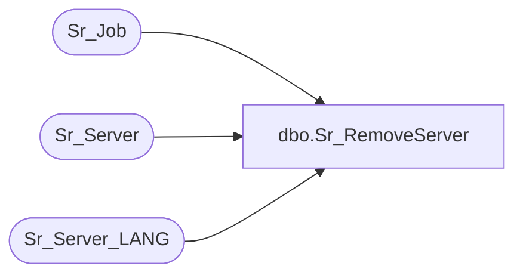

# dbo.Sr_RemoveServer

**Database:** foundation  
**Server:** bedrockdb01  

## Architecture Diagram



## Table Dependencies

| Referenced Table |
|---|
| Sr_Job |
| Sr_Server |
| Sr_Server_LANG |

## Stored Procedure Code

```sql
create proc dbo.Sr_RemoveServer 

@ServerId int
/*********************************************************/
/*	                                      		 */
/*	    Author: Adam Whiston               		 */
/*	    Creation Date: 22-Feb-1999        		 */
/*	    Comments: Removes a Server from Sr_Server &	 */
/*                    puts all the jobs related to that  */
/*		      server on the job shelf            */
/*********************************************************/
/*
Amendments
Modified by		Date		Reason
Annie Deland		June 10, 2014	Added statement to delete record from the associated LANG table.
-------------------------------------------------------------------------------------------------------------------------
*/
AS 
	/* put all jobs on the job shelf */
	UPDATE Sr_Job
	 SET server_id = 0, 
	     machine_id = -1
	 WHERE server_id = @ServerId

	DELETE Sr_Server_LANG
	 WHERE server_id = @ServerId

	DELETE Sr_Server 
	 WHERE server_id = @ServerId
               
	IF @@rowcount = 1 
	   RETURN 1
	ELSE
	   RETURN 0
```

