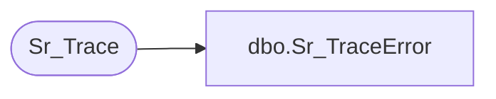

# dbo.Sr_TraceError

**Database:** foundation  
**Server:** bedrockdb01  

## Architecture Diagram



## Table Dependencies

| Referenced Table |
|---|
| Sr_Trace |

## Stored Procedure Code

```sql
create proc Sr_TraceError @ExecutionID int, @ExeName varchar(30), @ClassName varchar(30), @FunctionName varchar(30), @Message varchar(30),@Indent_Level int
/*********************************************************/
/*	                                                 */
/*	    Author: Chris Carveth              		 */
/*	    Creation Date: 05-March-1999                 */
/*	    Comments:                                    */
/*                                                       */
/*********************************************************/

AS 

        INSERT INTO Sr_Trace (execution_id, exe_name, class_name, function_name, message,
                              indent_level, trace_datetime)
             VALUES (@ExecutionID, @ExeName, @ClassName, @FunctionName, @Message, @Indent_Level,
                  getdate())
             
RETURN
```

