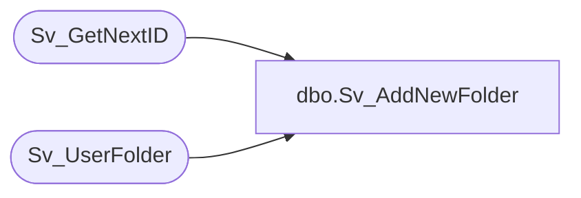

# dbo.Sv_AddNewFolder

**Database:** foundation  
**Server:** bedrockdb01  

## Architecture Diagram



## Table Dependencies

| Referenced Table |
|---|
| Sv_GetNextID |
| Sv_UserFolder |

## Stored Procedure Code

```sql
create proc dbo.Sv_AddNewFolder 

@TopicID int, @UserID int, @FolderType int, 
      @FolderLevel int, @PeriodID int, @FolderName nvarchar(30)
AS
DECLARE @FolderID int,
	@result int
	
	SELECT @result = 0
        
	EXEC @FolderID = Sv_GetNextID 5
	
	INSERT into Sv_UserFolder (folder_id, user_id, folder_type, topic_id, folder_level, folder_name, period_id)
		VALUES (@FolderID, @UserID, @FolderType, @TopicID, @FolderLevel, @FolderName, @PeriodID)
	IF @@ROWCOUNT = 1 SELECT @result = @FolderID
  	
RETURN @result
```

