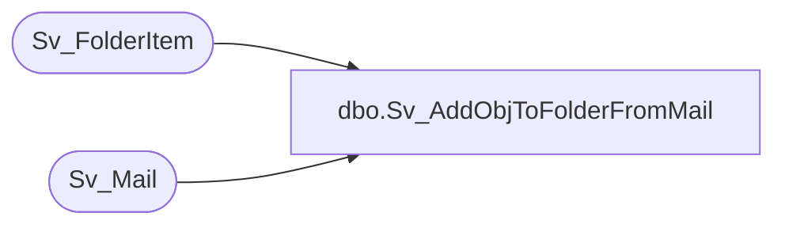

# dbo.Sv_AddObjToFolderFromMail

**Database:** foundation  
**Server:** bedrockdb01  

## Architecture Diagram



## Table Dependencies

| Referenced Table |
|---|
| Sv_FolderItem |
| Sv_Mail |

## Stored Procedure Code

```sql
create proc Sv_AddObjToFolderFromMail @TopicID int, @UserID int, @TargetFolderID int, 
@ObjectType int, @ObjectID int, @MailID int
AS
DECLARE @NextSequence int,
	@result int
	
	SELECT @result = 0
        
	SELECT @NextSequence = ISNULL(MAX(item_sequence),0) + 1
		FROM Sv_FolderItem
		WHERE folder_id = @TargetFolderID

	INSERT into Sv_FolderItem (folder_id, item_sequence, item_type, item_id, 
			   default_data_view, output_data, crosstab_data, graph_data)
		SELECT @TargetFolderID, @NextSequence,  @ObjectType , @ObjectID, 
			a.default_data_view , a.output_data, a.crosstab_data , a.graph_data
	          	FROM Sv_Mail a
	                WHERE a.mail_id = @MailID

	IF @@rowcount > 0 BEGIN
		DELETE FROM Sv_Mail
	        WHERE mail_id = @MailID		
	END
	
  	SELECT @result = @NextSequence  	
RETURN @result
```

