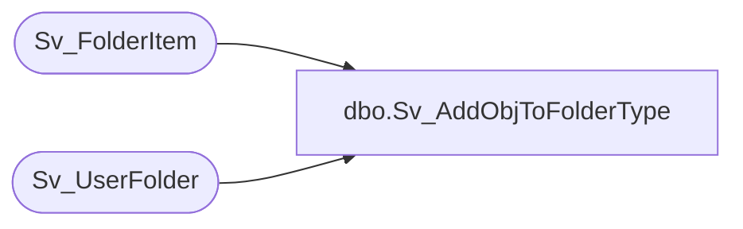

# dbo.Sv_AddObjToFolderType

**Database:** foundation  
**Server:** bedrockdb01  

## Architecture Diagram



## Table Dependencies

| Referenced Table |
|---|
| Sv_FolderItem |
| Sv_UserFolder |

## Stored Procedure Code

```sql
create proc Sv_AddObjToFolderType @TopicID int, @UserID int, @FolderType int, @ObjectType int, @ObjectID int
AS
DECLARE @NextSequence int,
	@folderid int,
	@result int
	
	SELECT @result = 0
	SELECT @folderid = MIN(folder_id)
		FROM Sv_UserFolder 
		WHERE user_id = @UserID 
		AND folder_type = @FolderType
		AND folder_level = 0
        	AND topic_id = @TopicID
        
        IF ISNULL(@folderid,0) <> 0 BEGIN
        	SELECT @NextSequence = ISNULL(MAX(item_sequence),0) 
        		FROM Sv_FolderItem
			WHERE folder_id = @folderid
		
		INSERT into Sv_FolderItem (folder_id, item_sequence, item_type, item_id, default_data_view)
			Values (@folderid, @NextSequence + 1,  @ObjectType , @ObjectID, 'O')
			
		SELECT @result = @folderid
        END
```

