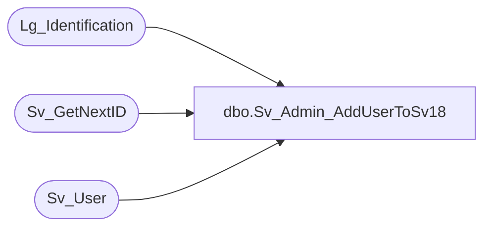

# dbo.Sv_Admin_AddUserToSv18

**Database:** foundation  
**Server:** bedrockdb01  

## Architecture Diagram



## Table Dependencies

| Referenced Table |
|---|
| Lg_Identification |
| Sv_GetNextID |
| Sv_User |

## Stored Procedure Code

```sql
create proc dbo.Sv_Admin_AddUserToSv18 

@TopicId int, @UserLevel int,
@UserName nvarchar(30), @UserFullName nvarchar(30),
@MailBoxName varchar(150), 
@MailBoxPassword varchar(30),
@UserPassword varchar(60),
@EmailAddress nvarchar(80) = NULL

AS 
DECLARE 
@UserID int,
@Result int,
@LanguageID int
	
	SELECT @Result = 0
	EXEC @UserID = Sv_GetNextID 6
  	IF NOT EXISTS (SELECT 1 FROM Sv_User WHERE user_name = @UserName) BEGIN
   	
	    SELECT @LanguageID = language_id FROM Lg_Identification WHERE column_position = 1

	    INSERT INTO Sv_User (user_id, user_name, user_fullname, user_level, topic_id, 
	    			flags, logo_filename, check_mail_interval, mail_user_name, 
	    			mail_password, user_password, email_address, language_id, pc_language_id)
	            VALUES (@UserID, @UserName , @UserFullName, @UserLevel, @TopicId,
	            		'1111     101111', NULL, 10, @MailBoxName, 
	            		@MailBoxPassword, @UserPassword, @EmailAddress, @LanguageID, @LanguageID)
		SELECT @Result = @UserID
	END
	ELSE BEGIN
		SELECT @Result = user_id FROM Sv_User WHERE user_name = @UserName
	END
	
RETURN @Result
```

