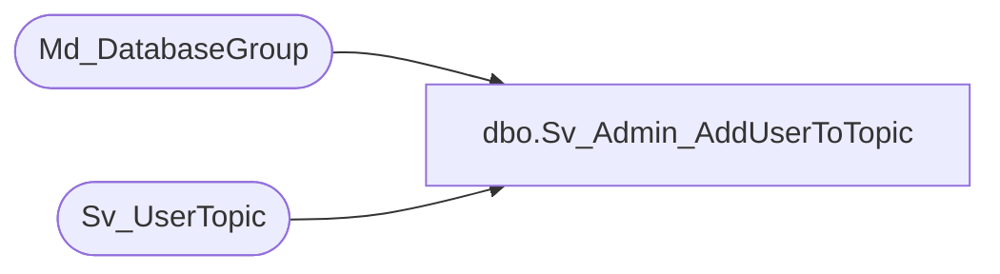

# dbo.Sv_Admin_AddUserToTopic

**Database:** foundation  
**Server:** bedrockdb01  

## Architecture Diagram



## Table Dependencies

| Referenced Table |
|---|
| Md_DatabaseGroup |
| Sv_UserTopic |

## Stored Procedure Code

```sql
create proc Sv_Admin_AddUserToTopic @TopicId int, @UserID int
AS 
DECLARE 
@DbGroupID int,
@Result int
	
	SELECT @Result = 0
	SELECT @DbGroupID = Min(db_group_id) 
		FROM Md_DatabaseGroup 
		WHERE topic_id = @TopicId
   
   	IF NOT EXISTS(SELECT 1 FROM Sv_UserTopic 
   			WHERE user_id = @UserID 
   			AND topic_id = @TopicId ) BEGIN
		INSERT INTO Sv_UserTopic (user_id, view_id, query_id, period_id,
					 sec_query_id, topic_id, db_group_id)
					Values( @UserID,0,0,0,0,@TopicId ,@DbGroupID )
		SELECT @Result = 1
	END
	
RETURN @Result
```

