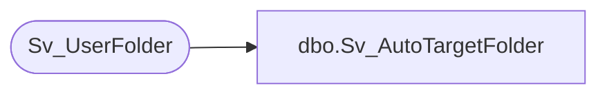

# dbo.Sv_AutoTargetFolder

**Database:** foundation  
**Server:** bedrockdb01  

## Architecture Diagram



## Table Dependencies

| Referenced Table |
|---|
| Sv_UserFolder |

## Stored Procedure Code

```sql
create proc Sv_AutoTargetFolder @TopicID int, @UserID int, @FolderType int, @ObjectType int
AS
DECLARE	@folderid int,
	@result int
	
	SELECT @result = 0
	SELECT @folderid = MIN(folder_id)
		FROM Sv_UserFolder 
		WHERE user_id = @UserID 
		AND folder_type = @FolderType
		AND folder_level = 0
        	AND topic_id = @TopicID
        
        IF ISNULL(@folderid,0) <> 0 BEGIN
		SELECT @result = @folderid
        END
        
RETURN @result
```

