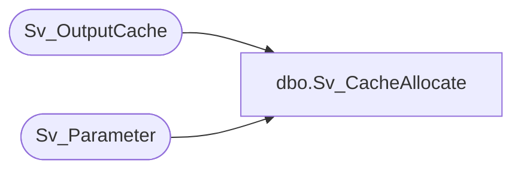

# dbo.Sv_CacheAllocate

**Database:** foundation  
**Server:** bedrockdb01  

## Architecture Diagram



## Table Dependencies

| Referenced Table |
|---|
| Sv_OutputCache |
| Sv_Parameter |

## Stored Procedure Code

```sql
CREATE PROC dbo.Sv_CacheAllocate
/*
Author: Tim Nishikawa
Creation Date: 28-Feb-2000
Comments: Expands or contracts the size of Sv_OutputCache table
	depending on the 'MAXCACHEFILECOUNT' parameter in Sv_Parameter

Modified by		Date		Reason
------------------------------------------------------------------------

*/
AS
DECLARE @errmsg               varchar(255), 
        @errno                int, 
        @final_maxfiles	      int,
        @current_maxfiles     int,
        @return               tinyint

SELECT @errmsg = NULL, 
       @errno = 0, 
       @return = 0

SELECT @current_maxfiles = COUNT(*) FROM Sv_OutputCache

SELECT @final_maxfiles = CONVERT(int, parameter_value) FROM Sv_Parameter
	WHERE parameter_key = 'MAXCACHEFILECOUNT'

/* assumes cache_file_id continuous from 1 to count(*) from sv_outputcache */
WHILE @current_maxfiles < @final_maxfiles 
BEGIN
	/* Bump up record counter */
	SELECT @current_maxfiles = @current_maxfiles + 1

	INSERT INTO Sv_OutputCache
		(cache_file_id, view_id, query_id, period_id,
		 db_group_id, security_query_id, dynamic_query, 
		 qparameters_bag, created_datetime, valid_until, 
		 locked)
	VALUES (@current_maxfiles, 0, 0, 0, 0, 0, NULL, NULL, 
		getdate(), getdate(), 0)
	
END /* While @current_maxfiles < @final_maxfiles */ 

IF @current_maxfiles > @final_maxfiles 
BEGIN
	DELETE Sv_OutputCache WHERE cache_file_id > @final_maxfiles
END

RETURN 1
```

