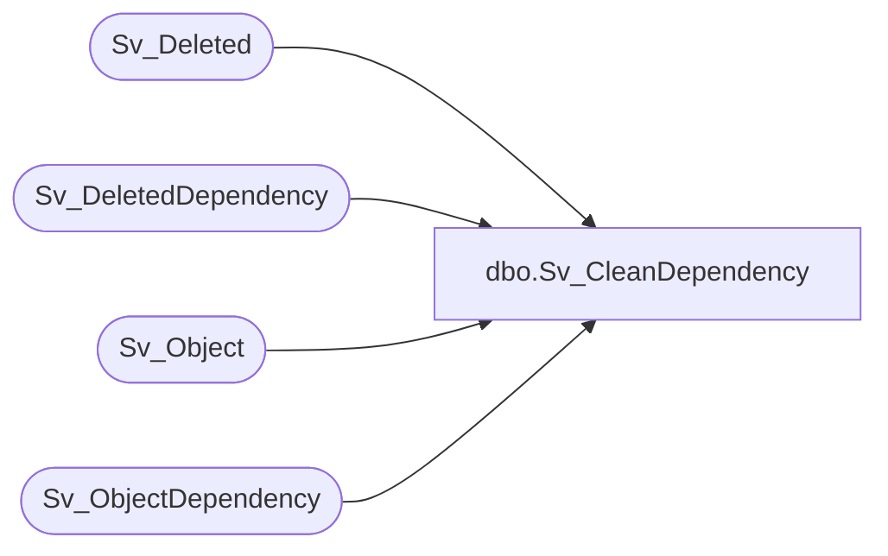

# dbo.Sv_CleanDependency

**Database:** foundation  
**Server:** bedrockdb01  

## Architecture Diagram



## Table Dependencies

| Referenced Table |
|---|
| Sv_Deleted |
| Sv_DeletedDependency |
| Sv_Object |
| Sv_ObjectDependency |

## Stored Procedure Code

```sql
create proc Sv_CleanDependency --*********************************************************
--	                                                
--	    Author:   Chris Carveth                       
--	    Creation  Date: 15-Feb-1998                  
--	    Comments: Deletes rows in Sv_ObjectDependency 
--                    that don't have corresponding rows in
--                    Sv_Object. Also does the same for 
--                    Sv_DeletedDepency.  
--                                                     
--*********************************************************
AS 

	DELETE Sv_ObjectDependency
	 WHERE object_id NOT IN (SELECT object_id 
	                           FROM Sv_Object)

	DELETE Sv_DeletedDependency
	 WHERE deleted_id NOT IN (SELECT delete_id 
	                           FROM Sv_Deleted)
              
RETURN 0
```

