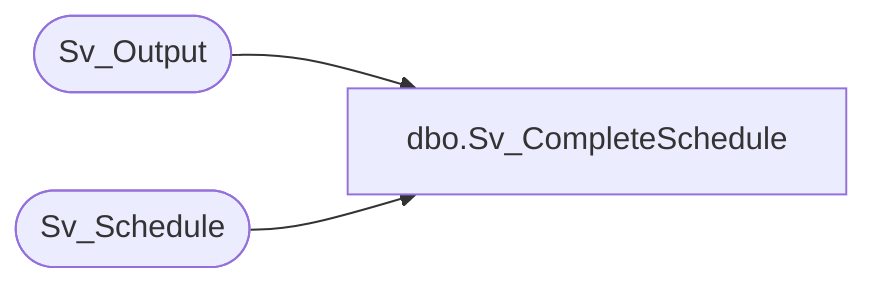

# dbo.Sv_CompleteSchedule

**Database:** foundation  
**Server:** bedrockdb01  

## Architecture Diagram



## Table Dependencies

| Referenced Table |
|---|
| Sv_Output |
| Sv_Schedule |

## Stored Procedure Code

```sql
create proc Sv_CompleteSchedule @object_id 		int,
@db_group_id 		int,
@keep_count 		int,
@keep_days		int
as
/* Update the schedule status and unlock the record if required not */
/* By Ashraf Zaid				  Date June 20 1997 */
	UPDATE Sv_Schedule
		SET server_lock    = 0,
		    status 	   = 0,
		    last_execution = Getdate()
		WHERE object_id = @object_id
		  AND db_group_id = @db_group_id
	IF @keep_days <> 0 
		DELETE FROM Sv_Output WHERE object_id = @object_id
		   AND DATEADD(day, @keep_days, execution_date) < GETDATE()
	IF @keep_count <> 0
		WHILE (SELECT COUNT(*) FROM Sv_Output WHERE object_id = @object_id) > @keep_count
		BEGIN
			SET ROWCOUNT 1
			DELETE FROM Sv_Output WHERE object_id = @object_id
				AND execution_date = (SELECT MIN(execution_date) FROM 
						Sv_Output WHERE object_id = @object_id )
			SET ROWCOUNT 0
		END
```

