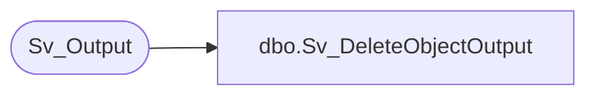

# dbo.Sv_DeleteObjectOutput

**Database:** foundation  
**Server:** bedrockdb01  

## Architecture Diagram



## Table Dependencies

| Referenced Table |
|---|
| Sv_Output |

## Stored Procedure Code

```sql
create proc Sv_DeleteObjectOutput @object_id 	int
as
/* Proc to delete all output from Sv_Output and Sv_OutputPage  will be deleted by the trigger Sv_OutputDelete */
/* For a specific object_id				    */
/* By Ashraf Zaid			Date June 23 1997 */
DELETE FROM Sv_Output
	WHERE object_id = @object_id
```

