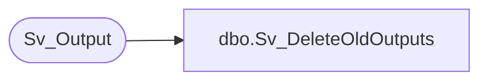

# dbo.Sv_DeleteOldOutputs

**Database:** foundation  
**Server:** bedrockdb01  

## Architecture Diagram



## Table Dependencies

| Referenced Table |
|---|
| Sv_Output |

## Stored Procedure Code

```sql
create proc dbo.Sv_DeleteOldOutputs @object_id 	int,
@keep_count     int
as
/* Proc to delete old outputs for a report from Sv_Output */
/* Sv_OutputPage and SvOutputIndex will be deleted by the trigger Sv_OutputDelete */
/* By Ashraf Zaid			Date Jan 24 2002 */
DECLARE 
@output_count int,
@delete_count int,
@min_date smalldatetime

DELETE FROM Sv_Output
	WHERE object_id = @object_id
	  AND expires IS NOT NULL
	  AND expires < GETDATE()

If @keep_count >= 0 BEGIN -- -1 means keep all	
	SELECT @output_count = COUNT(output_id) FROM Sv_Output WHERE object_id = @object_id
	SELECT @delete_count = @output_count - @keep_count

	SET ROWCOUNT 1
	WHILE (@delete_count > 0) BEGIN
	   SELECT @min_date = MIN(execution_date) FROM Sv_Output WHERE object_id = @object_id
	   DELETE FROM Sv_Output WHERE object_id = @object_id AND execution_date = @min_date
	   SELECT @delete_count = @delete_count - 1
	END -- while (@delete_count > 0)
	SET ROWCOUNT 0
END
```

