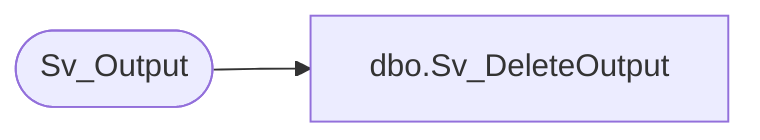

# dbo.Sv_DeleteOutput

**Database:** foundation  
**Server:** bedrockdb01  

## Architecture Diagram



## Table Dependencies

| Referenced Table |
|---|
| Sv_Output |

## Stored Procedure Code

```sql
create proc Sv_DeleteOutput @output_id 	int
as
/* Proc to delete an output from Sv_Output and Sv_OutputPage will be deleted by the trigger Sv_OutputDelete */
/* By Ashraf Zaid			Date June 23 1997 */
DELETE FROM Sv_Output
	WHERE output_id = @output_id
```

