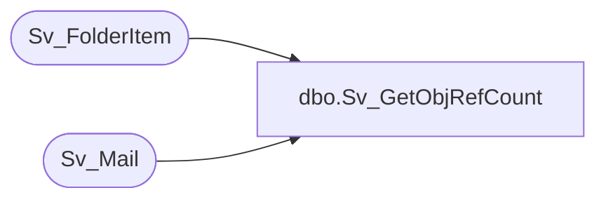

# dbo.Sv_GetObjRefCount

**Database:** foundation  
**Server:** bedrockdb01  

## Architecture Diagram



## Table Dependencies

| Referenced Table |
|---|
| Sv_FolderItem |
| Sv_Mail |

## Stored Procedure Code

```sql
create proc Sv_GetObjRefCount @object_id 		int

AS
/* Proc return the number of references an object have */
/* By Ashraf Zaid		Date June 10 1997 */
DECLARE 
@result 		int,
@refcount		int,
@mail_refcount		int


SELECT @result = 0

SELECT @refcount = COUNT(*)
	FROM Sv_FolderItem
	WHERE item_id = @object_id
	  
SELECT @mail_refcount = COUNT(*)
	FROM Sv_Mail
	WHERE attached_id = @object_id		
		
SELECT @result = @refcount + @mail_refcount

RETURN @result
```

