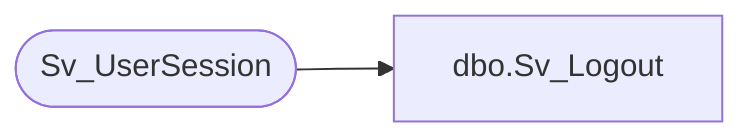

# dbo.Sv_Logout

**Database:** foundation  
**Server:** bedrockdb01  

## Architecture Diagram



## Table Dependencies

| Referenced Table |
|---|
| Sv_UserSession |

## Stored Procedure Code

```sql
create proc dbo.Sv_Logout 

/*******************************************************/
/*	                                                 */
/*	    Author   Andrea Nagy                         */
/*	    Creation Date  21-JUL-2000                   */
/*	    Comments   Logs the SV user out of the APP   */
/*	                                                 */
/*******************************************************/

AS

DECLARE   @current_spid int


begin

SELECT @current_spid = @@spid

DELETE FROM Sv_UserSession
      WHERE session_id = @current_spid
      
end
```

