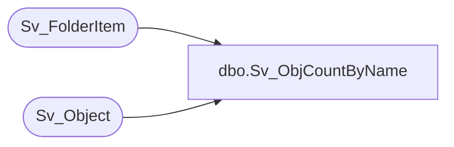

# dbo.Sv_ObjCountByName

**Database:** foundation  
**Server:** bedrockdb01  

## Architecture Diagram



## Table Dependencies

| Referenced Table |
|---|
| Sv_FolderItem |
| Sv_Object |

## Stored Procedure Code

```sql
create proc Sv_ObjCountByName @FolderID int, @ObjectType int, @ObjectID int,  @Language int,  @ObjectName varchar(30)

AS
DECLARE	@result int
	
	SELECT @result = 0
	if @FolderID > 0 BEGIN
		if @Language = 1 BEGIN
			SELECT @result = count(*) 
				FROM Sv_FolderItem a, Sv_Object b
				WHERE a.folder_id = @FolderID
				AND a.item_type = @ObjectType
				AND a.item_id = b.object_id
				AND a.item_id <> @ObjectID
				AND b.object_id <> @ObjectID
				AND b.object_type = @ObjectType
				AND b.label_1 = @ObjectName
		END
		ELSE BEGIN
			SELECT @result = count(*) 
				FROM Sv_FolderItem a, Sv_Object b
				WHERE a.folder_id = @FolderID
				AND a.item_type = @ObjectType
				AND a.item_id = b.object_id
				AND a.item_id <> @ObjectID
				AND b.object_id <> @ObjectID
				AND b.object_type = @ObjectType
				AND b.label_2 = @ObjectName
		END
	END
	ELSE BEGIN
		if @Language = 1 BEGIN
			SELECT @result = count(*) 
				FROM Sv_Object b
				WHERE b.object_id <> @ObjectID
				AND b.object_type = @ObjectType
				AND b.label_1 = @ObjectName
		END
		ELSE BEGIN
			SELECT @result = count(*) 
				FROM Sv_FolderItem a, Sv_Object b
				WHERE b.object_id <> @ObjectID
				AND b.object_type = @ObjectType
				AND b.label_2 = @ObjectName
		END
	END        
RETURN @result
```

