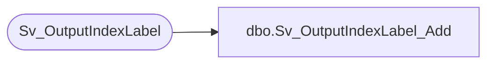

# dbo.Sv_OutputIndexLabel_Add

**Database:** foundation  
**Server:** bedrockdb01  

## Architecture Diagram



## Table Dependencies

| Referenced Table |
|---|
| Sv_OutputIndexLabel |

## Stored Procedure Code

```sql
create proc Sv_OutputIndexLabel_Add  (@OutputID int, @FieldID int, @FieldLabel varchar(30))

/**********************************************************************/
/*	                                                              */
/*	    Author : Ashraf Zaid                                      */
/*	    Creation Date : Jan 10 2001                               */
/*	    Comments : Insert one record in Sv_OutputIndexLabel       */
/*	    	       Used starting verison 4.0                      */
/**********************************************************************/

AS 
begin
	INSERT INTO Sv_OutputIndexLabel(output_id, index_field_id, label)
		VALUES( @OutputID, @FieldID, @FieldLabel)
end
```

