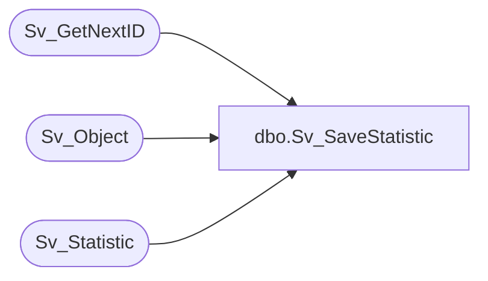

# dbo.Sv_SaveStatistic

**Database:** foundation  
**Server:** bedrockdb01  

## Architecture Diagram



## Table Dependencies

| Referenced Table |
|---|
| Sv_GetNextID |
| Sv_Object |
| Sv_Statistic |

## Stored Procedure Code

```sql
create proc Sv_SaveStatistic @ViewId int, @QueryId int, @PeriodId int,
@FolderID int, @TopicId int, @UserId int,
@Rows int, @Cols int, @DrillCount int, 
@TableCount int, @DrilledTo int, @UserCancelled int,
@loading_time int, @prepare_time int, @exec_time int,
@retreive_time int, @usage_time int, @start_date_time varchar(60),
@DataViewType char(1)
AS 
DECLARE @exec_id int
	EXEC @exec_id = Sv_GetNextID 4 /* next id in Sv_Statistic */
	
	IF @exec_id > 0 BEGIN
		INSERT INTO Sv_Statistic (exec_id, view_id, query_id, period_id, folder_id, topic_id,
			        	  user_id, rows_count, cols_count, drill_count, table_count,
				          drilled_to, user_cancelled, data_view_type, 
				          loading_time, prepare_time, exec_time,
				          retreive_time, usage_time, start_date_time )
		        	VALUES (@exec_id, @ViewId, @QueryId, @PeriodId, @FolderID, @TopicId,
			        	@UserId, @Rows, @Cols, @DrillCount, @TableCount,
				        @DrilledTo, @UserCancelled, @DataViewType,
				        @loading_time, @prepare_time, @exec_time,
				        @retreive_time, @usage_time, @start_date_time)
	
	    	UPDATE Sv_Object
	    		SET last_used_id = @UserId,
	    		    last_used_date = GETDATE()
	    	      WHERE object_id  = @ViewId
	
	    	UPDATE Sv_Object
	    		SET last_used_id = @UserId,
	    		    last_used_date = GETDATE()
	    	      WHERE object_id  = @QueryId
	END
RETURN @exec_id
```

