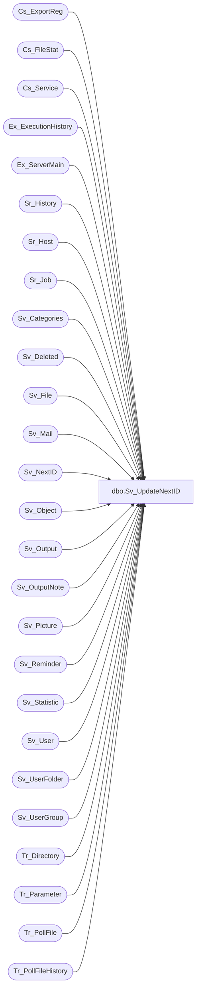

# dbo.Sv_UpdateNextID

**Database:** foundation  
**Server:** bedrockdb01  

## Architecture Diagram



## Table Dependencies

| Referenced Table |
|---|
| Cs_ExportReg |
| Cs_FileStat |
| Cs_Service |
| Ex_ExecutionHistory |
| Ex_ServerMain |
| Sr_History |
| Sr_Host |
| Sr_Job |
| Sv_Categories |
| Sv_Deleted |
| Sv_File |
| Sv_Mail |
| Sv_NextID |
| Sv_Object |
| Sv_Output |
| Sv_OutputNote |
| Sv_Picture |
| Sv_Reminder |
| Sv_Statistic |
| Sv_User |
| Sv_UserFolder |
| Sv_UserGroup |
| Tr_Directory |
| Tr_Parameter |
| Tr_PollFile |
| Tr_PollFileHistory |

## Stored Procedure Code

```sql
create proc Sv_UpdateNextID AS

Update Sv_NextID
Set next_id = (SELECT ISNULL(max(output_id),0) + 1 from Sv_Output)
WHERE table_id = 1
IF @@ROWCOUNT = 0 BEGIN
	INSERT INTO Sv_NextID VALUES (1,'Sv_Output', 1, 2100000000)
END

Update Sv_NextID
Set next_id = (SELECT ISNULL(max(picture_id),0) + 1 from Sv_Picture)
WHERE table_id = 2
IF @@ROWCOUNT = 0 BEGIN
	INSERT INTO Sv_NextID VALUES (2,'Sv_Picture', 1, 2100000000)
END

Update Sv_NextID
Set next_id = (SELECT ISNULL(max(object_id),0) + 1 from Sv_Object)
WHERE table_id = 3
IF @@ROWCOUNT = 0 BEGIN
	INSERT INTO Sv_NextID VALUES (3,'Sv_Object', 1, 2100000000)
END

Update Sv_NextID
Set next_id = (SELECT ISNULL(max(exec_id),0) + 1 from Sv_Statistic)
WHERE table_id = 4
IF @@ROWCOUNT = 0 BEGIN
	INSERT INTO Sv_NextID VALUES (4,'Sv_Statistic', 1, 2100000000)
END

Update Sv_NextID
Set next_id = (SELECT ISNULL(max(folder_id),0) + 1 from Sv_UserFolder)
WHERE table_id = 5
IF @@ROWCOUNT = 0 BEGIN
	INSERT INTO Sv_NextID VALUES (5,'Sv_UserFolder', 1, 2100000000)
END

Update Sv_NextID
Set next_id = (SELECT ISNULL(max(user_id),0)+ 1 from Sv_User)
WHERE table_id = 6
IF @@ROWCOUNT = 0 BEGIN
	INSERT INTO Sv_NextID VALUES (6,'Sv_User', 1, 2100000000)
END

Update Sv_NextID
Set next_id = (SELECT ISNULL(max(delete_id),0)+ 1 from Sv_Deleted)
WHERE table_id = 7
IF @@ROWCOUNT = 0 BEGIN
	INSERT INTO Sv_NextID VALUES (7,'Sv_Deleted', 1, 2100000000)
END

Update Sv_NextID
Set next_id = (SELECT ISNULL(max(mail_id),0)+ 1 from Sv_Mail)
WHERE table_id = 8
IF @@ROWCOUNT = 0 BEGIN
	INSERT INTO Sv_NextID VALUES (8,'Sv_Mail', 1, 2100000000)
END

Update Sv_NextID
Set next_id = (SELECT ISNULL(max(usergroup_id),0)+ 1 from Sv_UserGroup)
WHERE table_id = 9
IF @@ROWCOUNT = 0 BEGIN
	INSERT INTO Sv_NextID VALUES (9,'Sv_UserGroup', 1, 2100000000)
END

Update Sv_NextID
Set next_id = (SELECT ISNULL(max(execution_id),0)+ 1 from Ex_ExecutionHistory)
WHERE table_id = 10
IF @@ROWCOUNT = 0 BEGIN
	INSERT INTO Sv_NextID VALUES (10,'Ex_ExecutionHistory', 1, 2100000000)
END

Update Sv_NextID
Set next_id = (SELECT ISNULL(max(job_id),0)+ 1 from Ex_ServerMain)
WHERE table_id = 11
IF @@ROWCOUNT = 0 BEGIN
	INSERT INTO Sv_NextID VALUES (11,'Ex_ServerMain', 1, 2100000000)
END

Update Sv_NextID
Set next_id = (SELECT ISNULL(max(category_id),0)+ 1 from Sv_Categories)
WHERE table_id = 12
IF @@ROWCOUNT = 0 BEGIN
	INSERT INTO Sv_NextID VALUES (12,'Sv_Categories', 1, 2100000000)
END

Update Sv_NextID
Set next_id = (SELECT ISNULL(max(file_id),0)+ 1 from Sv_File)
WHERE table_id = 13
IF @@ROWCOUNT = 0 BEGIN
	INSERT INTO Sv_NextID VALUES (13,'Sv_File', 1, 2100000000)
END

Update Sv_NextID
Set next_id = (SELECT ISNULL(max(job_id),0)+ 1 from Sr_Job)
WHERE table_id = 14
IF @@ROWCOUNT = 0 BEGIN
	INSERT INTO Sv_NextID VALUES (14,'Sr_Job', 1, 2100000000)
END

Update Sv_NextID
Set next_id = (SELECT ISNULL(max(execution_id),0)+ 1 from Sr_History)
WHERE table_id = 15
IF @@ROWCOUNT = 0 BEGIN
	INSERT INTO Sv_NextID VALUES (15,'Sr_History', 1, 2100000000)
END

Update Sv_NextID
Set next_id = (SELECT ISNULL(max(company_id),0)+ 1 from Tr_Parameter)
WHERE table_id = 16
IF @@ROWCOUNT = 0 BEGIN
	INSERT INTO Sv_NextID VALUES (16,'Tr_Parameter', 1, 2100000000)
END

Update Sv_NextID
Set next_id = (SELECT ISNULL(max(remind_id),0)+ 1 from Sv_Reminder)
WHERE table_id = 17
IF @@ROWCOUNT = 0 BEGIN
	INSERT INTO Sv_NextID VALUES (17,'Sv_Reminder', 1, 2100000000)
END

Update Sv_NextID
Set next_id = (SELECT ISNULL(max(host_id),0)+ 1 from Sr_Host)
WHERE table_id = 18
IF @@ROWCOUNT = 0 BEGIN
	INSERT INTO Sv_NextID VALUES (18,'Sr_Host', 1, 2100000000)
END

Update Sv_NextID
Set next_id = (SELECT ISNULL(max(note_id),0)+ 1 from Sv_OutputNote)
WHERE table_id = 19
IF @@ROWCOUNT = 0 BEGIN
	INSERT INTO Sv_NextID VALUES (19,'Sv_OutputNote', 1, 2100000000)
END

Update Sv_NextID
Set next_id = (SELECT ISNULL(max(service_id),0)+ 1 from Cs_Service)
WHERE table_id = 20
IF @@ROWCOUNT = 0 BEGIN
	INSERT INTO Sv_NextID VALUES (20,'Cs_Service', 1, 2100000000)
END

Update Sv_NextID
Set next_id = (SELECT ISNULL(max(cs_file_id),0)+ 1 from Cs_ExportReg)
WHERE table_id = 21
IF @@ROWCOUNT = 0 BEGIN
	INSERT INTO Sv_NextID VALUES (21,'Cs_ExportReg', 1, 2100000000)
END

Update Sv_NextID
Set next_id = (SELECT ISNULL(max(transmission_id),0)+ 1 from Cs_FileStat)
WHERE table_id = 22
IF @@ROWCOUNT = 0 BEGIN
	INSERT INTO Sv_NextID VALUES (22,'Cs_FileStat', 1, 2100000000)
END

Update Sv_NextID
Set next_id = (SELECT ISNULL(max(id),0)+ 1 from Tr_PollFile)
WHERE table_id = 23
IF @@ROWCOUNT = 0 BEGIN
	INSERT INTO Sv_NextID VALUES (23,'Tr_PollFile', 1, 2100000000)
END

Update Sv_NextID
Set next_id = (SELECT ISNULL(max(id),0)+ 1 from Tr_PollFileHistory)
WHERE table_id = 24
IF @@ROWCOUNT = 0 BEGIN
	INSERT INTO Sv_NextID VALUES (24,'Tr_PollFileHistory', 1, 2100000000)
END

Update Sv_NextID
Set next_id = (SELECT ISNULL(max(id),0)+ 1 from Tr_Directory)
WHERE table_id = 25
IF @@ROWCOUNT = 0 BEGIN
	INSERT INTO Sv_NextID VALUES (25,'Tr_Directory', 1, 2100000000)
END
```

