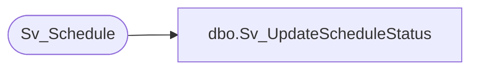

# dbo.Sv_UpdateScheduleStatus

**Database:** foundation  
**Server:** bedrockdb01  

## Architecture Diagram



## Table Dependencies

| Referenced Table |
|---|
| Sv_Schedule |

## Stored Procedure Code

```sql
create proc Sv_UpdateScheduleStatus @object_id 		int,
@db_group_id 		int,
@status			smallint
as
/* Update the schedule status 					    */
/* By Ashraf Zaid				  Date June 20 1997 */
	UPDATE Sv_Schedule
		SET status 	   = @status
		WHERE object_id = @object_id
		  AND db_group_id = @db_group_id
```

