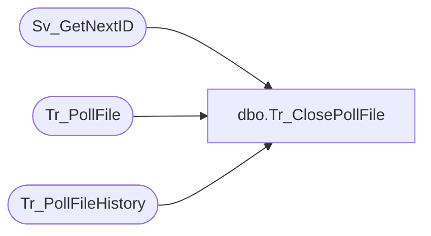

# dbo.Tr_ClosePollFile

**Database:** foundation  
**Server:** bedrockdb01  

## Architecture Diagram



## Table Dependencies

| Referenced Table |
|---|
| Sv_GetNextID |
| Tr_PollFile |
| Tr_PollFileHistory |

## Stored Procedure Code

```sql
create proc dbo.Tr_ClosePollFile @PollID int, @Status int, @Transactions int, @FileName varchar(30)
/*********************************************************/
/*	                                                 */
/*	    Author: Michael Orsoni            		 */
/*	    Creation Date: 10-March-2000                 */
/*	    Comments:                                    */
/*                                                       */
/*********************************************************/

AS 
DECLARE @HistoryPollID int

       	EXEC @HistoryPollID = Sv_GetNextID 24

	INSERT INTO Tr_PollFileHistory (id, dir_id, filename, output_mask, execution_id, file_size, transactions, 
					status, translate_type, translate_version, start_time, history_date_time)
	     SELECT @HistoryPollID, dir_id, @FileName, output_mask, execution_id, file_size, @Transactions, 
	     		@Status, translate_type, translate_version, start_time, getdate ()
	       FROM Tr_PollFile
	      WHERE id = @PollID

	DELETE Tr_PollFile
	 WHERE id = @PollID

RETURN 0
```

