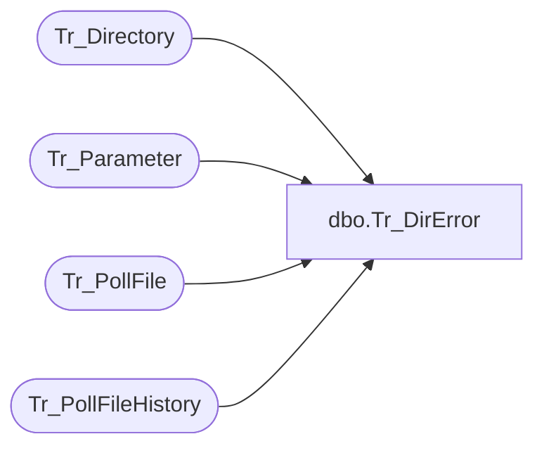

# dbo.Tr_DirError

**Database:** foundation  
**Server:** bedrockdb01  

## Architecture Diagram



## Table Dependencies

| Referenced Table |
|---|
| Tr_Directory |
| Tr_Parameter |
| Tr_PollFile |
| Tr_PollFileHistory |

## Stored Procedure Code

```sql
create proc dbo.Tr_DirError @CompanyID int
/********************************************************************************

	    Author	Michael Orsoni
	    Creation Date: 08-March-2000
	    Comments:	look for an unclosed Dir where all files have finished
	    		processing, and last file was processed longer than
	    		maxdirminutes. Dir that are closed have a time stamp in
	    		dir_close_date_time field.
	    		Return directory ID of that dir.

*********************************************************************************/
AS 
DECLARE	@DirID  int,
	@MaxTime int,
	@LatestDate datetime

        SELECT @DirID = 0
        SELECT @MaxTime = 0

	SELECT @MaxTime = isnull(CONVERT(int, parameter_value), 0)
	  FROM Tr_Parameter
	 WHERE parameter_key = 'MaxDirMinutes'
	   AND company_id = @CompanyID

        IF @MaxTime != 0
        BEGIN
	        SELECT @LatestDate = dateadd(minute, -@MaxTime, getdate())

		SELECT @DirID = ISNULL(MIN(b.id), 0) 
		FROM Tr_PollFileHistory a, Tr_Directory b
		WHERE a.dir_id = b.id
		AND b.company_id = @CompanyID
		AND b.dir_close_date_time IS NULL
		AND a.history_date_time < @LatestDate
		AND NOT EXISTS (SELECT c.id
				FROM Tr_PollFile c
				WHERE c.dir_id = a.dir_id)
		AND a.dir_id NOT IN ( SELECT d.dir_id 
			  		     FROM Tr_PollFileHistory d
					     WHERE d.history_date_time >= @LatestDate)
		GROUP BY b.id
	END

RETURN @DirID
```

