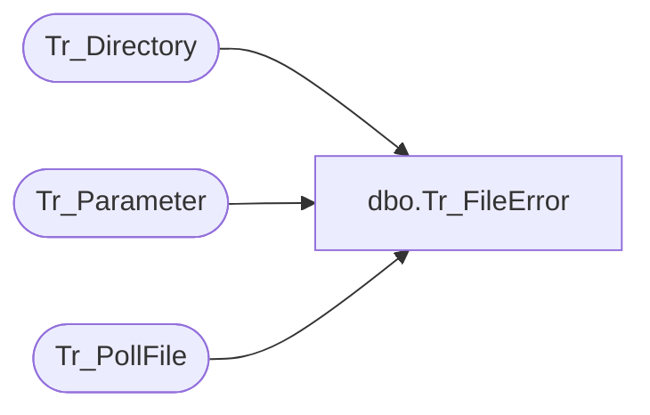

# dbo.Tr_FileError

**Database:** foundation  
**Server:** bedrockdb01  

## Architecture Diagram



## Table Dependencies

| Referenced Table |
|---|
| Tr_Directory |
| Tr_Parameter |
| Tr_PollFile |

## Stored Procedure Code

```sql
create proc dbo.Tr_FileError @CompanyID int
/********************************************************************************

	    Author	Michael Orsoni
	    Creation Date: 08-March-2000
	    Comments:	Look for any file that has been processing for longer
	    		than the max allowable for 1 file for this company.

*********************************************************************************/
AS 
DECLARE	@PollID  int,
	@MaxTime int

	SELECT @PollID = 0
	SELECT @MaxTime = 0

	SELECT @MaxTime = isnull(CONVERT(int, parameter_value), 0)
	FROM Tr_Parameter
	WHERE parameter_key = 'MaxFileMinutes'
	AND company_id = @CompanyID

	IF @MaxTime != 0
	BEGIN
		SELECT @PollID = isnull(MIN(a.id), 0)
		  FROM Tr_PollFile a, Tr_Directory b
		 WHERE a.dir_id = b.id
		   AND b.company_id = @CompanyID
		   AND dateadd(minute, @MaxTime, a.start_time) < getdate()
		   AND a.status = 2
	END

RETURN @PollID
```

