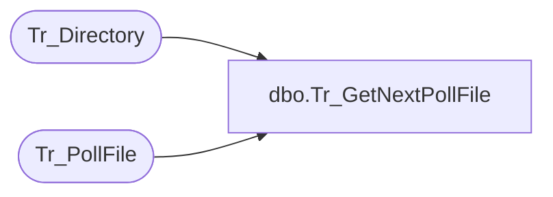

# dbo.Tr_GetNextPollFile

**Database:** foundation  
**Server:** bedrockdb01  

## Architecture Diagram



## Table Dependencies

| Referenced Table |
|---|
| Tr_Directory |
| Tr_PollFile |

## Stored Procedure Code

```sql
create proc dbo.Tr_GetNextPollFile @ExecutionID int, @TranslateType int, @TranslateVersion int, @CompanyID int, @Path varchar(255)
/*********************************************************/
/*	                                                 */
/*	    Author: Michael Orsoni            		 */
/*	    Creation Date: 10-March-2000                 */
/*	    Comments:                                    */
/*                                                       */
/*********************************************************/
AS 
DECLARE @JobID int,
	@TempTranType int,
	@DirID int,
	@TempPath varchar(255)

	SELECT @JobID = 0
	SELECT @DirID = 0
	SELECT @TempTranType = @TranslateType
	SELECT @TempPath = @Path

	IF @TempPath = ''
	BEGIN
		SELECT @TempPath = NULL
	END

	IF @TempPath IS NOT NULL
	BEGIN
		SELECT @DirID = ISNULL (id, 0)
		  FROM Tr_Directory
		 WHERE path = @TempPath
		   AND company_id = @CompanyID
		   AND dir_close_date_time IS NULL 
	END

	BEGIN TRAN

	SELECT @JobID = isnull (MIN(a.id), 0)
	FROM Tr_PollFile a
	WITH (TABLOCKX)
	WHERE a.status = -99
		
	WHILE @JobID = 0
	BEGIN
		if @TempTranType = 0 AND @TempPath IS NULL
		BEGIN
			SELECT @JobID = isnull (MIN(a.id), 0)
			  FROM Tr_PollFile a, Tr_Directory b
			 WHERE a.dir_id = b.id
			   AND b.company_id = @CompanyID
			   AND a.status = 1

			BREAK
		END

		IF @TempTranType = 0
		BEGIN
			SELECT @JobID = isnull (MIN(a.id), 0)
			  FROM Tr_PollFile a, Tr_Directory b
			 WHERE a.dir_id = b.id
			   AND b.company_id = @CompanyID
			   AND b.id = @DirID
			   AND a.status = 1

			IF @JobID <> 0
			BEGIN
				BREAK
			END	

			SELECT @TempPath = NULL
			CONTINUE
		END

		IF @TempPath IS NULL
		BEGIN
			SELECT @JobID = isnull (MIN(a.id), 0)
			  FROM Tr_PollFile a, Tr_Directory b
			 WHERE a.dir_id = b.id
			   AND b.company_id = @CompanyID
			   AND a.translate_type = @TranslateType
			   AND a.translate_version = @TranslateVersion
			   AND a.status = 1

			IF @JobID <> 0
			BEGIN
				BREAK
			END

			SELECT @TempPath = @Path
			SELECT @TempTranType = 0
			CONTINUE
		END

		SELECT @JobID = isnull (MIN(a.id), 0)
		  FROM Tr_PollFile a, Tr_Directory b
		 WHERE a.dir_id = b.id
		   AND b.id = @DirID
		   AND b.company_id = @CompanyID
		   AND a.translate_type = @TranslateType
		   AND a.translate_version = @TranslateVersion
		   AND a.status = 1

		IF @JobID <> 0
		BEGIN
			BREAK
		END

		SELECT @TempPath = NULL
	END

	IF @JobID <> 0
	BEGIN
		UPDATE Tr_PollFile
		   SET execution_id = @ExecutionID, status = 2, start_time = getdate()
		 WHERE id = @JobID
	END
	
	COMMIT

RETURN @JobID
```

