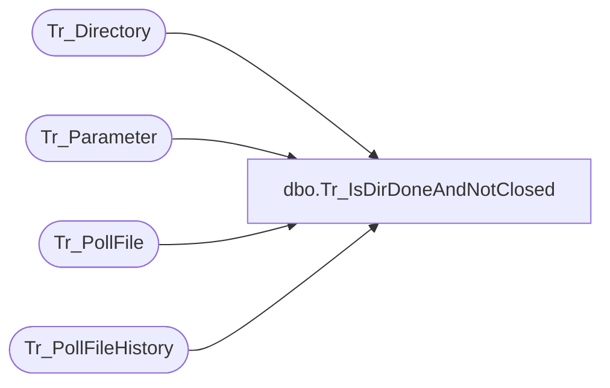

# dbo.Tr_IsDirDoneAndNotClosed

**Database:** foundation  
**Server:** bedrockdb01  

## Architecture Diagram



## Table Dependencies

| Referenced Table |
|---|
| Tr_Directory |
| Tr_Parameter |
| Tr_PollFile |
| Tr_PollFileHistory |

## Stored Procedure Code

```sql
create proc dbo.Tr_IsDirDoneAndNotClosed @CompanyID int, @Directory varchar(255)
/********************************************************************************

    Author	Michael Orsoni
    Creation Date: 08-March-2000
    Comments:	Look for any files that are unprocessed in specified directory

*********************************************************************************/
AS 
DECLARE @CloseDirsInOrder int,
	@OtherOldestID numeric (12, 0),
	@MyOldestID numeric (12, 0)

	SELECT @CloseDirsInOrder = 0
	SELECT @OtherOldestID = 0
	SELECT @MyOldestID = 0

	IF EXISTS (SELECT 1
		     FROM Tr_PollFile a, Tr_Directory b
		    WHERE a.dir_id = b.id
		      AND b.path = @Directory
		      AND b.company_id = @CompanyID)
	    RETURN 0

	IF EXISTS (SELECT 1
		     FROM Tr_PollFileHistory a, Tr_Directory b
		    WHERE a.dir_id = b.id
		      AND b.path = @Directory
		      AND b.company_id = @CompanyID
		      AND ((a.status > 0 AND a.status < 200 AND a.status != 3)
			   OR (a.status > 300 AND a.status < 400)))
	    RETURN 0

	IF NOT EXISTS (SELECT 1
		     FROM Tr_Directory
		    WHERE path = @Directory
		      AND company_id = @CompanyID
		      AND dir_close_date_time IS NULL)
	    RETURN 0

	SELECT @CloseDirsInOrder = CONVERT (INTEGER, parameter_value)
	 FROM Tr_Parameter
	WHERE parameter_key = 'CloseDirsInOrder'
	  AND company_id = @CompanyID

	SELECT @CloseDirsInOrder = ISNULL(@CloseDirsInOrder,0)

	IF @CloseDirsInOrder = 1
	BEGIN
		SELECT @OtherOldestID = isnull(MIN(a.id), 0)
		  FROM Tr_PollFileHistory a, Tr_Directory b
		 WHERE a.dir_id = b.id
		   AND b.path != @Directory
		   AND b.company_id = @CompanyID
		   AND b.dir_close_date_time IS NULL

		IF @OtherOldestID = 0
			RETURN 1

		SELECT @MyOldestID = isnull(MIN(a.id), 0)
		  FROM Tr_PollFileHistory a, Tr_Directory b
		 WHERE a.dir_id = b.id
		   AND b.path = @Directory
		   AND b.dir_close_date_time IS NULL
		   AND b.company_id = @CompanyID

		IF @MyOldestID = 0
			RETURN 0

		IF @OtherOldestID < @MyOldestID
			RETURN 0
		ELSE
			RETURN 1				 
	END

RETURN 1
```

