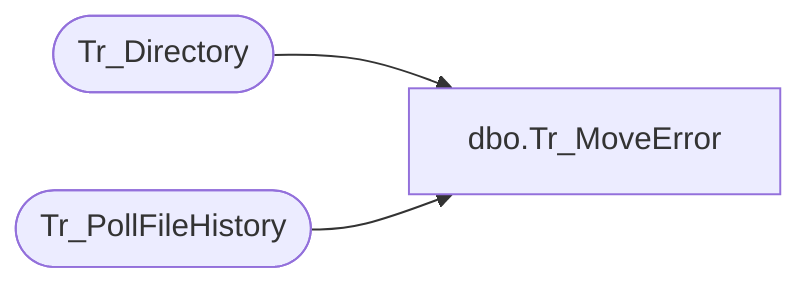

# dbo.Tr_MoveError

**Database:** foundation  
**Server:** bedrockdb01  

## Architecture Diagram



## Table Dependencies

| Referenced Table |
|---|
| Tr_Directory |
| Tr_PollFileHistory |

## Stored Procedure Code

```sql
create proc dbo.Tr_MoveError @CompanyID int, @PreviousID int
/********************************************************************************

	    Author	Michael Orsoni
	    Creation Date: 08-May-2001
	    Comments:	

*********************************************************************************/
AS 
DECLARE	@PollID  int

	SELECT @PollID = 0

	SELECT @PollID = isnull(MIN(a.id), 0)
	  FROM Tr_PollFileHistory a, Tr_Directory b
	 WHERE a.dir_id = b.id
	   AND a.id > @PreviousID
	   AND ((a.status > 100 AND a.status < 200)
	    	OR (a.status > 300 AND a.status < 400))
	   AND b.company_id = @CompanyID

RETURN @PollID
```

