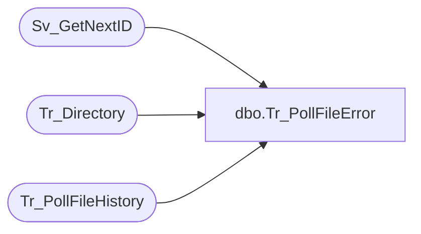

# dbo.Tr_PollFileError

**Database:** foundation  
**Server:** bedrockdb01  

## Architecture Diagram



## Table Dependencies

| Referenced Table |
|---|
| Sv_GetNextID |
| Tr_Directory |
| Tr_PollFileHistory |

## Stored Procedure Code

```sql
create proc dbo.Tr_PollFileError @Status int, @CompanyID int, @FileSize int, @Path varchar(255), @FileName varchar(30)
/*********************************************************/
/*	                                                 */
/*	    Author: Michael Orsoni            		 */
/*	    Creation Date: 10-March-2000                 */
/*	    Comments:                                    */
/*                                                       */
/*********************************************************/
AS
DECLARE @DirID int,
	@PollID int

	SELECT @DirID = 0

	SELECT @DirID = ISNULL (id, 0)
	  FROM Tr_Directory
	 WHERE path = @Path
	   AND company_id = @CompanyID
	   AND dir_close_date_time IS NULL

	IF @DirID = 0
	BEGIN
	       	EXEC @DirID = Sv_GetNextID 25

		INSERT INTO Tr_Directory (id, company_id, path, done_file_type, done_file_date_time, dir_close_date_time)
			VALUES (@DirID, @CompanyID, @Path, 0, NULL, NULL)
	END

       	EXEC @PollID = Sv_GetNextID 24

	INSERT INTO Tr_PollFileHistory (id, dir_id, filename, file_size, transactions, status, start_time, history_date_time)
		VALUES (@PollID, @DirID, @FileName, @FileSize, 0, @Status, getdate(), getdate())

RETURN 0
```

