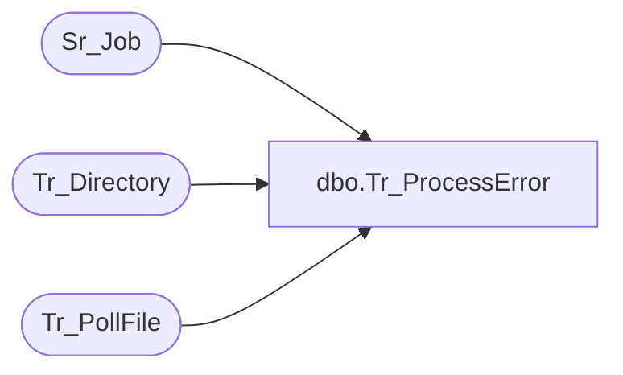

# dbo.Tr_ProcessError

**Database:** foundation  
**Server:** bedrockdb01  

## Architecture Diagram



## Table Dependencies

| Referenced Table |
|---|
| Sr_Job |
| Tr_Directory |
| Tr_PollFile |

## Stored Procedure Code

```sql
create proc dbo.Tr_ProcessError @CompanyID int
/********************************************************************************

	    Author	Michael Orsoni
	    Creation Date: 26-October-2000
	    Comments:	

*********************************************************************************/
AS 
DECLARE	@ExecID  int,
	@PollID  int

	SELECT @ExecID = 0
	SELECT @PollID = 0

	SELECT @ExecID = isnull(MIN(a.execution_id), 0)
	  FROM Tr_PollFile a, Tr_Directory b
	 WHERE a.dir_id = b.id
	   AND b.company_id = @CompanyID
	   AND a.status = 2
	   AND a.execution_id NOT IN (SELECT execution_id FROM Sr_Job)

        IF @ExecID != 0
        BEGIN
		SELECT @PollID = id 
		FROM Tr_PollFile
		WHERE execution_id = @ExecID
        END

RETURN @PollID
```

