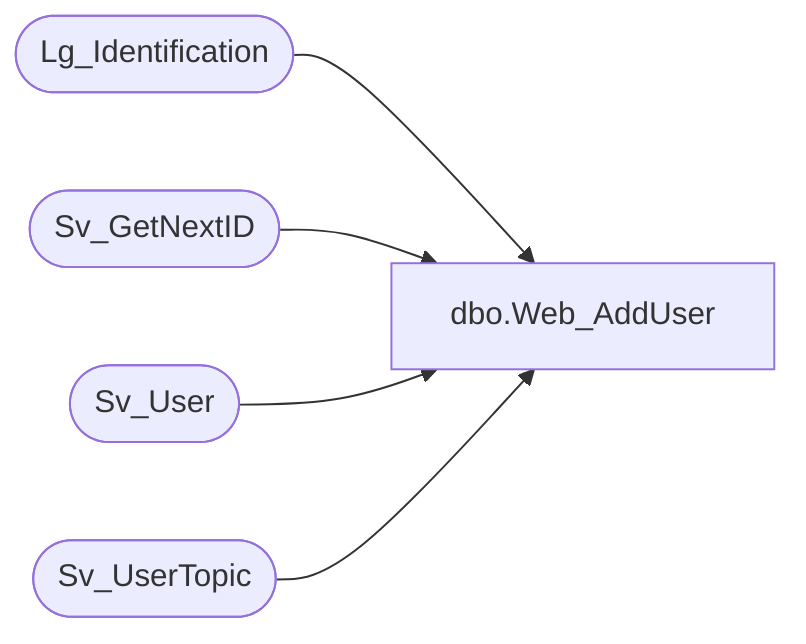

# dbo.Web_AddUser

**Database:** foundation  
**Server:** bedrockdb01  

## Architecture Diagram



## Table Dependencies

| Referenced Table |
|---|
| Lg_Identification |
| Sv_GetNextID |
| Sv_User |
| Sv_UserTopic |

## Stored Procedure Code

```sql
create proc dbo.Web_AddUser   @TopicId int, @DBGroupId int, @UserName varchar(30), @UserPassword varchar(60)
/*********************************************************/
/*	                                                 */
/*	    Author: MICHAELO                             */
/*	    Creation Date: 07/01                         */
/*	    Comments:                                    */
/*                                                       */
/*                                                       */
/*********************************************************/

AS 
DECLARE 
@UserID int,
@Result int,
@LanguageID int

	SELECT @Result = 0

	IF NOT EXISTS (SELECT 1 FROM Sv_User WHERE upper (user_name) = upper (@UserName)) 
	BEGIN
		EXEC @UserID = Sv_GetNextID 6
		SELECT @LanguageID = language_id FROM Lg_Identification WHERE column_position = 1

		INSERT INTO Sv_User (user_id, user_name, user_fullname, user_level, topic_id, flags, logo_filename, 
					check_mail_interval, mail_user_name, mail_password, user_password, email_address, language_id, pc_language_id)
			VALUES (@UserID, @UserName , @UserName, 0, @TopicId,'1111     101111', NULL, 
					10, NULL, NULL, @UserPassword, NULL, @LanguageID, @LanguageID)
		SELECT @Result = @UserID
	END
	ELSE BEGIN
		SELECT @Result = user_id FROM Sv_User WHERE upper (user_name) = upper (@UserName)
	END

   	IF NOT EXISTS(SELECT 1 FROM Sv_UserTopic WHERE user_id = @Result AND topic_id = @TopicId ) 
   	BEGIN
		INSERT INTO Sv_UserTopic (user_id, view_id, query_id, period_id, sec_query_id, topic_id, db_group_id)
			Values (@Result,0,0,0,0,@TopicId ,@DBGroupId)
	END
	
RETURN @Result
```

