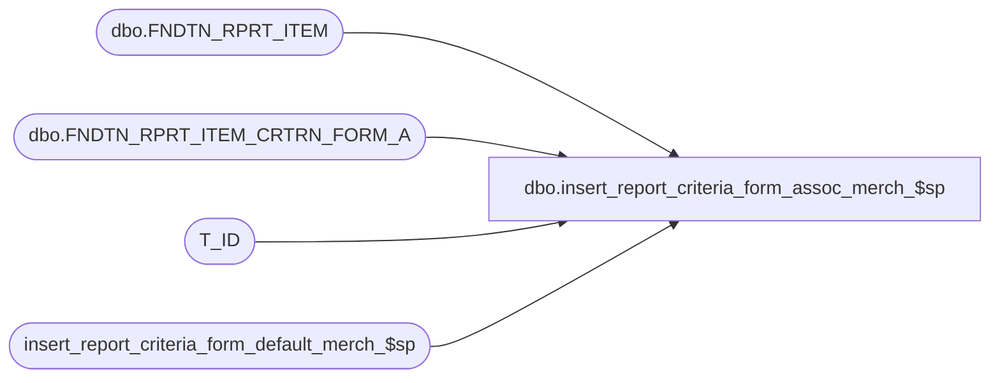

# dbo.insert_report_criteria_form_assoc_merch_$sp

**Database:** foundation  
**Server:** bedrockdb01  

## Architecture Diagram



## Table Dependencies

| Referenced Table |
|---|
| dbo.FNDTN_RPRT_ITEM |
| dbo.FNDTN_RPRT_ITEM_CRTRN_FORM_A |
| T_ID |
| insert_report_criteria_form_default_merch_$sp |

## Stored Procedure Code

```sql
CREATE PROC dbo.insert_report_criteria_form_assoc_merch_$sp
(
	@report_server_id smallint,
	@report_item_id T_ID,
--	@criteria_list type_criteria_list_merch READONLY,
	@temp_table_id INT,
	@fully_qualified_name varchar(255),	
	@criteria_form_id T_ID,
	@sequence_number smallint	
)
AS
	DECLARE @parent_folder_id AS T_ID;
	DECLARE @old_report_id as T_ID;
	
	SELECT @old_report_id = (SELECT RPRT_ITEM_ID FROM dbo.FNDTN_RPRT_ITEM WHERE FLY_QLFD_NAME = @fully_qualified_name AND RPRT_SRVR_ID = @report_server_id)
	
	-- remove the old criteria value
	IF @old_report_id IS NOT NULL
	  BEGIN
		DELETE FROM dbo.FNDTN_RPRT_ITEM_CRTRN_FORM_A WHERE RPRT_ITEM_ID = @old_report_id
	  END


	--check if there are any sequence values in the criteria list, if so deal with them
	IF @temp_table_id = 1
	BEGIN

		IF EXISTS (SELECT * FROM #criteria_list WHERE sequence_number IS NOT NULL) --if the user sent in a list of criteria items deal with them
		BEGIN

			INSERT INTO dbo.FNDTN_RPRT_ITEM_CRTRN_FORM_A (RPRT_ITEM_ID, CRTRN_FORM_ID, CRTRN_FORM_SEQ)

					(
						SELECT DISTINCT @report_item_id, a.criteriaformid, a.sequence_number
						FROM #criteria_list a
						WHERE sequence_number IS NOT NULL
					 )

		END

	END
	ELSE IF @temp_table_id = 2
	BEGIN

		IF EXISTS (SELECT * FROM #criteria_list_empty WHERE sequence_number IS NOT NULL) --if the user sent in a list of criteria items deal with them
		BEGIN

			INSERT INTO dbo.FNDTN_RPRT_ITEM_CRTRN_FORM_A (RPRT_ITEM_ID, CRTRN_FORM_ID, CRTRN_FORM_SEQ)

					(
						SELECT DISTINCT @report_item_id, a.criteriaformid, a.sequence_number
						FROM #criteria_list_empty a
						WHERE sequence_number IS NOT NULL
					 )

		END

	END
	ELSE IF @temp_table_id = 3
	BEGIN

		IF EXISTS (SELECT * FROM #criteria_list_non_scope WHERE sequence_number IS NOT NULL) --if the user sent in a list of criteria items deal with them
		BEGIN

			INSERT INTO dbo.FNDTN_RPRT_ITEM_CRTRN_FORM_A (RPRT_ITEM_ID, CRTRN_FORM_ID, CRTRN_FORM_SEQ)

					(
						SELECT DISTINCT @report_item_id, a.criteriaformid, a.sequence_number
						FROM #criteria_list_non_scope a
						WHERE sequence_number IS NOT NULL
					 )

		END

	END
	ELSE IF @temp_table_id = 4
	BEGIN

		IF EXISTS (SELECT * FROM #criteria_list_non_scope_query WHERE sequence_number IS NOT NULL) --if the user sent in a list of criteria items deal with them
		BEGIN

			INSERT INTO dbo.FNDTN_RPRT_ITEM_CRTRN_FORM_A (RPRT_ITEM_ID, CRTRN_FORM_ID, CRTRN_FORM_SEQ)

					(
						SELECT DISTINCT @report_item_id, a.criteriaformid, a.sequence_number
						FROM #criteria_list_non_scope_query a
						WHERE sequence_number IS NOT NULL
					 )

		END

	END

	


	
	--the user may have input a single criteria value as well as the list above (or no list was included)
	IF (@sequence_number IS NOT NULL)
		BEGIN
			INSERT INTO dbo.FNDTN_RPRT_ITEM_CRTRN_FORM_A (RPRT_ITEM_ID, CRTRN_FORM_ID, CRTRN_FORM_SEQ) 
				VALUES (@report_item_id, @criteria_form_id, @sequence_number)
		END
		
	--if there are default values in the criteria list (if there is a criteria list) pass it along
	IF @temp_table_id = 1
	BEGIN

		IF EXISTS (SELECT * FROM #criteria_list WHERE defaultvalue IS NOT NULL)
		BEGIN

				EXEC insert_report_criteria_form_default_merch_$sp @report_server_id, @report_item_id, @temp_table_id, @fully_qualified_name, NULL, NULL, NULL

		END

	END
	ELSE IF @temp_table_id = 2
	BEGIN

		IF EXISTS (SELECT * FROM #criteria_list_empty WHERE defaultvalue IS NOT NULL)
		BEGIN

				EXEC insert_report_criteria_form_default_merch_$sp @report_server_id, @report_item_id, @temp_table_id, @fully_qualified_name, NULL, NULL, NULL

		END

	END
	ELSE IF @temp_table_id = 3
	BEGIN

		IF EXISTS (SELECT * FROM #criteria_list_non_scope WHERE defaultvalue IS NOT NULL)
		BEGIN

				EXEC insert_report_criteria_form_default_merch_$sp @report_server_id, @report_item_id, @temp_table_id, @fully_qualified_name, NULL, NULL, NULL

		END

	END
	ELSE IF @temp_table_id = 4
	BEGIN

		IF EXISTS (SELECT * FROM #criteria_list_non_scope_query WHERE defaultvalue IS NOT NULL)
		BEGIN

				EXEC insert_report_criteria_form_default_merch_$sp @report_server_id, @report_item_id, @temp_table_id, @fully_qualified_name, NULL, NULL, NULL

		END

	END
```

