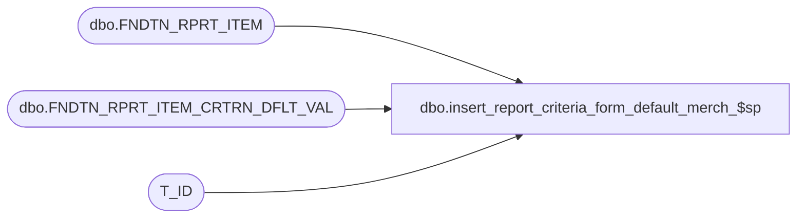

# dbo.insert_report_criteria_form_default_merch_$sp

**Database:** foundation  
**Server:** bedrockdb01  

## Architecture Diagram



## Table Dependencies

| Referenced Table |
|---|
| dbo.FNDTN_RPRT_ITEM |
| dbo.FNDTN_RPRT_ITEM_CRTRN_DFLT_VAL |
| T_ID |

## Stored Procedure Code

```sql
CREATE PROC dbo.insert_report_criteria_form_default_merch_$sp 
(
	@report_server_id smallint,
	@report_item_id T_ID,
--	@criteria_list type_criteria_list_merch READONLY,
	@temp_table_id INT,
	@fully_qualified_name varchar(255),	
	@criteria_form_id T_ID,
	@criteria_id T_ID,
	@default_value nvarchar(255)
)
AS
	DECLARE @parent_folder_id AS T_ID;
	DECLARE @old_report_id as T_ID;
	
	SELECT @old_report_id = (SELECT RPRT_ITEM_ID FROM dbo.FNDTN_RPRT_ITEM WHERE FLY_QLFD_NAME = @fully_qualified_name AND RPRT_SRVR_ID = @report_server_id)
	
	-- remove the old default value if it's there
	IF @old_report_id IS NOT NULL
	  BEGIN
		DELETE FROM dbo.FNDTN_RPRT_ITEM_CRTRN_DFLT_VAL WHERE RPRT_ITEM_ID = @old_report_id
	  END
	  


	--check if there are any default values in the criteria list, if so deal with them
	IF @temp_table_id = 1
	BEGIN

		IF EXISTS (SELECT * FROM #criteria_list WHERE defaultvalue IS NOT NULL)
		BEGIN

			INSERT INTO dbo.FNDTN_RPRT_ITEM_CRTRN_DFLT_VAL (RPRT_ITEM_ID, CRTRN_FORM_ID, CRTRN_ID, DFLT_VAL)

					(
						SELECT @report_item_id, a.criteriaformid, a.criterionid, a.defaultvalue
						FROM #criteria_list a
						WHERE defaultvalue IS NOT NULL
						AND criterionid IS NOT NULL
					)

		END

	END
	ELSE IF @temp_table_id = 2
	BEGIN

		IF EXISTS (SELECT * FROM #criteria_list_empty WHERE defaultvalue IS NOT NULL)
		BEGIN

			INSERT INTO dbo.FNDTN_RPRT_ITEM_CRTRN_DFLT_VAL (RPRT_ITEM_ID, CRTRN_FORM_ID, CRTRN_ID, DFLT_VAL)

					(
						SELECT @report_item_id, a.criteriaformid, a.criterionid, a.defaultvalue
						FROM #criteria_list_empty a
						WHERE defaultvalue IS NOT NULL
						AND criterionid IS NOT NULL
					)

		END

	END
	ELSE IF @temp_table_id = 3
	BEGIN

		IF EXISTS (SELECT * FROM #criteria_list_non_scope WHERE defaultvalue IS NOT NULL)
		BEGIN

			INSERT INTO dbo.FNDTN_RPRT_ITEM_CRTRN_DFLT_VAL (RPRT_ITEM_ID, CRTRN_FORM_ID, CRTRN_ID, DFLT_VAL)

					(
						SELECT @report_item_id, a.criteriaformid, a.criterionid, a.defaultvalue
						FROM #criteria_list_non_scope a
						WHERE defaultvalue IS NOT NULL
						AND criterionid IS NOT NULL
					)

		END

	END
	ELSE IF @temp_table_id = 4
	BEGIN

		IF EXISTS (SELECT * FROM #criteria_list_non_scope_query WHERE defaultvalue IS NOT NULL)
		BEGIN

			INSERT INTO dbo.FNDTN_RPRT_ITEM_CRTRN_DFLT_VAL (RPRT_ITEM_ID, CRTRN_FORM_ID, CRTRN_ID, DFLT_VAL)

					(
						SELECT @report_item_id, a.criteriaformid, a.criterionid, a.defaultvalue
						FROM #criteria_list_non_scope_query a
						WHERE defaultvalue IS NOT NULL
						AND criterionid IS NOT NULL
					)

		END

	END

	
	--the user MIGHT have asked the proc to also insert another single criteria default
	IF (@default_value IS NOT NULL)
		BEGIN	  
			INSERT INTO dbo.FNDTN_RPRT_ITEM_CRTRN_DFLT_VAL (RPRT_ITEM_ID, CRTRN_FORM_ID, CRTRN_ID, DFLT_VAL) 
				VALUES (@report_item_id, @criteria_form_id, @criteria_id, @default_value)
		END
```

