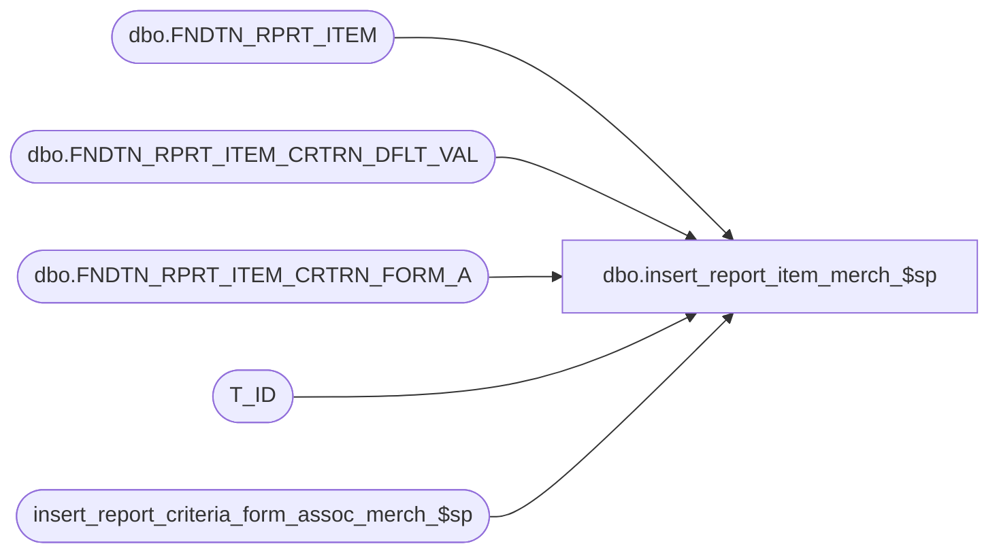

# dbo.insert_report_item_merch_$sp

**Database:** foundation  
**Server:** bedrockdb01  

## Architecture Diagram



## Table Dependencies

| Referenced Table |
|---|
| dbo.FNDTN_RPRT_ITEM |
| dbo.FNDTN_RPRT_ITEM_CRTRN_DFLT_VAL |
| dbo.FNDTN_RPRT_ITEM_CRTRN_FORM_A |
| T_ID |
| insert_report_criteria_form_assoc_merch_$sp |

## Stored Procedure Code

```sql
CREATE PROC dbo.insert_report_item_merch_$sp 
(	
	@report_server_id smallint,
	@report_item_id T_ID, 
--	@criteria_list type_criteria_list_merch READONLY,
	@temp_table_id INT,
	@security_app_id smallint,
	@parent_fully_qualified_name nvarchar(255),
	@name nvarchar(255),
	@name_resource varchar(255),
	@description_resource varchar(255),	
	@security_access_key nvarchar(20),
	@report_type smallint, --1 = linked report, 2 = normal report, 0 = folder
	@report_status smallint --0 not accepted (not visible but required), accepted (visible) (link are always 0, folders should be visible thus 2)	
)
AS 

	DECLARE @parent_folder_id AS T_ID;
	DECLARE @old_report_id as T_ID;
	DECLARE @fully_qualified_name nvarchar(255);
	
	IF (@parent_fully_qualified_name IS NOT NULL)
		BEGIN
			IF(@parent_fully_qualified_name = '/')
				BEGIN
					SELECT @fully_qualified_name = @parent_fully_qualified_name + @name;
				END
			ELSE
				SELECT @fully_qualified_name = @parent_fully_qualified_name + '/' + @name;
		END
	ELSE --if there is no parent given the "folder" name must be '/'
		BEGIN
			SELECT @fully_qualified_name = '/';
		END
			
	SELECT @old_report_id = (SELECT RPRT_ITEM_ID FROM dbo.FNDTN_RPRT_ITEM WHERE FLY_QLFD_NAME = @fully_qualified_name AND RPRT_SRVR_ID = @report_server_id)
	
	IF (@report_item_id IS NULL)
		BEGIN
			SELECT @report_item_id = newid()
		END
		
	--get rid of the old report if it's there, and set the new one up
	IF @old_report_id IS NOT NULL
	  BEGIN
		DELETE FROM dbo.FNDTN_RPRT_ITEM_CRTRN_DFLT_VAL WHERE RPRT_ITEM_ID = @old_report_id
		DELETE FROM dbo.FNDTN_RPRT_ITEM_CRTRN_FORM_A WHERE RPRT_ITEM_ID = @old_report_id
		DELETE FROM dbo.FNDTN_RPRT_ITEM WHERE RPRT_ITEM_ID = @old_report_id
		UPDATE dbo.FNDTN_RPRT_ITEM SET PRNT_FLDR_ID = @report_item_id WHERE PRNT_FLDR_ID = @old_report_id
	  END

    -- we need to know the parents id
	SELECT @parent_folder_id = (SELECT RPRT_ITEM_ID FROM dbo.FNDTN_RPRT_ITEM WHERE FLY_QLFD_NAME = @parent_fully_qualified_name AND RPRT_SRVR_ID = @report_server_id)

	IF (@report_type = 1) -- linked report
		BEGIN
			INSERT INTO dbo.FNDTN_RPRT_ITEM (RPRT_ITEM_ID, FLY_QLFD_NAME, RPRT_SRVR_ID, PRNT_FLDR_ID, NAME_RSRC_KEY, DESC_RSRC_KEY, TYPE, SCRTY_APP_ID, SCRTY_ACS_KEY, ENBL_PRFRNCS, OPTNS, PRNT_RPRT_ITEM_ID, RPRT_ITEM_STS) 
				VALUES (@report_item_id, @fully_qualified_name, @report_server_id, @parent_folder_id, @name_resource, @description_resource, 1, @security_app_id, @security_access_key, 1, NULL, NULL, @report_status)
		END
	ELSE IF (@report_type = 2) -- report
		BEGIN
			INSERT INTO dbo.FNDTN_RPRT_ITEM (RPRT_ITEM_ID, FLY_QLFD_NAME, RPRT_SRVR_ID, PRNT_FLDR_ID, NAME_RSRC_KEY, DESC_RSRC_KEY, TYPE, SCRTY_APP_ID, SCRTY_ACS_KEY, ENBL_PRFRNCS, OPTNS, PRNT_RPRT_ITEM_ID, RPRT_ITEM_STS) 
				VALUES (@report_item_id, @fully_qualified_name, @report_server_id, @parent_folder_id, @name_resource, @description_resource, 2, @security_app_id, @security_access_key, 1, NULL, NULL, @report_status)
		END
	ELSE IF (@report_type = 0) -- folder
		BEGIN
			INSERT INTO dbo.FNDTN_RPRT_ITEM (RPRT_ITEM_ID, FLY_QLFD_NAME, RPRT_SRVR_ID, PRNT_FLDR_ID, NAME_RSRC_KEY, DESC_RSRC_KEY, TYPE, SCRTY_APP_ID, SCRTY_ACS_KEY, ENBL_PRFRNCS, OPTNS, PRNT_RPRT_ITEM_ID, RPRT_ITEM_STS) 
				VALUES (@report_item_id, @fully_qualified_name, @report_server_id, @parent_folder_id, @name_resource, @description_resource, 0, @security_app_id, @security_access_key, 0, NULL, NULL, 2)
		END
		
	--check if our criteria list has anything to deal with, if so pass it along to the next proc

IF @temp_table_id = 1
BEGIN

	IF EXISTS (SELECT * FROM #criteria_list) AND @report_type IN (1, 2)
	BEGIN

		EXECUTE insert_report_criteria_form_assoc_merch_$sp @report_server_id, @report_item_id, @temp_table_id, @fully_qualified_name, NULL, NULL

	END

END
ELSE IF @temp_table_id = 2
BEGIN

	IF EXISTS (SELECT * FROM #criteria_list_empty) AND @report_type IN (1, 2)
	BEGIN

		EXECUTE insert_report_criteria_form_assoc_merch_$sp @report_server_id, @report_item_id, @temp_table_id, @fully_qualified_name, NULL, NULL

	END

END
ELSE IF @temp_table_id = 3
BEGIN

	IF EXISTS (SELECT * FROM #criteria_list_non_scope) AND @report_type IN (1, 2)
	BEGIN

		EXECUTE insert_report_criteria_form_assoc_merch_$sp @report_server_id, @report_item_id, @temp_table_id, @fully_qualified_name, NULL, NULL

	END

END
ELSE IF @temp_table_id = 4
BEGIN

	IF EXISTS (SELECT * FROM #criteria_list_non_scope_query) AND @report_type IN (1, 2)
	BEGIN

		EXECUTE insert_report_criteria_form_assoc_merch_$sp @report_server_id, @report_item_id, @temp_table_id, @fully_qualified_name, NULL, NULL

	END

END
```

