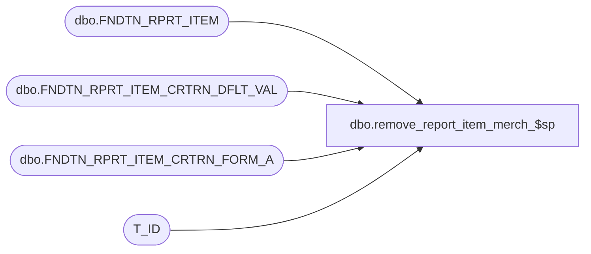

# dbo.remove_report_item_merch_$sp

**Database:** foundation  
**Server:** bedrockdb01  

## Architecture Diagram



## Table Dependencies

| Referenced Table |
|---|
| dbo.FNDTN_RPRT_ITEM |
| dbo.FNDTN_RPRT_ITEM_CRTRN_DFLT_VAL |
| dbo.FNDTN_RPRT_ITEM_CRTRN_FORM_A |
| T_ID |

## Stored Procedure Code

```sql
CREATE PROC dbo.remove_report_item_merch_$sp 
(	
	@report_server_id smallint,
	@parent_fully_qualified_name nvarchar(255),
	@name nvarchar(255)
)
AS 

	DECLARE @parent_folder_id AS T_ID;
	DECLARE @old_report_id as T_ID;
	DECLARE @fully_qualified_name nvarchar(255);
	
	IF (@parent_fully_qualified_name IS NOT NULL)
		BEGIN
			IF(@parent_fully_qualified_name = '/')
				BEGIN
					SELECT @fully_qualified_name = @parent_fully_qualified_name + @name;
				END
			ELSE
				SELECT @fully_qualified_name = @parent_fully_qualified_name + '/' + @name;
		END
	ELSE --if there is no parent given the "folder" name must be '/'
		BEGIN
			SELECT @fully_qualified_name = '/';
		END
			
	SELECT @old_report_id = (SELECT RPRT_ITEM_ID FROM dbo.FNDTN_RPRT_ITEM WHERE FLY_QLFD_NAME = @fully_qualified_name AND RPRT_SRVR_ID = @report_server_id)
	
		
	--get rid of the old report if it's there, and set the new one up
	IF @old_report_id IS NOT NULL
	  BEGIN
		DELETE FROM dbo.FNDTN_RPRT_ITEM_CRTRN_DFLT_VAL WHERE RPRT_ITEM_ID = @old_report_id
		DELETE FROM dbo.FNDTN_RPRT_ITEM_CRTRN_FORM_A WHERE RPRT_ITEM_ID = @old_report_id
		DELETE FROM dbo.FNDTN_RPRT_ITEM WHERE RPRT_ITEM_ID = @old_report_id
	  END
```

