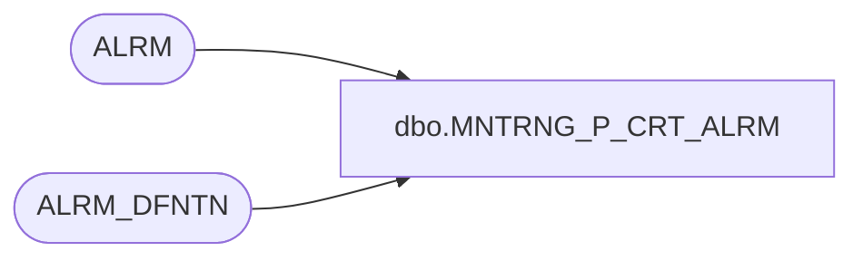

# dbo.MNTRNG_P_CRT_ALRM

**Database:** foundation_event  
**Server:** bedrockdb01  

## Architecture Diagram



## Table Dependencies

| Referenced Table |
|---|
| ALRM |
| ALRM_DFNTN |

## Stored Procedure Code

```sql
/**************************************************************** 
 Name           : MNTRNG_P_CRT_ALRM 
 Purpose        : Create alarms by running a query on events, statistics or history tables.
 Parameters     : Alarm Definition ID
 Returns        : 0 - Success, < 0 - Failure
 Created by     : Philippe Lanthier 
 Creation Date  : Jan-07-2005
****************************************************************/ 
CREATE PROCEDURE [dbo].[MNTRNG_P_CRT_ALRM]
@ALRM_DFNTN_ID int

AS
       
DECLARE @MAX_EVNT_ID int,        --Maximum event ID in the table at process time
        @KEY varchar(255),       --Contains the concatenated key names and values
        @ISERROR int,            --Indicates if an error happened
        @DT_UTC_STMP datetime,   --Current UTC process date time
        @DT_STMP datetime,       --Current process date time
        @BCKT_UTC_DTM datetime,  --Current utc bucket date time
        @ALRM_DTM datetime,  --Alarm count date time
        @NEW_ALRM_COUNT int,     --Number of new alarms that can be created
        @SQL_QRY nvarchar(4000),  --Contains query to run
        @PRMTR nvarchar(500),    --Contains parameters to run a query
        @FLD_NAME varchar(25),   --To set a field name
   
        --ALRM_DFNTN info
        @EVNT_TYPE_ID int,          --Type of event
        @TEST_BCKT_LVL smallint,    --Bucket level to test
        @LAST_EVNT_ID int,          --Last processed event id 
        @ALRM_QNTY int,             --Maximum alarms allowed in ALRM_DRTN
        @ALRM_DRTN int,             --Period of time for the ALRM_QNTY to be reached
        @ALRM_QRY nvarchar(4000),   --Query to be executed
        @LAST_ALRM_DTM datetime,    --Indicates the date time the alarm definition was ran.
        @TRGR_TYPE tinyint,         --Indicates the trigger type 1-After batch, 2-after event, 3-On timer, 4-after bucket

        @mm int,                    --Current month
        @dd int,                    --Current day
        @mi int,                    --Current minute
        @ms int,                    --Current millisecond
        @ss int,                    --Current second
        @dw int                     --Current day of week

DECLARE @KEY_TABLE table            --Table to contain the distinct keys
(
  KEYS varchar(255) NOT NULL
)

--Get alarm definition information
SELECT @EVNT_TYPE_ID  = EVNT_TYPE_ID, 
       @TEST_BCKT_LVL = TEST_BCKT_LVL, 
       @LAST_EVNT_ID  = LAST_EVNT_ID,
       @ALRM_QNTY     = ALRM_QNTY, 
       @ALRM_DRTN     = ALRM_DRTN, 
       @ALRM_QRY      = ALRM_QRY, 
       @LAST_ALRM_DTM = LAST_ALRM_DTM
--REF#61984...
,      @TRGR_TYPE = TRGR_TYPE
--REF#61984
  FROM ALRM_DFNTN
 WHERE ALRM_DFNTN_ID = @ALRM_DFNTN_ID

IF @@ERROR <> 0
   RETURN -1

CREATE TABLE #TEMP_KEY            --Table to contain the keys and IDs
(
   EVNT_ID integer NOT NULL,
   KEYS varchar(255) NOT NULL
)

SET @DT_UTC_STMP = getutcdate()
SET @DT_STMP = getdate()

IF @TEST_BCKT_LVL = 0
   SET @FLD_NAME = 'EVNT_ID'
ELSE
   IF @TEST_BCKT_LVL = 1
      SET @FLD_NAME = 'EVNT_STSTC_ID'
   ELSE
      SET @FLD_NAME = 'EVNT_STSTC_HSTRY_ID'

SELECT @mm = -DATEPART(mm, @DT_UTC_STMP), 
       @dw = -DATEPART(dw, @DT_UTC_STMP),
       @dd = -DATEPART(dd, @DT_UTC_STMP), 
       @mi = -DATEPART(mi, @DT_UTC_STMP),
       @ss = -DATEPART(ss, @DT_UTC_STMP), 
       @ms = -DATEPART(ms, @DT_UTC_STMP), 
       @ISERROR = 0, 
       @ALRM_DTM = DATEADD(mi, @ALRM_DRTN * -1, @DT_STMP)

--Set latest date time to look for
SET @BCKT_UTC_DTM = @DT_UTC_STMP --After Batch or After Event

IF @TRGR_TYPE = 3  --On Timer
   SET @BCKT_UTC_DTM = '01/01/1900 12:01:00 AM'

IF @TRGR_TYPE = 4  --After Bucket
BEGIN
   IF @TEST_BCKT_LVL = 1
      --Current hour bucket minus 1 second (to use <= instead of <)
      SET @BCKT_UTC_DTM = DATEADD(ss , -1 , DATEADD(mi, @mi, DATEADD(ss, @ss, DATEADD(ms, @ms, @DT_UTC_STMP))))

   IF @TEST_BCKT_LVL = 2
      --Current day bucket minus 1 second (to use <= instead of <)
      SET @BCKT_UTC_DTM = DATEADD(ss, -1, convert(varchar, @DT_UTC_STMP, 102))

   IF @TEST_BCKT_LVL = 3
      --Current week bucket minus 1 second (to use <= instead of <)
      SET @BCKT_UTC_DTM = DATEADD(ss, -1, DATEADD(dw, @dw + 1, convert(varchar, @DT_UTC_STMP, 102)))

   IF @TEST_BCKT_LVL = 4
      --Current month bucket minus 1 second (to use <= instead of <)
      SET @BCKT_UTC_DTM = DATEADD(ss, -1, DATEADD(dd, @dd + 1, convert(varchar, @DT_UTC_STMP,102)))

   IF @TEST_BCKT_LVL = 5
      --Current year bucket minus 1 second (to use <= instead of <)
      SET @BCKT_UTC_DTM = DATEADD(ss, -1, DATEADD(mm, @mm + 1, DATEADD(dd, @dd + 1, convert(varchar, @DT_UTC_STMP, 102))))
END

--Events
IF @TEST_BCKT_LVL = 0
BEGIN
   --Get max event id to process
   SET @SQL_QRY = N'SELECT @MAX_EVNT_ID = ISNULL(MAX(EVNT_ID), -1) FROM EVNT_' + ltrim(str(@EVNT_TYPE_ID))
   SET @PRMTR = N'@MAX_EVNT_ID integer OUTPUT'

   EXECUTE sp_executesql @SQL_QRY, @PRMTR, @MAX_EVNT_ID OUTPUT

   --Populate temp table 
   SET @SQL_QRY = N'INSERT INTO #TEMP_KEY (EVNT_ID, KEYS) ' + @ALRM_QRY + ' AND EVNT_ID >= ' + ltrim(str(@LAST_EVNT_ID + 1)) + ' AND EVNT_ID <= ' + ltrim(str(@MAX_EVNT_ID))
END

ELSE
   --Buckets and continuous
   --Populate temp table 
--REF#61984...
--   IF @LAST_ALRM_DTM IS NULL
   IF @LAST_ALRM_DTM IS NULL OR  @TEST_BCKT_LVL =  6
--REF#61984
      SET @SQL_QRY = N'INSERT INTO #TEMP_KEY (EVNT_ID, KEYS) ' + @ALRM_QRY + ' AND POST_DTM <= ''' + convert(varchar, @BCKT_UTC_DTM) + ''''
   ELSE
      SET @SQL_QRY = N'INSERT INTO #TEMP_KEY (EVNT_ID, KEYS) ' + @ALRM_QRY + ' AND POST_DTM <= ''' + convert(varchar, @BCKT_UTC_DTM) + ''' AND LAST_MDFD_DTM >= ''' + convert(varchar, @LAST_ALRM_DTM) + ''''

EXECUTE sp_executesql @SQL_QRY

IF @@ERROR <> 0
   SET @ISERROR = -2

CREATE INDEX TEMP_KEY_X1 ON #TEMP_KEY (KEYS) ON [PRIMARY]

INSERT INTO @KEY_TABLE (KEYS)
SELECT DISTINCT KEYS
  FROM #TEMP_KEY

DECLARE KEYS_CURS CURSOR LOCAL FAST_FORWARD FOR 
SELECT KEYS
  FROM @KEY_TABLE

BEGIN TRAN

OPEN KEYS_CURS 
FETCH NEXT FROM KEYS_CURS INTO @KEY

WHILE @@FETCH_STATUS = 0
BEGIN

   --Compute how many alarms can be created
   SELECT @NEW_ALRM_COUNT = @ALRM_QNTY - COUNT(*)
     FROM ALRM
    WHERE ALRM_DFNTN_ID = @ALRM_DFNTN_ID
      AND ALRM_KEY = @KEY
      AND ALRM_DTM > @ALRM_DTM

   IF @@ERROR <> 0
   BEGIN
      SET @ISERROR = -3
      BREAK
   END

   IF @NEW_ALRM_COUNT > 0
   BEGIN

      --Create alarms using the oldest ones
      SET ROWCOUNT @NEW_ALRM_COUNT

      SET @SQL_QRY = 'INSERT INTO ALRM (ALRM_DTM, EVNT_TYPE_ID, ALRM_DFNTN_ID, ' + @FLD_NAME + ', ALRM_KEY) SELECT ''' + convert(varchar, @DT_STMP, 121) + ''', ' + ltrim(str(@EVNT_TYPE_ID)) + ', ' + ltrim(str(@ALRM_DFNTN_ID)) + ', EVNT_ID, ''' + @KEY + ''' FROM #TEMP_KEY WHERE KEYS = ''' + @KEY + ''' ORDER BY EVNT_ID'

      EXECUTE sp_executesql @SQL_QRY

      IF @@ERROR <> 0
      BEGIN
         SET @ISERROR = -4
         BREAK
      END

      SET ROWCOUNT 0

   END   

	FETCH NEXT FROM KEYS_CURS INTO @KEY
END

CLOSE KEYS_CURS 
DEALLOCATE KEYS_CURS 

SET ROWCOUNT 0

IF @TEST_BCKT_LVL = 0
   --Event
   UPDATE ALRM_DFNTN 
      SET LAST_EVNT_ID = @MAX_EVNT_ID
    WHERE ALRM_DFNTN_ID = @ALRM_DFNTN_ID
ELSE
   --Statistics and history
   UPDATE ALRM_DFNTN 
      SET LAST_ALRM_DTM = @DT_STMP
    WHERE ALRM_DFNTN_ID = @ALRM_DFNTN_ID

IF @@ERROR <> 0
   SET @ISERROR = -5

DROP TABLE #TEMP_KEY
   
IF @ISERROR = 0
   COMMIT TRAN
ELSE
   ROLLBACK TRAN

RETURN @ISERROR
```

