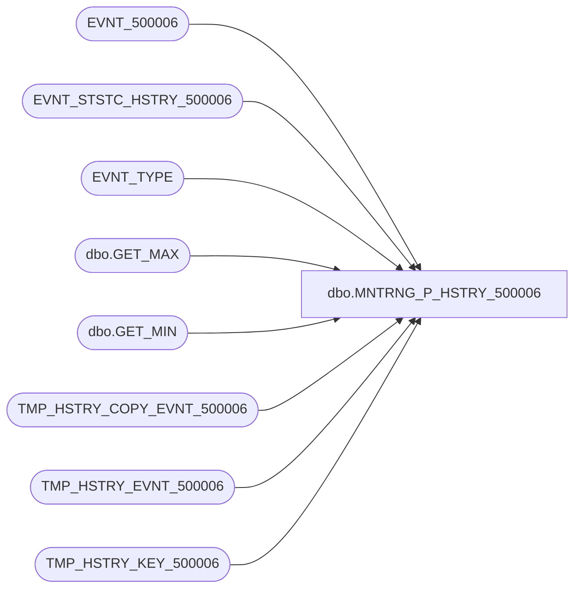

# dbo.MNTRNG_P_HSTRY_500006

**Database:** foundation_event  
**Server:** bedrockdb01  

## Architecture Diagram



## Table Dependencies

| Referenced Table |
|---|
| EVNT_500006 |
| EVNT_STSTC_HSTRY_500006 |
| EVNT_TYPE |
| dbo.GET_MAX |
| dbo.GET_MIN |
| TMP_HSTRY_COPY_EVNT_500006 |
| TMP_HSTRY_EVNT_500006 |
| TMP_HSTRY_KEY_500006 |

## Stored Procedure Code

```sql
CREATE PROCEDURE [dbo].[MNTRNG_P_HSTRY_500006] 

@BATCH_SIZE as int --Max number of records in a batch
AS

--Create temporary event table to keep a copy of the batch
IF EXISTS (SELECT * FROM sysobjects WHERE xtype = 'U' AND name = 'TMP_HSTRY_COPY_EVNT_500006')
   DROP TABLE dbo.TMP_HSTRY_COPY_EVNT_500006

CREATE TABLE dbo.TMP_HSTRY_COPY_EVNT_500006
(
   ID_CLMN integer NOT NULL,
   POST_YEAR smallint NOT NULL,
   POST_MNTH tinyint NOT NULL,
   POST_WEEK tinyint NOT NULL,
   POST_DAY tinyint NOT NULL,
   POST_DTM smalldatetime NOT NULL
   , SRVR_NAME nvarchar(50) NOT NULL 
 , APP_ID decimal NOT NULL 
 , PRDCT_ID nvarchar(30) NOT NULL 
 , INSTNC_NUM smallint NOT NULL 
    , FLD_34 nvarchar(50) NULL 
   , FLD_35 smallint NULL 
   , FLD_126 nvarchar(20) NULL 
   , FLD_127 int NULL 
   , FLD_15 smallint NULL 
   , FLD_16 bigint NULL 
   , FLD_17 bigint NULL 
   , FLD_128 smallint NULL 
   , FLD_129 smallint NULL 
   , FLD_49 nvarchar(20) NULL 
   , FLD_48 int NULL 

) ON [PRIMARY]

CREATE CLUSTERED INDEX TMP_HSTRY_COPY_EVNT_500006_1 ON dbo.TMP_HSTRY_COPY_EVNT_500006 (ID_CLMN) ON [PRIMARY]

--Create temporary event table
IF EXISTS (SELECT * FROM sysobjects WHERE xtype = 'U' AND name = 'TMP_HSTRY_EVNT_500006')
   DROP TABLE dbo.TMP_HSTRY_EVNT_500006

CREATE TABLE dbo.TMP_HSTRY_EVNT_500006
(
   ID_CLMN integer NOT NULL,
   POST_YEAR smallint NOT NULL,
   POST_MNTH tinyint NOT NULL,
   POST_WEEK tinyint NOT NULL,
   POST_DAY tinyint NOT NULL,
   POST_DTM smalldatetime NOT NULL
   , SRVR_NAME nvarchar(50) NOT NULL 
 , APP_ID decimal NOT NULL 
 , PRDCT_ID nvarchar(30) NOT NULL 
 , INSTNC_NUM smallint NOT NULL 
    , FLD_34 nvarchar(50) NULL 
   , FLD_35 smallint NULL 
   , FLD_126 nvarchar(20) NULL 
   , FLD_127 int NULL 
   , FLD_15 smallint NULL 
   , FLD_16 bigint NULL 
   , FLD_17 bigint NULL 
   , FLD_128 smallint NULL 
   , FLD_129 smallint NULL 
   , FLD_49 nvarchar(20) NULL 
   , FLD_48 int NULL 

) ON [PRIMARY]

--Indexes to speed up process
CREATE INDEX TMP_HSTRY_EVNT_500006_1 ON dbo.TMP_HSTRY_EVNT_500006 (POST_YEAR, POST_MNTH, POST_WEEK, POST_DAY , SRVR_NAME , APP_ID , PRDCT_ID , INSTNC_NUM , FLD_34 , FLD_35 , FLD_126 , FLD_127 ) ON [PRIMARY] 
CREATE CLUSTERED INDEX TMP_HSTRY_EVNT_500006_2 ON dbo.TMP_HSTRY_EVNT_500006 (ID_CLMN) ON [PRIMARY]

--Create temporary event table for history ids
IF EXISTS (SELECT * FROM sysobjects WHERE xtype = 'U' AND name = 'TMP_HSTRY_KEY_500006')
   DROP TABLE dbo.TMP_HSTRY_KEY_500006

CREATE TABLE dbo.TMP_HSTRY_KEY_500006
(
   POST_YEAR smallint NOT NULL,
   POST_MNTH tinyint NOT NULL,
   POST_WEEK tinyint NOT NULL,
   POST_DAY tinyint NOT NULL,
   POST_DTM smalldatetime NOT NULL
  , SRVR_NAME nvarchar(50) NOT NULL 
 , APP_ID decimal NOT NULL 
 , PRDCT_ID nvarchar(30) NOT NULL 
 , INSTNC_NUM smallint NOT NULL 
    , KEY_34 nvarchar(50) NULL 
   , KEY_35 smallint NULL 
   , KEY_126 nvarchar(20) NULL 
   , KEY_127 int NULL 
   , FLD_17_SUM float NULL 
   , FLD_17_MIN bigint NULL 
   , FLD_17_MAX bigint NULL 

 , CNT integer NOT NULL
 , MIN_ID integer NOT NULL
 , MAX_ID integer NOT NULL
)

--Indexes to speed up process
CREATE INDEX TMP_HSTRY_KEY_500006_1 ON dbo.TMP_HSTRY_KEY_500006 (POST_YEAR, POST_MNTH, POST_WEEK, POST_DAY , SRVR_NAME , APP_ID , PRDCT_ID , INSTNC_NUM , KEY_34 , KEY_35 , KEY_126 , KEY_127 ) ON [PRIMARY] 
CREATE CLUSTERED INDEX TMP_HSTRY_KEY_500006_2 ON dbo.TMP_HSTRY_KEY_500006 (MIN_ID, MAX_ID) ON [PRIMARY]

--Variables
DECLARE @MAX_EVNT_ID as int,        --Last event id processed during this cycle
        @STRT_EVNT_ID as int,       --First event of batch
        @END_EVNT_ID as int,        --Last event of batch
        @LAST_HSTRY_EVNT_ID as int, --Last event id processed in the previous cycle
        @EVNT_TYPE_ID as int,       --Constant for Event Type ID
        @ERROR as int,              --Error return code
        @ROWS as int,               --Total number of events processed
        @ROWCOUNT as int,           --Number of events processed in a batch
        @DAY_LVL as int,            --Day level
        @MNTH_LVL as int,           --Month level
        @WEEK_LVL as int,           --Week level
        @YEAR_LVL as int,           --Year level
        @STSTC_LVL as int           --Statistics level

SELECT @EVNT_TYPE_ID = 500006, @ERROR = 0 , @ROWS = 0, @END_EVNT_ID = 0

--Get last event id processed during this cycle
SELECT @MAX_EVNT_ID = MAX(ISNULL(EVNT_ID,0))
  FROM EVNT_500006

SELECT @DAY_LVL = NUM_STSTC_KEEP_DAY,
       @MNTH_LVL = NUM_STSTC_KEEP_MNTH,
       @WEEK_LVL = NUM_STSTC_KEEP_WEEK,
       @YEAR_LVL = NUM_STSTC_KEEP_YEAR,
       @STSTC_LVL = STSTC_LVL
  FROM EVNT_TYPE
 WHERE EVNT_TYPE_ID = @EVNT_TYPE_ID

IF (@@ERROR <> 0)
BEGIN
   SELECT @ERROR = -1
   RETURN @ERROR
END

--Loop to process all events by doing it in smaller batch
WHILE @END_EVNT_ID < @MAX_EVNT_ID
BEGIN

   --Get last event id processed in the previous cycle and the statistics levels
   SELECT @LAST_HSTRY_EVNT_ID = ISNULL(LAST_HSTRY_EVNT_ID,0)
     FROM EVNT_TYPE
    WHERE EVNT_TYPE_ID = @EVNT_TYPE_ID

   IF (@@ERROR <> 0)
   BEGIN
      SELECT @ERROR = -2
      BREAK
   END

   --Set the batch range
   SELECT @STRT_EVNT_ID = @LAST_HSTRY_EVNT_ID + 1, 
          @END_EVNT_ID = @LAST_HSTRY_EVNT_ID + @BATCH_SIZE

   --Make sure to stay within the range of events to process
   IF @END_EVNT_ID > @MAX_EVNT_ID
      SELECT @END_EVNT_ID = @MAX_EVNT_ID

   IF @STRT_EVNT_ID > @END_EVNT_ID
   BEGIN
      SELECT @ERROR = @ROWS 
      BREAK
   END

   BEGIN TRAN

   --Populate the temporary event table using only the new events
   INSERT INTO TMP_HSTRY_COPY_EVNT_500006 (ID_CLMN, POST_YEAR, POST_MNTH, POST_WEEK, POST_DAY, POST_DTM , SRVR_NAME , APP_ID , PRDCT_ID , INSTNC_NUM , FLD_34 , FLD_35 , FLD_126 , FLD_127 , FLD_15 , FLD_16 , FLD_17 , FLD_128 , FLD_129 , FLD_49 , FLD_48 )
   SELECT EVNT_ID,
         DATEPART(yy,EVNT_POST_DTM),
         DATEPART(mm,EVNT_POST_DTM),
         DATEPART(ww,EVNT_POST_DTM),
         DATEPART(dd,EVNT_POST_DTM),   
         DATEADD(ms, -DATEPART(ms, EVNT_POST_DTM), DATEADD(ss, -DATEPART(ss, EVNT_POST_DTM), DATEADD(mi, -DATEPART(mi, EVNT_POST_DTM), DATEADD(hh, -DATEPART(hh, EVNT_POST_DTM), EVNT_POST_DTM)))) 
         , SRVR_NAME , APP_ID , PRDCT_ID , INSTNC_NUM , FLD_34 , FLD_35 , FLD_126 , FLD_127 , FLD_15 , FLD_16 , FLD_17 , FLD_128 , FLD_129 , FLD_49 , FLD_48 
    FROM EVNT_500006
   WHERE EVNT_ID BETWEEN @STRT_EVNT_ID AND @END_EVNT_ID

   --Get the number of rows processed
   SELECT @ROWCOUNT = @@ROWCOUNT, @ERROR = @@ERROR

   IF (@ERROR <> 0)
   BEGIN
      ROLLBACK TRAN
      SELECT @ERROR = -3
      BREAK
   END

   --Add the processed rows
   SELECT @ROWS = @ROWS + @ROWCOUNT

   --Day bucket
   IF (@DAY_LVL > 0)
   BEGIN

      --Step 0-Populate the temporary event table from the copy
      INSERT INTO TMP_HSTRY_EVNT_500006 
      SELECT ID_CLMN,
             POST_YEAR,
             POST_MNTH,
             POST_WEEK,
             POST_DAY,
             POST_DTM 
             , SRVR_NAME , APP_ID , PRDCT_ID , INSTNC_NUM , FLD_34 , FLD_35 , FLD_126 , FLD_127 , FLD_15 , FLD_16 , FLD_17 , FLD_128 , FLD_129 , FLD_49 , FLD_48 
        FROM TMP_HSTRY_COPY_EVNT_500006 

      IF (@@ERROR <> 0)
      BEGIN
         ROLLBACK TRAN
         SELECT @ERROR = -4
         BREAK
      END
      
      --Step 1-Insert computed values from the temp event table
      INSERT TMP_HSTRY_KEY_500006 (POST_YEAR, POST_MNTH, POST_WEEK, POST_DAY , SRVR_NAME , APP_ID , PRDCT_ID , INSTNC_NUM , KEY_34 , KEY_35 , KEY_126 , KEY_127  , FLD_17_SUM , FLD_17_MIN , FLD_17_MAX , POST_DTM, CNT, MIN_ID, MAX_ID)
      SELECT MIN(POST_YEAR), MIN(POST_MNTH), 0, MIN(POST_DAY) , MIN(SRVR_NAME) , MIN(APP_ID) , MIN(PRDCT_ID) , MIN(INSTNC_NUM) , MIN(FLD_34) , MIN(FLD_35) , MIN(FLD_126) , MIN(FLD_127) , SUM(FLD_17) , MIN(FLD_17) , MAX(FLD_17) , '01/01/1900 12:01:00 AM', COUNT(*), MIN(ID_CLMN), MAX(ID_CLMN)
        FROM TMP_HSTRY_EVNT_500006
        GROUP BY  SRVR_NAME , APP_ID , PRDCT_ID , INSTNC_NUM , FLD_34 , FLD_35 , FLD_126 , FLD_127 

      IF (@@ERROR <> 0)
      BEGIN
         ROLLBACK TRAN
         SELECT @ERROR = -5
         BREAK
      END

      --Step 2-Update actual statistics using the computed value temporary table
      UPDATE EVNT_STSTC_HSTRY_500006 SET 
             EVNT_STSTC_HSTRY_500006.CNT = s.CNT + te.CNT,
             EVNT_STSTC_HSTRY_500006.LAST_MDFD_DTM = getdate() 
             , EVNT_STSTC_HSTRY_500006.FLD_15_LAST = L.FLD_15 
 , EVNT_STSTC_HSTRY_500006.FLD_17_SUM = s.FLD_17_SUM + te.FLD_17_SUM 
 , EVNT_STSTC_HSTRY_500006.FLD_17_MIN = dbo.GET_MIN(s.FLD_17_MIN, te.FLD_17_MIN) 
 , EVNT_STSTC_HSTRY_500006.FLD_17_MAX = dbo.GET_MAX(s.FLD_17_MAX, te.FLD_17_MAX) 
 , EVNT_STSTC_HSTRY_500006.FLD_128_LAST = L.FLD_128 
 , EVNT_STSTC_HSTRY_500006.FLD_129_LAST = L.FLD_129 
 
        FROM TMP_HSTRY_KEY_500006 te, EVNT_STSTC_HSTRY_500006 s, TMP_HSTRY_EVNT_500006 F, TMP_HSTRY_EVNT_500006 L
       WHERE te.MIN_ID = F.ID_CLMN 
         AND te.MAX_ID = L.ID_CLMN
         AND s.POST_YEAR = te.POST_YEAR
         AND s.POST_MNTH = te.POST_MNTH
         AND s.POST_WEEK = 0
         AND s.POST_DAY  = te.POST_DAY 
              AND s.SRVR_NAME = te.SRVR_NAME 
  AND s.APP_ID = te.APP_ID 
  AND s.PRDCT_ID = te.PRDCT_ID 
  AND s.INSTNC_NUM = te.INSTNC_NUM 
  AND s.KEY_34 = te.KEY_34 
  AND s.KEY_35 = te.KEY_35 
  AND s.KEY_126 = te.KEY_126 
  AND s.KEY_127 = te.KEY_127 
    

      IF (@@ERROR <> 0)
      BEGIN
         ROLLBACK TRAN
         SELECT @ERROR = -6
         BREAK
      END

      --Step 3-clean the computed value temp table
      TRUNCATE TABLE TMP_HSTRY_KEY_500006
      
      --Step 4-Delete temporary events already used to update statistics
      DELETE TMP_HSTRY_EVNT_500006
        FROM TMP_HSTRY_EVNT_500006 te, EVNT_STSTC_HSTRY_500006 s
       WHERE s.POST_YEAR = te.POST_YEAR
         AND s.POST_MNTH = te.POST_MNTH
         AND s.POST_WEEK = 0
         AND s.POST_DAY  = te.POST_DAY 
              AND s.SRVR_NAME = te.SRVR_NAME 
  AND s.APP_ID = te.APP_ID 
  AND s.PRDCT_ID = te.PRDCT_ID 
  AND s.INSTNC_NUM = te.INSTNC_NUM 
  AND s.KEY_34 = te.FLD_34 
  AND s.KEY_35 = te.FLD_35 
  AND s.KEY_126 = te.FLD_126 
  AND s.KEY_127 = te.FLD_127 
    

      IF (@@ERROR <> 0)
      BEGIN
         ROLLBACK TRAN
         SELECT @ERROR = -7
         BREAK
      END

      --Step 5-Insert computed values from the temp event table
      INSERT TMP_HSTRY_KEY_500006 (POST_YEAR, POST_MNTH, POST_WEEK, POST_DAY , SRVR_NAME , APP_ID , PRDCT_ID , INSTNC_NUM , KEY_34 , KEY_35 , KEY_126 , KEY_127  , FLD_17_SUM , FLD_17_MIN , FLD_17_MAX , POST_DTM, CNT, MIN_ID, MAX_ID)
      SELECT MIN(POST_YEAR), MIN(POST_MNTH), 0, MIN(POST_DAY) , MIN(SRVR_NAME) , MIN(APP_ID) , MIN(PRDCT_ID) , MIN(INSTNC_NUM) , MIN(FLD_34) , MIN(FLD_35) , MIN(FLD_126) , MIN(FLD_127) , SUM(FLD_17) , MIN(FLD_17) , MAX(FLD_17) , MIN(POST_DTM), COUNT(*), MIN(ID_CLMN), MAX(ID_CLMN)
        FROM TMP_HSTRY_EVNT_500006
        GROUP BY POST_YEAR, POST_MNTH, POST_WEEK, POST_DAY , SRVR_NAME , APP_ID , PRDCT_ID , INSTNC_NUM , FLD_34 , FLD_35 , FLD_126 , FLD_127 

      IF (@@ERROR <> 0)
      BEGIN
         ROLLBACK TRAN
         SELECT @ERROR = -8
         BREAK
      END

      --Step 6-Insert new keys using the computed value temporary table
      INSERT EVNT_STSTC_HSTRY_500006 (POST_DTM, POST_YEAR, POST_MNTH, POST_WEEK, POST_DAY , SRVR_NAME , APP_ID , PRDCT_ID , INSTNC_NUM , KEY_34 , KEY_35 , KEY_126 , KEY_127 , CNT , FLD_15_LAST 
 , FLD_17_SUM , FLD_17_MIN , FLD_17_MAX , FLD_128_LAST 
 , FLD_129_LAST 
 )
      SELECT D.POST_DTM, D.POST_YEAR, D.POST_MNTH, 0, D.POST_DAY , D.SRVR_NAME , D.APP_ID , D.PRDCT_ID , D.INSTNC_NUM , D.KEY_34 , D.KEY_35 , D.KEY_126 , D.KEY_127 , D.CNT , L.FLD_15 , D.FLD_17_SUM , D.FLD_17_MIN , D.FLD_17_MAX , L.FLD_128 , L.FLD_129 
        FROM TMP_HSTRY_EVNT_500006 F, TMP_HSTRY_EVNT_500006 L, TMP_HSTRY_KEY_500006 D
       WHERE D.MIN_ID = F.ID_CLMN 
         AND D.MAX_ID = L.ID_CLMN

      IF (@@ERROR <> 0)
      BEGIN
         ROLLBACK TRAN
         SELECT @ERROR = -9
         BREAK
      END

      --Step 7-Clean temp tables
      TRUNCATE TABLE TMP_HSTRY_EVNT_500006
      TRUNCATE TABLE TMP_HSTRY_KEY_500006
   END

   --Week bucket
   IF (@WEEK_LVL > 0)
   BEGIN

      --Step 0-Populate the temporary event table from the copy
      INSERT INTO TMP_HSTRY_EVNT_500006 
      SELECT ID_CLMN,
             POST_YEAR,
             POST_MNTH,
             POST_WEEK,
             POST_DAY,
             POST_DTM 
             , SRVR_NAME , APP_ID , PRDCT_ID , INSTNC_NUM , FLD_34 , FLD_35 , FLD_126 , FLD_127 , FLD_15 , FLD_16 , FLD_17 , FLD_128 , FLD_129 , FLD_49 , FLD_48  
        FROM TMP_HSTRY_COPY_EVNT_500006 

      IF (@@ERROR <> 0)
      BEGIN
         ROLLBACK TRAN
         SELECT @ERROR = -10
         BREAK
      END

      --Step 1-Insert computed values from the temp event table
      INSERT TMP_HSTRY_KEY_500006 (POST_YEAR, POST_MNTH, POST_WEEK, POST_DAY , SRVR_NAME , APP_ID , PRDCT_ID , INSTNC_NUM , KEY_34 , KEY_35 , KEY_126 , KEY_127  , FLD_17_SUM , FLD_17_MIN , FLD_17_MAX , POST_DTM, CNT, MIN_ID, MAX_ID)
      SELECT MIN(POST_YEAR), 0, MIN(POST_WEEK), 0 , MIN(SRVR_NAME) , MIN(APP_ID) , MIN(PRDCT_ID) , MIN(INSTNC_NUM) , MIN(FLD_34) , MIN(FLD_35) , MIN(FLD_126) , MIN(FLD_127) , SUM(FLD_17) , MIN(FLD_17) , MAX(FLD_17) , '01/01/1900 12:01:00 AM', COUNT(*), MIN(ID_CLMN), MAX(ID_CLMN)
        FROM TMP_HSTRY_EVNT_500006
        GROUP BY  SRVR_NAME , APP_ID , PRDCT_ID , INSTNC_NUM , FLD_34 , FLD_35 , FLD_126 , FLD_127 

      IF (@@ERROR <> 0)
      BEGIN
         ROLLBACK TRAN
         SELECT @ERROR = -11
         BREAK
      END

      --Step 2-Update actual statistics using the computed value temporary table
      UPDATE EVNT_STSTC_HSTRY_500006 SET 
             EVNT_STSTC_HSTRY_500006.CNT = s.CNT + te.CNT,
             EVNT_STSTC_HSTRY_500006.LAST_MDFD_DTM = getdate()
             , EVNT_STSTC_HSTRY_500006.FLD_15_LAST = L.FLD_15 
 , EVNT_STSTC_HSTRY_500006.FLD_17_SUM = s.FLD_17_SUM + te.FLD_17_SUM 
 , EVNT_STSTC_HSTRY_500006.FLD_17_MIN = dbo.GET_MIN(s.FLD_17_MIN, te.FLD_17_MIN) 
 , EVNT_STSTC_HSTRY_500006.FLD_17_MAX = dbo.GET_MAX(s.FLD_17_MAX, te.FLD_17_MAX) 
 , EVNT_STSTC_HSTRY_500006.FLD_128_LAST = L.FLD_128 
 , EVNT_STSTC_HSTRY_500006.FLD_129_LAST = L.FLD_129 
 
        FROM TMP_HSTRY_KEY_500006 te, EVNT_STSTC_HSTRY_500006 s, TMP_HSTRY_EVNT_500006 F, TMP_HSTRY_EVNT_500006 L
       WHERE te.MIN_ID = F.ID_CLMN 
         AND te.MAX_ID = L.ID_CLMN
         AND s.POST_YEAR = te.POST_YEAR
         AND s.POST_MNTH = 0
         AND s.POST_WEEK = te.POST_WEEK
         AND s.POST_DAY  = 0 
              AND s.SRVR_NAME = te.SRVR_NAME 
  AND s.APP_ID = te.APP_ID 
  AND s.PRDCT_ID = te.PRDCT_ID 
  AND s.INSTNC_NUM = te.INSTNC_NUM 
  AND s.KEY_34 = te.KEY_34 
  AND s.KEY_35 = te.KEY_35 
  AND s.KEY_126 = te.KEY_126 
  AND s.KEY_127 = te.KEY_127 
    

      IF (@@ERROR <> 0)
      BEGIN
         ROLLBACK TRAN
         SELECT @ERROR = -12
         BREAK
      END

      --Step 3-clean the computed value temp table
      TRUNCATE TABLE TMP_HSTRY_KEY_500006
      
      --Step 4-Delete temporary events already used to update statistics
      DELETE TMP_HSTRY_EVNT_500006
        FROM TMP_HSTRY_EVNT_500006 te, EVNT_STSTC_HSTRY_500006 s
       WHERE s.POST_YEAR = te.POST_YEAR
         AND s.POST_MNTH = 0
         AND s.POST_WEEK = te.POST_WEEK
         AND s.POST_DAY  = 0 
              AND s.SRVR_NAME = te.SRVR_NAME 
  AND s.APP_ID = te.APP_ID 
  AND s.PRDCT_ID = te.PRDCT_ID 
  AND s.INSTNC_NUM = te.INSTNC_NUM 
  AND s.KEY_34 = te.FLD_34 
  AND s.KEY_35 = te.FLD_35 
  AND s.KEY_126 = te.FLD_126 
  AND s.KEY_127 = te.FLD_127 
    

      IF (@@ERROR <> 0)
      BEGIN
         ROLLBACK TRAN
         SELECT @ERROR = -13
         BREAK
      END

      --Step 5-Insert computed values from the temp event table
      INSERT TMP_HSTRY_KEY_500006 (POST_YEAR, POST_MNTH, POST_WEEK, POST_DAY , SRVR_NAME , APP_ID , PRDCT_ID , INSTNC_NUM , KEY_34 , KEY_35 , KEY_126 , KEY_127  , FLD_17_SUM , FLD_17_MIN , FLD_17_MAX , POST_DTM, CNT, MIN_ID, MAX_ID)
      SELECT MIN(POST_YEAR), 0, MIN(POST_WEEK), 0 , MIN(SRVR_NAME) , MIN(APP_ID) , MIN(PRDCT_ID) , MIN(INSTNC_NUM) , MIN(FLD_34) , MIN(FLD_35) , MIN(FLD_126) , MIN(FLD_127) , SUM(FLD_17) , MIN(FLD_17) , MAX(FLD_17) , MIN(DATEADD(dd, DATEPART(dy, POST_DTM) - DATEPART(dw, POST_DTM), DATEADD(mm, -DATEPART(mm, POST_DTM) + 1, DATEADD(dd, -DATEPART(dd, POST_DTM) + 1, POST_DTM)))), COUNT(*), MIN(ID_CLMN), MAX(ID_CLMN)
        FROM TMP_HSTRY_EVNT_500006
        GROUP BY POST_YEAR, POST_WEEK , SRVR_NAME , APP_ID , PRDCT_ID , INSTNC_NUM , FLD_34 , FLD_35 , FLD_126 , FLD_127 

      IF (@@ERROR <> 0)
      BEGIN
         ROLLBACK TRAN
         SELECT @ERROR = -14
         BREAK
      END

      --Step 6-Insert new keys using the computed value temporary table
      INSERT EVNT_STSTC_HSTRY_500006 (POST_DTM, POST_YEAR, POST_MNTH, POST_WEEK, POST_DAY , SRVR_NAME , APP_ID , PRDCT_ID , INSTNC_NUM , KEY_34 , KEY_35 , KEY_126 , KEY_127 , CNT , FLD_15_LAST 
 , FLD_17_SUM , FLD_17_MIN , FLD_17_MAX , FLD_128_LAST 
 , FLD_129_LAST 
 )
      SELECT D.POST_DTM, D.POST_YEAR, 0, D.POST_WEEK, 0 , D.SRVR_NAME , D.APP_ID , D.PRDCT_ID , D.INSTNC_NUM , D.KEY_34 , D.KEY_35 , D.KEY_126 , D.KEY_127 , D.CNT , L.FLD_15 , D.FLD_17_SUM , D.FLD_17_MIN , D.FLD_17_MAX , L.FLD_128 , L.FLD_129 
        FROM TMP_HSTRY_EVNT_500006 F, TMP_HSTRY_EVNT_500006 L, TMP_HSTRY_KEY_500006 D
       WHERE D.MIN_ID = F.ID_CLMN 
         AND D.MAX_ID = L.ID_CLMN

      IF (@@ERROR <> 0)
      BEGIN
         ROLLBACK TRAN
         SELECT @ERROR = -15
         BREAK
      END

      --Step 7-Clean temp tables
      TRUNCATE TABLE TMP_HSTRY_EVNT_500006
      TRUNCATE TABLE TMP_HSTRY_KEY_500006
   END

   --Month bucket
   IF (@MNTH_LVL > 0)
   BEGIN

      --Step 0-Populate the temporary event table from the copy
      INSERT INTO TMP_HSTRY_EVNT_500006 
      SELECT ID_CLMN,
             POST_YEAR,
             POST_MNTH,
             POST_WEEK,
             POST_DAY,
             POST_DTM
             , SRVR_NAME , APP_ID , PRDCT_ID , INSTNC_NUM , FLD_34 , FLD_35 , FLD_126 , FLD_127 , FLD_15 , FLD_16 , FLD_17 , FLD_128 , FLD_129 , FLD_49 , FLD_48  
        FROM TMP_HSTRY_COPY_EVNT_500006 

      IF (@@ERROR <> 0)
      BEGIN
         ROLLBACK TRAN
         SELECT @ERROR = -16
         BREAK
      END

      --Step 1-Insert computed values from the temp event table
      INSERT TMP_HSTRY_KEY_500006 (POST_YEAR, POST_MNTH, POST_WEEK, POST_DAY , SRVR_NAME , APP_ID , PRDCT_ID , INSTNC_NUM , KEY_34 , KEY_35 , KEY_126 , KEY_127  , FLD_17_SUM , FLD_17_MIN , FLD_17_MAX , POST_DTM, CNT, MIN_ID, MAX_ID)
      SELECT MIN(POST_YEAR), MIN(POST_MNTH), 0, 0 , MIN(SRVR_NAME) , MIN(APP_ID) , MIN(PRDCT_ID) , MIN(INSTNC_NUM) , MIN(FLD_34) , MIN(FLD_35) , MIN(FLD_126) , MIN(FLD_127) , SUM(FLD_17) , MIN(FLD_17) , MAX(FLD_17) , '01/01/1900 12:01:00 AM', COUNT(*), MIN(ID_CLMN), MAX(ID_CLMN)
        FROM TMP_HSTRY_EVNT_500006
        GROUP BY  SRVR_NAME , APP_ID , PRDCT_ID , INSTNC_NUM , FLD_34 , FLD_35 , FLD_126 , FLD_127 

      IF (@@ERROR <> 0)
      BEGIN
         ROLLBACK TRAN
         SELECT @ERROR = -17
         BREAK
      END

      --Step 2-Update actual statistics using the computed value temporary table
      UPDATE EVNT_STSTC_HSTRY_500006 SET 
             EVNT_STSTC_HSTRY_500006.CNT = s.CNT + te.CNT,
             EVNT_STSTC_HSTRY_500006.LAST_MDFD_DTM = getdate()
             , EVNT_STSTC_HSTRY_500006.FLD_15_LAST = L.FLD_15 
 , EVNT_STSTC_HSTRY_500006.FLD_17_SUM = s.FLD_17_SUM + te.FLD_17_SUM 
 , EVNT_STSTC_HSTRY_500006.FLD_17_MIN = dbo.GET_MIN(s.FLD_17_MIN, te.FLD_17_MIN) 
 , EVNT_STSTC_HSTRY_500006.FLD_17_MAX = dbo.GET_MAX(s.FLD_17_MAX, te.FLD_17_MAX) 
 , EVNT_STSTC_HSTRY_500006.FLD_128_LAST = L.FLD_128 
 , EVNT_STSTC_HSTRY_500006.FLD_129_LAST = L.FLD_129 
 
        FROM TMP_HSTRY_KEY_500006 te, EVNT_STSTC_HSTRY_500006 s, TMP_HSTRY_EVNT_500006 F, TMP_HSTRY_EVNT_500006 L
       WHERE te.MIN_ID = F.ID_CLMN 
         AND te.MAX_ID = L.ID_CLMN
         AND s.POST_YEAR = te.POST_YEAR
         AND s.POST_MNTH = te.POST_MNTH
         AND s.POST_WEEK = 0
         AND s.POST_DAY  = 0 
              AND s.SRVR_NAME = te.SRVR_NAME 
  AND s.APP_ID = te.APP_ID 
  AND s.PRDCT_ID = te.PRDCT_ID 
  AND s.INSTNC_NUM = te.INSTNC_NUM 
  AND s.KEY_34 = te.KEY_34 
  AND s.KEY_35 = te.KEY_35 
  AND s.KEY_126 = te.KEY_126 
  AND s.KEY_127 = te.KEY_127 
    

      IF (@@ERROR <> 0)
      BEGIN
         ROLLBACK TRAN
         SELECT @ERROR = -18
         BREAK
      END

      --Step 3-clean the computed value temp table
      TRUNCATE TABLE TMP_HSTRY_KEY_500006
      
      --Step 4-Delete temporary events already used to update statistics
      DELETE TMP_HSTRY_EVNT_500006
        FROM TMP_HSTRY_EVNT_500006 te, EVNT_STSTC_HSTRY_500006 s
       WHERE s.POST_YEAR = te.POST_YEAR
         AND s.POST_MNTH = te.POST_MNTH
         AND s.POST_WEEK = 0
         AND s.POST_DAY  = 0
              AND s.SRVR_NAME = te.SRVR_NAME 
  AND s.APP_ID = te.APP_ID 
  AND s.PRDCT_ID = te.PRDCT_ID 
  AND s.INSTNC_NUM = te.INSTNC_NUM 
  AND s.KEY_34 = te.FLD_34 
  AND s.KEY_35 = te.FLD_35 
  AND s.KEY_126 = te.FLD_126 
  AND s.KEY_127 = te.FLD_127 
    

      IF (@@ERROR <> 0)
      BEGIN
         ROLLBACK TRAN
         SELECT @ERROR = -19
         BREAK
      END

      --Step 5-Insert computed values from the temp event table
      INSERT TMP_HSTRY_KEY_500006 (POST_YEAR, POST_MNTH, POST_WEEK, POST_DAY , SRVR_NAME , APP_ID , PRDCT_ID , INSTNC_NUM , KEY_34 , KEY_35 , KEY_126 , KEY_127  , FLD_17_SUM , FLD_17_MIN , FLD_17_MAX , POST_DTM, CNT, MIN_ID, MAX_ID)
      SELECT MIN(POST_YEAR), MIN(POST_MNTH), 0, 0 , MIN(SRVR_NAME) , MIN(APP_ID) , MIN(PRDCT_ID) , MIN(INSTNC_NUM) , MIN(FLD_34) , MIN(FLD_35) , MIN(FLD_126) , MIN(FLD_127) , SUM(FLD_17) , MIN(FLD_17) , MAX(FLD_17) , MIN(DATEADD(dd, -DATEPART(dd, POST_DTM)+1, POST_DTM)), COUNT(*), MIN(ID_CLMN), MAX(ID_CLMN)
        FROM TMP_HSTRY_EVNT_500006
        GROUP BY POST_YEAR, POST_MNTH , SRVR_NAME , APP_ID , PRDCT_ID , INSTNC_NUM , FLD_34 , FLD_35 , FLD_126 , FLD_127 

      IF (@@ERROR <> 0)
      BEGIN
         ROLLBACK TRAN
         SELECT @ERROR = -20
         BREAK
      END

      --Step 6-Insert new keys using the computed value temporary table
      INSERT EVNT_STSTC_HSTRY_500006 (POST_DTM, POST_YEAR, POST_MNTH, POST_WEEK, POST_DAY , SRVR_NAME , APP_ID , PRDCT_ID , INSTNC_NUM , KEY_34 , KEY_35 , KEY_126 , KEY_127 , CNT , FLD_15_LAST 
 , FLD_17_SUM , FLD_17_MIN , FLD_17_MAX , FLD_128_LAST 
 , FLD_129_LAST 
 )
      SELECT D.POST_DTM, D.POST_YEAR, D.POST_MNTH, 0, 0 , D.SRVR_NAME , D.APP_ID , D.PRDCT_ID , D.INSTNC_NUM , D.KEY_34 , D.KEY_35 , D.KEY_126 , D.KEY_127 , D.CNT , L.FLD_15 , D.FLD_17_SUM , D.FLD_17_MIN , D.FLD_17_MAX , L.FLD_128 , L.FLD_129 
        FROM TMP_HSTRY_EVNT_500006 F, TMP_HSTRY_EVNT_500006 L, TMP_HSTRY_KEY_500006 D
       WHERE D.MIN_ID = F.ID_CLMN 
         AND D.MAX_ID = L.ID_CLMN

      IF (@@ERROR <> 0)
      BEGIN
         ROLLBACK TRAN
         SELECT @ERROR = -21
         BREAK
      END
      
      --Step 7-Clean temp tables
      TRUNCATE TABLE TMP_HSTRY_EVNT_500006
      TRUNCATE TABLE TMP_HSTRY_KEY_500006
   END

   --Year bucket
   IF (@YEAR_LVL > 0)
   BEGIN

      --Step 0-Populate the temporary event table from the copy
      INSERT INTO TMP_HSTRY_EVNT_500006 
      SELECT ID_CLMN,
             POST_YEAR,
             POST_MNTH,
             POST_WEEK,
             POST_DAY,
             POST_DTM
             , SRVR_NAME , APP_ID , PRDCT_ID , INSTNC_NUM , FLD_34 , FLD_35 , FLD_126 , FLD_127 , FLD_15 , FLD_16 , FLD_17 , FLD_128 , FLD_129 , FLD_49 , FLD_48 
        FROM TMP_HSTRY_COPY_EVNT_500006 

      IF (@@ERROR <> 0)
      BEGIN
         ROLLBACK TRAN
         SELECT @ERROR = -22
         BREAK
      END

      --Step 1-Insert computed values from the temp event table
      INSERT TMP_HSTRY_KEY_500006 (POST_YEAR, POST_MNTH, POST_WEEK, POST_DAY , SRVR_NAME , APP_ID , PRDCT_ID , INSTNC_NUM , KEY_34 , KEY_35 , KEY_126 , KEY_127  , FLD_17_SUM , FLD_17_MIN , FLD_17_MAX , POST_DTM, CNT, MIN_ID, MAX_ID)
      SELECT MIN(POST_YEAR), 0, 0, 0 , MIN(SRVR_NAME) , MIN(APP_ID) , MIN(PRDCT_ID) , MIN(INSTNC_NUM) , MIN(FLD_34) , MIN(FLD_35) , MIN(FLD_126) , MIN(FLD_127) , SUM(FLD_17) , MIN(FLD_17) , MAX(FLD_17) , '01/01/1900 12:01:00 AM', COUNT(*), MIN(ID_CLMN), MAX(ID_CLMN)
        FROM TMP_HSTRY_EVNT_500006
        GROUP BY  SRVR_NAME , APP_ID , PRDCT_ID , INSTNC_NUM , FLD_34 , FLD_35 , FLD_126 , FLD_127 

      IF (@@ERROR <> 0)
      BEGIN
         ROLLBACK TRAN
         SELECT @ERROR = -23
         BREAK
      END

      --Step 2-Update actual statistics using the computed value temporary table
      UPDATE EVNT_STSTC_HSTRY_500006 SET 
             EVNT_STSTC_HSTRY_500006.CNT = s.CNT + te.CNT,
             EVNT_STSTC_HSTRY_500006.LAST_MDFD_DTM = getdate()
             , EVNT_STSTC_HSTRY_500006.FLD_15_LAST = L.FLD_15 
 , EVNT_STSTC_HSTRY_500006.FLD_17_SUM = s.FLD_17_SUM + te.FLD_17_SUM 
 , EVNT_STSTC_HSTRY_500006.FLD_17_MIN = dbo.GET_MIN(s.FLD_17_MIN, te.FLD_17_MIN) 
 , EVNT_STSTC_HSTRY_500006.FLD_17_MAX = dbo.GET_MAX(s.FLD_17_MAX, te.FLD_17_MAX) 
 , EVNT_STSTC_HSTRY_500006.FLD_128_LAST = L.FLD_128 
 , EVNT_STSTC_HSTRY_500006.FLD_129_LAST = L.FLD_129 
 
        FROM TMP_HSTRY_KEY_500006 te, EVNT_STSTC_HSTRY_500006 s, TMP_HSTRY_EVNT_500006 F, TMP_HSTRY_EVNT_500006 L
       WHERE te.MIN_ID = F.ID_CLMN 
         AND te.MAX_ID = L.ID_CLMN
         AND s.POST_YEAR = te.POST_YEAR
         AND s.POST_MNTH = 0
         AND s.POST_WEEK = 0
         AND s.POST_DAY  = 0 
              AND s.SRVR_NAME = te.SRVR_NAME 
  AND s.APP_ID = te.APP_ID 
  AND s.PRDCT_ID = te.PRDCT_ID 
  AND s.INSTNC_NUM = te.INSTNC_NUM 
  AND s.KEY_34 = te.KEY_34 
  AND s.KEY_35 = te.KEY_35 
  AND s.KEY_126 = te.KEY_126 
  AND s.KEY_127 = te.KEY_127 
    

      IF (@@ERROR <> 0)
      BEGIN
         ROLLBACK TRAN
         SELECT @ERROR = -24
         BREAK
      END

      --Step 3-clean the computed value temp table
      TRUNCATE TABLE TMP_HSTRY_KEY_500006
      
      --Step 4-Delete temporary events already used to update statistics
      DELETE TMP_HSTRY_EVNT_500006
        FROM TMP_HSTRY_EVNT_500006 te, EVNT_STSTC_HSTRY_500006 s
       WHERE s.POST_YEAR = te.POST_YEAR
         AND s.POST_MNTH = 0
         AND s.POST_WEEK = 0
         AND s.POST_DAY  = 0 
          AND s.SRVR_NAME = te.SRVR_NAME 
  AND s.APP_ID = te.APP_ID 
  AND s.PRDCT_ID = te.PRDCT_ID 
  AND s.INSTNC_NUM = te.INSTNC_NUM 
  AND s.KEY_34 = te.FLD_34 
  AND s.KEY_35 = te.FLD_35 
  AND s.KEY_126 = te.FLD_126 
  AND s.KEY_127 = te.FLD_127 
    

      IF (@@ERROR <> 0)
      BEGIN
         ROLLBACK TRAN
         SELECT @ERROR = -25
         BREAK
      END

      --Step 5-Insert computed values from the temp event table
      INSERT TMP_HSTRY_KEY_500006 (POST_YEAR, POST_MNTH, POST_WEEK, POST_DAY , SRVR_NAME , APP_ID , PRDCT_ID , INSTNC_NUM , KEY_34 , KEY_35 , KEY_126 , KEY_127  , FLD_17_SUM , FLD_17_MIN , FLD_17_MAX , POST_DTM, CNT, MIN_ID, MAX_ID)
      SELECT MIN(POST_YEAR), 0, 0, 0 , MIN(SRVR_NAME) , MIN(APP_ID) , MIN(PRDCT_ID) , MIN(INSTNC_NUM) , MIN(FLD_34) , MIN(FLD_35) , MIN(FLD_126) , MIN(FLD_127) , SUM(FLD_17) , MIN(FLD_17) , MAX(FLD_17) , MIN(DATEADD(mm, -DATEPART(mm, POST_DTM)+1, DATEADD(dd, -DATEPART(dd, POST_DTM)+1, POST_DTM))), COUNT(*), MIN(ID_CLMN), MAX(ID_CLMN)
        FROM TMP_HSTRY_EVNT_500006
        GROUP BY POST_YEAR , SRVR_NAME , APP_ID , PRDCT_ID , INSTNC_NUM , FLD_34 , FLD_35 , FLD_126 , FLD_127 

      IF (@@ERROR <> 0)
      BEGIN
         ROLLBACK TRAN
         SELECT @ERROR = -26
         BREAK
      END

      --Step 6-Insert new keys using the computed value temporary table
      INSERT EVNT_STSTC_HSTRY_500006 (POST_DTM, POST_YEAR, POST_MNTH, POST_WEEK, POST_DAY , SRVR_NAME , APP_ID , PRDCT_ID , INSTNC_NUM , KEY_34 , KEY_35 , KEY_126 , KEY_127 , CNT , FLD_15_LAST 
 , FLD_17_SUM , FLD_17_MIN , FLD_17_MAX , FLD_128_LAST 
 , FLD_129_LAST 
 )
      SELECT D.POST_DTM, D.POST_YEAR, 0, 0, 0 , D.SRVR_NAME , D.APP_ID , D.PRDCT_ID , D.INSTNC_NUM , D.KEY_34 , D.KEY_35 , D.KEY_126 , D.KEY_127 , D.CNT , L.FLD_15 , D.FLD_17_SUM , D.FLD_17_MIN , D.FLD_17_MAX , L.FLD_128 , L.FLD_129 
        FROM TMP_HSTRY_EVNT_500006 F, TMP_HSTRY_EVNT_500006 L, TMP_HSTRY_KEY_500006 D
       WHERE D.MIN_ID = F.ID_CLMN 
         AND D.MAX_ID = L.ID_CLMN

      IF (@@ERROR <> 0)
      BEGIN
         ROLLBACK TRAN
         SELECT @ERROR = -27
         BREAK
      END

      --Step 7-Clean temp tables
      TRUNCATE TABLE TMP_HSTRY_EVNT_500006
      TRUNCATE TABLE TMP_HSTRY_KEY_500006
   END

   TRUNCATE TABLE TMP_HSTRY_COPY_EVNT_500006

   --Update the last event id processed
   UPDATE EVNT_TYPE
      SET LAST_HSTRY_EVNT_ID = @END_EVNT_ID
    WHERE EVNT_TYPE_ID = @EVNT_TYPE_ID 
   
   IF (@@ERROR <> 0)
   BEGIN
      ROLLBACK TRAN
      SELECT @ERROR = -28
      BREAK
   END

   COMMIT TRAN

END --WHILE

DROP TABLE TMP_HSTRY_COPY_EVNT_500006
DROP TABLE TMP_HSTRY_EVNT_500006
DROP TABLE TMP_HSTRY_KEY_500006

IF @ERROR <> 0
   RETURN @ERROR
ELSE
   RETURN @ROWS
```

