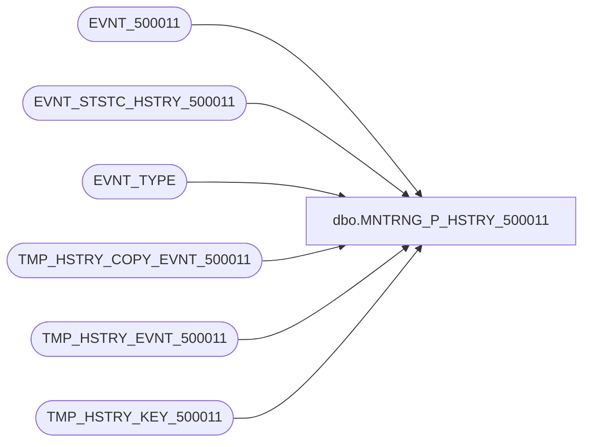

# dbo.MNTRNG_P_HSTRY_500011

**Database:** foundation_event  
**Server:** bedrockdb01  

## Architecture Diagram



## Table Dependencies

| Referenced Table |
|---|
| EVNT_500011 |
| EVNT_STSTC_HSTRY_500011 |
| EVNT_TYPE |
| TMP_HSTRY_COPY_EVNT_500011 |
| TMP_HSTRY_EVNT_500011 |
| TMP_HSTRY_KEY_500011 |

## Stored Procedure Code

```sql
CREATE PROCEDURE [dbo].[MNTRNG_P_HSTRY_500011] 

@BATCH_SIZE as int --Max number of records in a batch
AS

--Create temporary event table to keep a copy of the batch
IF EXISTS (SELECT * FROM sysobjects WHERE xtype = 'U' AND name = 'TMP_HSTRY_COPY_EVNT_500011')
   DROP TABLE dbo.TMP_HSTRY_COPY_EVNT_500011

CREATE TABLE dbo.TMP_HSTRY_COPY_EVNT_500011
(
   ID_CLMN integer NOT NULL,
   POST_YEAR smallint NOT NULL,
   POST_MNTH tinyint NOT NULL,
   POST_WEEK tinyint NOT NULL,
   POST_DAY tinyint NOT NULL,
   POST_DTM smalldatetime NOT NULL
      , FLD_1 smallint NULL 
   , FLD_2 smallint NULL 
   , FLD_64 smallint NULL 
   , FLD_63 smallint NULL 
   , FLD_61 int NULL 
   , FLD_62 nvarchar(80) NULL 
   , FLD_65 int NULL 
   , FLD_66 int NULL 
   , FLD_67 int NULL 
   , FLD_437 smallint NULL 
   , FLD_76 smallint NULL 
   , FLD_77 nvarchar(255) NULL 
   , FLD_68 nvarchar(255) NULL 
   , FLD_131 nvarchar(255) NULL 
   , FLD_69 nvarchar(255) NULL 
   , FLD_132 nvarchar(255) NULL 
   , FLD_73 datetime NULL 
   , FLD_74 datetime NULL 
   , FLD_75 datetime NULL 
   , FLD_438 bigint NULL 
   , FLD_70 datetime NULL 
   , FLD_71 datetime NULL 
   , FLD_72 datetime NULL 
   , FLD_78 nvarchar(80) NULL 
   , FLD_51 datetime NULL 
   , FLD_52 datetime NULL 

) ON [PRIMARY]

CREATE CLUSTERED INDEX TMP_HSTRY_COPY_EVNT_500011_1 ON dbo.TMP_HSTRY_COPY_EVNT_500011 (ID_CLMN) ON [PRIMARY]

--Create temporary event table
IF EXISTS (SELECT * FROM sysobjects WHERE xtype = 'U' AND name = 'TMP_HSTRY_EVNT_500011')
   DROP TABLE dbo.TMP_HSTRY_EVNT_500011

CREATE TABLE dbo.TMP_HSTRY_EVNT_500011
(
   ID_CLMN integer NOT NULL,
   POST_YEAR smallint NOT NULL,
   POST_MNTH tinyint NOT NULL,
   POST_WEEK tinyint NOT NULL,
   POST_DAY tinyint NOT NULL,
   POST_DTM smalldatetime NOT NULL
      , FLD_1 smallint NULL 
   , FLD_2 smallint NULL 
   , FLD_64 smallint NULL 
   , FLD_63 smallint NULL 
   , FLD_61 int NULL 
   , FLD_62 nvarchar(80) NULL 
   , FLD_65 int NULL 
   , FLD_66 int NULL 
   , FLD_67 int NULL 
   , FLD_437 smallint NULL 
   , FLD_76 smallint NULL 
   , FLD_77 nvarchar(255) NULL 
   , FLD_68 nvarchar(255) NULL 
   , FLD_131 nvarchar(255) NULL 
   , FLD_69 nvarchar(255) NULL 
   , FLD_132 nvarchar(255) NULL 
   , FLD_73 datetime NULL 
   , FLD_74 datetime NULL 
   , FLD_75 datetime NULL 
   , FLD_438 bigint NULL 
   , FLD_70 datetime NULL 
   , FLD_71 datetime NULL 
   , FLD_72 datetime NULL 
   , FLD_78 nvarchar(80) NULL 
   , FLD_51 datetime NULL 
   , FLD_52 datetime NULL 

) ON [PRIMARY]

--Indexes to speed up process
CREATE INDEX TMP_HSTRY_EVNT_500011_1 ON dbo.TMP_HSTRY_EVNT_500011 (POST_YEAR, POST_MNTH, POST_WEEK, POST_DAY , FLD_1 , FLD_2 , FLD_64 , FLD_63 , FLD_68 ) ON [PRIMARY] 
CREATE CLUSTERED INDEX TMP_HSTRY_EVNT_500011_2 ON dbo.TMP_HSTRY_EVNT_500011 (ID_CLMN) ON [PRIMARY]

--Create temporary event table for history ids
IF EXISTS (SELECT * FROM sysobjects WHERE xtype = 'U' AND name = 'TMP_HSTRY_KEY_500011')
   DROP TABLE dbo.TMP_HSTRY_KEY_500011

CREATE TABLE dbo.TMP_HSTRY_KEY_500011
(
   POST_YEAR smallint NOT NULL,
   POST_MNTH tinyint NOT NULL,
   POST_WEEK tinyint NOT NULL,
   POST_DAY tinyint NOT NULL,
   POST_DTM smalldatetime NOT NULL
     , KEY_1 smallint NULL 
   , KEY_2 smallint NULL 
   , KEY_64 smallint NULL 
   , KEY_63 smallint NULL 
   , KEY_68 nvarchar(255) NULL 

 , CNT integer NOT NULL
 , MIN_ID integer NOT NULL
 , MAX_ID integer NOT NULL
)

--Indexes to speed up process
CREATE INDEX TMP_HSTRY_KEY_500011_1 ON dbo.TMP_HSTRY_KEY_500011 (POST_YEAR, POST_MNTH, POST_WEEK, POST_DAY , KEY_1 , KEY_2 , KEY_64 , KEY_63 , KEY_68 ) ON [PRIMARY] 
CREATE CLUSTERED INDEX TMP_HSTRY_KEY_500011_2 ON dbo.TMP_HSTRY_KEY_500011 (MIN_ID, MAX_ID) ON [PRIMARY]

--Variables
DECLARE @MAX_EVNT_ID as int,        --Last event id processed during this cycle
        @STRT_EVNT_ID as int,       --First event of batch
        @END_EVNT_ID as int,        --Last event of batch
        @LAST_HSTRY_EVNT_ID as int, --Last event id processed in the previous cycle
        @EVNT_TYPE_ID as int,       --Constant for Event Type ID
        @ERROR as int,              --Error return code
        @ROWS as int,               --Total number of events processed
        @ROWCOUNT as int,           --Number of events processed in a batch
        @DAY_LVL as int,            --Day level
        @MNTH_LVL as int,           --Month level
        @WEEK_LVL as int,           --Week level
        @YEAR_LVL as int,           --Year level
        @STSTC_LVL as int           --Statistics level

SELECT @EVNT_TYPE_ID = 500011, @ERROR = 0 , @ROWS = 0, @END_EVNT_ID = 0

--Get last event id processed during this cycle
SELECT @MAX_EVNT_ID = MAX(ISNULL(EVNT_ID,0))
  FROM EVNT_500011

SELECT @DAY_LVL = NUM_STSTC_KEEP_DAY,
       @MNTH_LVL = NUM_STSTC_KEEP_MNTH,
       @WEEK_LVL = NUM_STSTC_KEEP_WEEK,
       @YEAR_LVL = NUM_STSTC_KEEP_YEAR,
       @STSTC_LVL = STSTC_LVL
  FROM EVNT_TYPE
 WHERE EVNT_TYPE_ID = @EVNT_TYPE_ID

IF (@@ERROR <> 0)
BEGIN
   SELECT @ERROR = -1
   RETURN @ERROR
END

--Loop to process all events by doing it in smaller batch
WHILE @END_EVNT_ID < @MAX_EVNT_ID
BEGIN

   --Get last event id processed in the previous cycle and the statistics levels
   SELECT @LAST_HSTRY_EVNT_ID = ISNULL(LAST_HSTRY_EVNT_ID,0)
     FROM EVNT_TYPE
    WHERE EVNT_TYPE_ID = @EVNT_TYPE_ID

   IF (@@ERROR <> 0)
   BEGIN
      SELECT @ERROR = -2
      BREAK
   END

   --Set the batch range
   SELECT @STRT_EVNT_ID = @LAST_HSTRY_EVNT_ID + 1, 
          @END_EVNT_ID = @LAST_HSTRY_EVNT_ID + @BATCH_SIZE

   --Make sure to stay within the range of events to process
   IF @END_EVNT_ID > @MAX_EVNT_ID
      SELECT @END_EVNT_ID = @MAX_EVNT_ID

   IF @STRT_EVNT_ID > @END_EVNT_ID
   BEGIN
      SELECT @ERROR = @ROWS 
      BREAK
   END

   BEGIN TRAN

   --Populate the temporary event table using only the new events
   INSERT INTO TMP_HSTRY_COPY_EVNT_500011 (ID_CLMN, POST_YEAR, POST_MNTH, POST_WEEK, POST_DAY, POST_DTM , FLD_1 , FLD_2 , FLD_64 , FLD_63 , FLD_61 , FLD_62 , FLD_65 , FLD_66 , FLD_67 , FLD_437 , FLD_76 , FLD_77 , FLD_68 , FLD_131 , FLD_69 , FLD_132 , FLD_73 , FLD_74 , FLD_75 , FLD_438 , FLD_70 , FLD_71 , FLD_72 , FLD_78 , FLD_51 , FLD_52 )
   SELECT EVNT_ID,
         DATEPART(yy,EVNT_POST_DTM),
         DATEPART(mm,EVNT_POST_DTM),
         DATEPART(ww,EVNT_POST_DTM),
         DATEPART(dd,EVNT_POST_DTM),   
         DATEADD(ms, -DATEPART(ms, EVNT_POST_DTM), DATEADD(ss, -DATEPART(ss, EVNT_POST_DTM), DATEADD(mi, -DATEPART(mi, EVNT_POST_DTM), DATEADD(hh, -DATEPART(hh, EVNT_POST_DTM), EVNT_POST_DTM)))) 
         , FLD_1 , FLD_2 , FLD_64 , FLD_63 , FLD_61 , FLD_62 , FLD_65 , FLD_66 , FLD_67 , FLD_437 , FLD_76 , FLD_77 , FLD_68 , FLD_131 , FLD_69 , FLD_132 , FLD_73 , FLD_74 , FLD_75 , FLD_438 , FLD_70 , FLD_71 , FLD_72 , FLD_78 , FLD_51 , FLD_52 
    FROM EVNT_500011
   WHERE EVNT_ID BETWEEN @STRT_EVNT_ID AND @END_EVNT_ID

   --Get the number of rows processed
   SELECT @ROWCOUNT = @@ROWCOUNT, @ERROR = @@ERROR

   IF (@ERROR <> 0)
   BEGIN
      ROLLBACK TRAN
      SELECT @ERROR = -3
      BREAK
   END

   --Add the processed rows
   SELECT @ROWS = @ROWS + @ROWCOUNT

   --Day bucket
   IF (@DAY_LVL > 0)
   BEGIN

      --Step 0-Populate the temporary event table from the copy
      INSERT INTO TMP_HSTRY_EVNT_500011 
      SELECT ID_CLMN,
             POST_YEAR,
             POST_MNTH,
             POST_WEEK,
             POST_DAY,
             POST_DTM 
             , FLD_1 , FLD_2 , FLD_64 , FLD_63 , FLD_61 , FLD_62 , FLD_65 , FLD_66 , FLD_67 , FLD_437 , FLD_76 , FLD_77 , FLD_68 , FLD_131 , FLD_69 , FLD_132 , FLD_73 , FLD_74 , FLD_75 , FLD_438 , FLD_70 , FLD_71 , FLD_72 , FLD_78 , FLD_51 , FLD_52 
        FROM TMP_HSTRY_COPY_EVNT_500011 

      IF (@@ERROR <> 0)
      BEGIN
         ROLLBACK TRAN
         SELECT @ERROR = -4
         BREAK
      END
      
      --Step 1-Insert computed values from the temp event table
      INSERT TMP_HSTRY_KEY_500011 (POST_YEAR, POST_MNTH, POST_WEEK, POST_DAY , KEY_1 , KEY_2 , KEY_64 , KEY_63 , KEY_68  , POST_DTM, CNT, MIN_ID, MAX_ID)
      SELECT MIN(POST_YEAR), MIN(POST_MNTH), 0, MIN(POST_DAY) , MIN(FLD_1) , MIN(FLD_2) , MIN(FLD_64) , MIN(FLD_63) , MIN(FLD_68) , '01/01/1900 12:01:00 AM', COUNT(*), MIN(ID_CLMN), MAX(ID_CLMN)
        FROM TMP_HSTRY_EVNT_500011
        GROUP BY  FLD_1 , FLD_2 , FLD_64 , FLD_63 , FLD_68 

      IF (@@ERROR <> 0)
      BEGIN
         ROLLBACK TRAN
         SELECT @ERROR = -5
         BREAK
      END

      --Step 2-Update actual statistics using the computed value temporary table
      UPDATE EVNT_STSTC_HSTRY_500011 SET 
             EVNT_STSTC_HSTRY_500011.CNT = s.CNT + te.CNT,
             EVNT_STSTC_HSTRY_500011.LAST_MDFD_DTM = getdate() 
             , EVNT_STSTC_HSTRY_500011.FLD_62_LAST = L.FLD_62 
 , EVNT_STSTC_HSTRY_500011.FLD_65_LAST = L.FLD_65 
 , EVNT_STSTC_HSTRY_500011.FLD_67_LAST = L.FLD_67 
 , EVNT_STSTC_HSTRY_500011.FLD_437_LAST = L.FLD_437 
 , EVNT_STSTC_HSTRY_500011.FLD_76_LAST = L.FLD_76 
 , EVNT_STSTC_HSTRY_500011.FLD_75_LAST = L.FLD_75 
 , EVNT_STSTC_HSTRY_500011.FLD_70_LAST = L.FLD_70 
 , EVNT_STSTC_HSTRY_500011.FLD_71_LAST = L.FLD_71 
 , EVNT_STSTC_HSTRY_500011.FLD_51_LAST = L.FLD_51 
 , EVNT_STSTC_HSTRY_500011.FLD_52_LAST = L.FLD_52 
 
        FROM TMP_HSTRY_KEY_500011 te, EVNT_STSTC_HSTRY_500011 s, TMP_HSTRY_EVNT_500011 F, TMP_HSTRY_EVNT_500011 L
       WHERE te.MIN_ID = F.ID_CLMN 
         AND te.MAX_ID = L.ID_CLMN
         AND s.POST_YEAR = te.POST_YEAR
         AND s.POST_MNTH = te.POST_MNTH
         AND s.POST_WEEK = 0
         AND s.POST_DAY  = te.POST_DAY 
              AND s.KEY_1 = te.KEY_1 
  AND s.KEY_2 = te.KEY_2 
  AND s.KEY_64 = te.KEY_64 
  AND s.KEY_63 = te.KEY_63 
  AND s.KEY_68 = te.KEY_68 
    

      IF (@@ERROR <> 0)
      BEGIN
         ROLLBACK TRAN
         SELECT @ERROR = -6
         BREAK
      END

      --Step 3-clean the computed value temp table
      TRUNCATE TABLE TMP_HSTRY_KEY_500011
      
      --Step 4-Delete temporary events already used to update statistics
      DELETE TMP_HSTRY_EVNT_500011
        FROM TMP_HSTRY_EVNT_500011 te, EVNT_STSTC_HSTRY_500011 s
       WHERE s.POST_YEAR = te.POST_YEAR
         AND s.POST_MNTH = te.POST_MNTH
         AND s.POST_WEEK = 0
         AND s.POST_DAY  = te.POST_DAY 
              AND s.KEY_1 = te.FLD_1 
  AND s.KEY_2 = te.FLD_2 
  AND s.KEY_64 = te.FLD_64 
  AND s.KEY_63 = te.FLD_63 
  AND s.KEY_68 = te.FLD_68 
    

      IF (@@ERROR <> 0)
      BEGIN
         ROLLBACK TRAN
         SELECT @ERROR = -7
         BREAK
      END

      --Step 5-Insert computed values from the temp event table
      INSERT TMP_HSTRY_KEY_500011 (POST_YEAR, POST_MNTH, POST_WEEK, POST_DAY , KEY_1 , KEY_2 , KEY_64 , KEY_63 , KEY_68  , POST_DTM, CNT, MIN_ID, MAX_ID)
      SELECT MIN(POST_YEAR), MIN(POST_MNTH), 0, MIN(POST_DAY) , MIN(FLD_1) , MIN(FLD_2) , MIN(FLD_64) , MIN(FLD_63) , MIN(FLD_68) , MIN(POST_DTM), COUNT(*), MIN(ID_CLMN), MAX(ID_CLMN)
        FROM TMP_HSTRY_EVNT_500011
        GROUP BY POST_YEAR, POST_MNTH, POST_WEEK, POST_DAY , FLD_1 , FLD_2 , FLD_64 , FLD_63 , FLD_68 

      IF (@@ERROR <> 0)
      BEGIN
         ROLLBACK TRAN
         SELECT @ERROR = -8
         BREAK
      END

      --Step 6-Insert new keys using the computed value temporary table
      INSERT EVNT_STSTC_HSTRY_500011 (POST_DTM, POST_YEAR, POST_MNTH, POST_WEEK, POST_DAY , KEY_1 , KEY_2 , KEY_64 , KEY_63 , KEY_68 , CNT , FLD_62_LAST 
 , FLD_65_LAST 
 , FLD_66_FRST , FLD_67_LAST 
 , FLD_437_LAST 
 , FLD_76_LAST 
 , FLD_73_FRST , FLD_75_LAST 
 , FLD_70_FRST , FLD_70_LAST 
 , FLD_71_FRST , FLD_71_LAST 
 , FLD_51_FRST , FLD_51_LAST 
 , FLD_52_FRST , FLD_52_LAST 
 )
      SELECT D.POST_DTM, D.POST_YEAR, D.POST_MNTH, 0, D.POST_DAY , D.KEY_1 , D.KEY_2 , D.KEY_64 , D.KEY_63 , D.KEY_68 , D.CNT , L.FLD_62 , L.FLD_65 , F.FLD_66 , L.FLD_67 , L.FLD_437 , L.FLD_76 , F.FLD_73 , L.FLD_75 , F.FLD_70 , L.FLD_70 , F.FLD_71 , L.FLD_71 , F.FLD_51 , L.FLD_51 , F.FLD_52 , L.FLD_52 
        FROM TMP_HSTRY_EVNT_500011 F, TMP_HSTRY_EVNT_500011 L, TMP_HSTRY_KEY_500011 D
       WHERE D.MIN_ID = F.ID_CLMN 
         AND D.MAX_ID = L.ID_CLMN

      IF (@@ERROR <> 0)
      BEGIN
         ROLLBACK TRAN
         SELECT @ERROR = -9
         BREAK
      END

      --Step 7-Clean temp tables
      TRUNCATE TABLE TMP_HSTRY_EVNT_500011
      TRUNCATE TABLE TMP_HSTRY_KEY_500011
   END

   --Week bucket
   IF (@WEEK_LVL > 0)
   BEGIN

      --Step 0-Populate the temporary event table from the copy
      INSERT INTO TMP_HSTRY_EVNT_500011 
      SELECT ID_CLMN,
             POST_YEAR,
             POST_MNTH,
             POST_WEEK,
             POST_DAY,
             POST_DTM 
             , FLD_1 , FLD_2 , FLD_64 , FLD_63 , FLD_61 , FLD_62 , FLD_65 , FLD_66 , FLD_67 , FLD_437 , FLD_76 , FLD_77 , FLD_68 , FLD_131 , FLD_69 , FLD_132 , FLD_73 , FLD_74 , FLD_75 , FLD_438 , FLD_70 , FLD_71 , FLD_72 , FLD_78 , FLD_51 , FLD_52  
        FROM TMP_HSTRY_COPY_EVNT_500011 

      IF (@@ERROR <> 0)
      BEGIN
         ROLLBACK TRAN
         SELECT @ERROR = -10
         BREAK
      END

      --Step 1-Insert computed values from the temp event table
      INSERT TMP_HSTRY_KEY_500011 (POST_YEAR, POST_MNTH, POST_WEEK, POST_DAY , KEY_1 , KEY_2 , KEY_64 , KEY_63 , KEY_68  , POST_DTM, CNT, MIN_ID, MAX_ID)
      SELECT MIN(POST_YEAR), 0, MIN(POST_WEEK), 0 , MIN(FLD_1) , MIN(FLD_2) , MIN(FLD_64) , MIN(FLD_63) , MIN(FLD_68) , '01/01/1900 12:01:00 AM', COUNT(*), MIN(ID_CLMN), MAX(ID_CLMN)
        FROM TMP_HSTRY_EVNT_500011
        GROUP BY  FLD_1 , FLD_2 , FLD_64 , FLD_63 , FLD_68 

      IF (@@ERROR <> 0)
      BEGIN
         ROLLBACK TRAN
         SELECT @ERROR = -11
         BREAK
      END

      --Step 2-Update actual statistics using the computed value temporary table
      UPDATE EVNT_STSTC_HSTRY_500011 SET 
             EVNT_STSTC_HSTRY_500011.CNT = s.CNT + te.CNT,
             EVNT_STSTC_HSTRY_500011.LAST_MDFD_DTM = getdate()
             , EVNT_STSTC_HSTRY_500011.FLD_62_LAST = L.FLD_62 
 , EVNT_STSTC_HSTRY_500011.FLD_65_LAST = L.FLD_65 
 , EVNT_STSTC_HSTRY_500011.FLD_67_LAST = L.FLD_67 
 , EVNT_STSTC_HSTRY_500011.FLD_437_LAST = L.FLD_437 
 , EVNT_STSTC_HSTRY_500011.FLD_76_LAST = L.FLD_76 
 , EVNT_STSTC_HSTRY_500011.FLD_75_LAST = L.FLD_75 
 , EVNT_STSTC_HSTRY_500011.FLD_70_LAST = L.FLD_70 
 , EVNT_STSTC_HSTRY_500011.FLD_71_LAST = L.FLD_71 
 , EVNT_STSTC_HSTRY_500011.FLD_51_LAST = L.FLD_51 
 , EVNT_STSTC_HSTRY_500011.FLD_52_LAST = L.FLD_52 
 
        FROM TMP_HSTRY_KEY_500011 te, EVNT_STSTC_HSTRY_500011 s, TMP_HSTRY_EVNT_500011 F, TMP_HSTRY_EVNT_500011 L
       WHERE te.MIN_ID = F.ID_CLMN 
         AND te.MAX_ID = L.ID_CLMN
         AND s.POST_YEAR = te.POST_YEAR
         AND s.POST_MNTH = 0
         AND s.POST_WEEK = te.POST_WEEK
         AND s.POST_DAY  = 0 
              AND s.KEY_1 = te.KEY_1 
  AND s.KEY_2 = te.KEY_2 
  AND s.KEY_64 = te.KEY_64 
  AND s.KEY_63 = te.KEY_63 
  AND s.KEY_68 = te.KEY_68 
    

      IF (@@ERROR <> 0)
      BEGIN
         ROLLBACK TRAN
         SELECT @ERROR = -12
         BREAK
      END

      --Step 3-clean the computed value temp table
      TRUNCATE TABLE TMP_HSTRY_KEY_500011
      
      --Step 4-Delete temporary events already used to update statistics
      DELETE TMP_HSTRY_EVNT_500011
        FROM TMP_HSTRY_EVNT_500011 te, EVNT_STSTC_HSTRY_500011 s
       WHERE s.POST_YEAR = te.POST_YEAR
         AND s.POST_MNTH = 0
         AND s.POST_WEEK = te.POST_WEEK
         AND s.POST_DAY  = 0 
              AND s.KEY_1 = te.FLD_1 
  AND s.KEY_2 = te.FLD_2 
  AND s.KEY_64 = te.FLD_64 
  AND s.KEY_63 = te.FLD_63 
  AND s.KEY_68 = te.FLD_68 
    

      IF (@@ERROR <> 0)
      BEGIN
         ROLLBACK TRAN
         SELECT @ERROR = -13
         BREAK
      END

      --Step 5-Insert computed values from the temp event table
      INSERT TMP_HSTRY_KEY_500011 (POST_YEAR, POST_MNTH, POST_WEEK, POST_DAY , KEY_1 , KEY_2 , KEY_64 , KEY_63 , KEY_68  , POST_DTM, CNT, MIN_ID, MAX_ID)
      SELECT MIN(POST_YEAR), 0, MIN(POST_WEEK), 0 , MIN(FLD_1) , MIN(FLD_2) , MIN(FLD_64) , MIN(FLD_63) , MIN(FLD_68) , MIN(DATEADD(dd, DATEPART(dy, POST_DTM) - DATEPART(dw, POST_DTM), DATEADD(mm, -DATEPART(mm, POST_DTM) + 1, DATEADD(dd, -DATEPART(dd, POST_DTM) + 1, POST_DTM)))), COUNT(*), MIN(ID_CLMN), MAX(ID_CLMN)
        FROM TMP_HSTRY_EVNT_500011
        GROUP BY POST_YEAR, POST_WEEK , FLD_1 , FLD_2 , FLD_64 , FLD_63 , FLD_68 

      IF (@@ERROR <> 0)
      BEGIN
         ROLLBACK TRAN
         SELECT @ERROR = -14
         BREAK
      END

      --Step 6-Insert new keys using the computed value temporary table
      INSERT EVNT_STSTC_HSTRY_500011 (POST_DTM, POST_YEAR, POST_MNTH, POST_WEEK, POST_DAY , KEY_1 , KEY_2 , KEY_64 , KEY_63 , KEY_68 , CNT , FLD_62_LAST 
 , FLD_65_LAST 
 , FLD_66_FRST , FLD_67_LAST 
 , FLD_437_LAST 
 , FLD_76_LAST 
 , FLD_73_FRST , FLD_75_LAST 
 , FLD_70_FRST , FLD_70_LAST 
 , FLD_71_FRST , FLD_71_LAST 
 , FLD_51_FRST , FLD_51_LAST 
 , FLD_52_FRST , FLD_52_LAST 
 )
      SELECT D.POST_DTM, D.POST_YEAR, 0, D.POST_WEEK, 0 , D.KEY_1 , D.KEY_2 , D.KEY_64 , D.KEY_63 , D.KEY_68 , D.CNT , L.FLD_62 , L.FLD_65 , F.FLD_66 , L.FLD_67 , L.FLD_437 , L.FLD_76 , F.FLD_73 , L.FLD_75 , F.FLD_70 , L.FLD_70 , F.FLD_71 , L.FLD_71 , F.FLD_51 , L.FLD_51 , F.FLD_52 , L.FLD_52 
        FROM TMP_HSTRY_EVNT_500011 F, TMP_HSTRY_EVNT_500011 L, TMP_HSTRY_KEY_500011 D
       WHERE D.MIN_ID = F.ID_CLMN 
         AND D.MAX_ID = L.ID_CLMN

      IF (@@ERROR <> 0)
      BEGIN
         ROLLBACK TRAN
         SELECT @ERROR = -15
         BREAK
      END

      --Step 7-Clean temp tables
      TRUNCATE TABLE TMP_HSTRY_EVNT_500011
      TRUNCATE TABLE TMP_HSTRY_KEY_500011
   END

   --Month bucket
   IF (@MNTH_LVL > 0)
   BEGIN

      --Step 0-Populate the temporary event table from the copy
      INSERT INTO TMP_HSTRY_EVNT_500011 
      SELECT ID_CLMN,
             POST_YEAR,
             POST_MNTH,
             POST_WEEK,
             POST_DAY,
             POST_DTM
             , FLD_1 , FLD_2 , FLD_64 , FLD_63 , FLD_61 , FLD_62 , FLD_65 , FLD_66 , FLD_67 , FLD_437 , FLD_76 , FLD_77 , FLD_68 , FLD_131 , FLD_69 , FLD_132 , FLD_73 , FLD_74 , FLD_75 , FLD_438 , FLD_70 , FLD_71 , FLD_72 , FLD_78 , FLD_51 , FLD_52  
        FROM TMP_HSTRY_COPY_EVNT_500011 

      IF (@@ERROR <> 0)
      BEGIN
         ROLLBACK TRAN
         SELECT @ERROR = -16
         BREAK
      END

      --Step 1-Insert computed values from the temp event table
      INSERT TMP_HSTRY_KEY_500011 (POST_YEAR, POST_MNTH, POST_WEEK, POST_DAY , KEY_1 , KEY_2 , KEY_64 , KEY_63 , KEY_68  , POST_DTM, CNT, MIN_ID, MAX_ID)
      SELECT MIN(POST_YEAR), MIN(POST_MNTH), 0, 0 , MIN(FLD_1) , MIN(FLD_2) , MIN(FLD_64) , MIN(FLD_63) , MIN(FLD_68) , '01/01/1900 12:01:00 AM', COUNT(*), MIN(ID_CLMN), MAX(ID_CLMN)
        FROM TMP_HSTRY_EVNT_500011
        GROUP BY  FLD_1 , FLD_2 , FLD_64 , FLD_63 , FLD_68 

      IF (@@ERROR <> 0)
      BEGIN
         ROLLBACK TRAN
         SELECT @ERROR = -17
         BREAK
      END

      --Step 2-Update actual statistics using the computed value temporary table
      UPDATE EVNT_STSTC_HSTRY_500011 SET 
             EVNT_STSTC_HSTRY_500011.CNT = s.CNT + te.CNT,
             EVNT_STSTC_HSTRY_500011.LAST_MDFD_DTM = getdate()
             , EVNT_STSTC_HSTRY_500011.FLD_62_LAST = L.FLD_62 
 , EVNT_STSTC_HSTRY_500011.FLD_65_LAST = L.FLD_65 
 , EVNT_STSTC_HSTRY_500011.FLD_67_LAST = L.FLD_67 
 , EVNT_STSTC_HSTRY_500011.FLD_437_LAST = L.FLD_437 
 , EVNT_STSTC_HSTRY_500011.FLD_76_LAST = L.FLD_76 
 , EVNT_STSTC_HSTRY_500011.FLD_75_LAST = L.FLD_75 
 , EVNT_STSTC_HSTRY_500011.FLD_70_LAST = L.FLD_70 
 , EVNT_STSTC_HSTRY_500011.FLD_71_LAST = L.FLD_71 
 , EVNT_STSTC_HSTRY_500011.FLD_51_LAST = L.FLD_51 
 , EVNT_STSTC_HSTRY_500011.FLD_52_LAST = L.FLD_52 
 
        FROM TMP_HSTRY_KEY_500011 te, EVNT_STSTC_HSTRY_500011 s, TMP_HSTRY_EVNT_500011 F, TMP_HSTRY_EVNT_500011 L
       WHERE te.MIN_ID = F.ID_CLMN 
         AND te.MAX_ID = L.ID_CLMN
         AND s.POST_YEAR = te.POST_YEAR
         AND s.POST_MNTH = te.POST_MNTH
         AND s.POST_WEEK = 0
         AND s.POST_DAY  = 0 
              AND s.KEY_1 = te.KEY_1 
  AND s.KEY_2 = te.KEY_2 
  AND s.KEY_64 = te.KEY_64 
  AND s.KEY_63 = te.KEY_63 
  AND s.KEY_68 = te.KEY_68 
    

      IF (@@ERROR <> 0)
      BEGIN
         ROLLBACK TRAN
         SELECT @ERROR = -18
         BREAK
      END

      --Step 3-clean the computed value temp table
      TRUNCATE TABLE TMP_HSTRY_KEY_500011
      
      --Step 4-Delete temporary events already used to update statistics
      DELETE TMP_HSTRY_EVNT_500011
        FROM TMP_HSTRY_EVNT_500011 te, EVNT_STSTC_HSTRY_500011 s
       WHERE s.POST_YEAR = te.POST_YEAR
         AND s.POST_MNTH = te.POST_MNTH
         AND s.POST_WEEK = 0
         AND s.POST_DAY  = 0
              AND s.KEY_1 = te.FLD_1 
  AND s.KEY_2 = te.FLD_2 
  AND s.KEY_64 = te.FLD_64 
  AND s.KEY_63 = te.FLD_63 
  AND s.KEY_68 = te.FLD_68 
    

      IF (@@ERROR <> 0)
      BEGIN
         ROLLBACK TRAN
         SELECT @ERROR = -19
         BREAK
      END

      --Step 5-Insert computed values from the temp event table
      INSERT TMP_HSTRY_KEY_500011 (POST_YEAR, POST_MNTH, POST_WEEK, POST_DAY , KEY_1 , KEY_2 , KEY_64 , KEY_63 , KEY_68  , POST_DTM, CNT, MIN_ID, MAX_ID)
      SELECT MIN(POST_YEAR), MIN(POST_MNTH), 0, 0 , MIN(FLD_1) , MIN(FLD_2) , MIN(FLD_64) , MIN(FLD_63) , MIN(FLD_68) , MIN(DATEADD(dd, -DATEPART(dd, POST_DTM)+1, POST_DTM)), COUNT(*), MIN(ID_CLMN), MAX(ID_CLMN)
        FROM TMP_HSTRY_EVNT_500011
        GROUP BY POST_YEAR, POST_MNTH , FLD_1 , FLD_2 , FLD_64 , FLD_63 , FLD_68 

      IF (@@ERROR <> 0)
      BEGIN
         ROLLBACK TRAN
         SELECT @ERROR = -20
         BREAK
      END

      --Step 6-Insert new keys using the computed value temporary table
      INSERT EVNT_STSTC_HSTRY_500011 (POST_DTM, POST_YEAR, POST_MNTH, POST_WEEK, POST_DAY , KEY_1 , KEY_2 , KEY_64 , KEY_63 , KEY_68 , CNT , FLD_62_LAST 
 , FLD_65_LAST 
 , FLD_66_FRST , FLD_67_LAST 
 , FLD_437_LAST 
 , FLD_76_LAST 
 , FLD_73_FRST , FLD_75_LAST 
 , FLD_70_FRST , FLD_70_LAST 
 , FLD_71_FRST , FLD_71_LAST 
 , FLD_51_FRST , FLD_51_LAST 
 , FLD_52_FRST , FLD_52_LAST 
 )
      SELECT D.POST_DTM, D.POST_YEAR, D.POST_MNTH, 0, 0 , D.KEY_1 , D.KEY_2 , D.KEY_64 , D.KEY_63 , D.KEY_68 , D.CNT , L.FLD_62 , L.FLD_65 , F.FLD_66 , L.FLD_67 , L.FLD_437 , L.FLD_76 , F.FLD_73 , L.FLD_75 , F.FLD_70 , L.FLD_70 , F.FLD_71 , L.FLD_71 , F.FLD_51 , L.FLD_51 , F.FLD_52 , L.FLD_52 
        FROM TMP_HSTRY_EVNT_500011 F, TMP_HSTRY_EVNT_500011 L, TMP_HSTRY_KEY_500011 D
       WHERE D.MIN_ID = F.ID_CLMN 
         AND D.MAX_ID = L.ID_CLMN

      IF (@@ERROR <> 0)
      BEGIN
         ROLLBACK TRAN
         SELECT @ERROR = -21
         BREAK
      END
      
      --Step 7-Clean temp tables
      TRUNCATE TABLE TMP_HSTRY_EVNT_500011
      TRUNCATE TABLE TMP_HSTRY_KEY_500011
   END

   --Year bucket
   IF (@YEAR_LVL > 0)
   BEGIN

      --Step 0-Populate the temporary event table from the copy
      INSERT INTO TMP_HSTRY_EVNT_500011 
      SELECT ID_CLMN,
             POST_YEAR,
             POST_MNTH,
             POST_WEEK,
             POST_DAY,
             POST_DTM
             , FLD_1 , FLD_2 , FLD_64 , FLD_63 , FLD_61 , FLD_62 , FLD_65 , FLD_66 , FLD_67 , FLD_437 , FLD_76 , FLD_77 , FLD_68 , FLD_131 , FLD_69 , FLD_132 , FLD_73 , FLD_74 , FLD_75 , FLD_438 , FLD_70 , FLD_71 , FLD_72 , FLD_78 , FLD_51 , FLD_52 
        FROM TMP_HSTRY_COPY_EVNT_500011 

      IF (@@ERROR <> 0)
      BEGIN
         ROLLBACK TRAN
         SELECT @ERROR = -22
         BREAK
      END

      --Step 1-Insert computed values from the temp event table
      INSERT TMP_HSTRY_KEY_500011 (POST_YEAR, POST_MNTH, POST_WEEK, POST_DAY , KEY_1 , KEY_2 , KEY_64 , KEY_63 , KEY_68  , POST_DTM, CNT, MIN_ID, MAX_ID)
      SELECT MIN(POST_YEAR), 0, 0, 0 , MIN(FLD_1) , MIN(FLD_2) , MIN(FLD_64) , MIN(FLD_63) , MIN(FLD_68) , '01/01/1900 12:01:00 AM', COUNT(*), MIN(ID_CLMN), MAX(ID_CLMN)
        FROM TMP_HSTRY_EVNT_500011
        GROUP BY  FLD_1 , FLD_2 , FLD_64 , FLD_63 , FLD_68 

      IF (@@ERROR <> 0)
      BEGIN
         ROLLBACK TRAN
         SELECT @ERROR = -23
         BREAK
      END

      --Step 2-Update actual statistics using the computed value temporary table
      UPDATE EVNT_STSTC_HSTRY_500011 SET 
             EVNT_STSTC_HSTRY_500011.CNT = s.CNT + te.CNT,
             EVNT_STSTC_HSTRY_500011.LAST_MDFD_DTM = getdate()
             , EVNT_STSTC_HSTRY_500011.FLD_62_LAST = L.FLD_62 
 , EVNT_STSTC_HSTRY_500011.FLD_65_LAST = L.FLD_65 
 , EVNT_STSTC_HSTRY_500011.FLD_67_LAST = L.FLD_67 
 , EVNT_STSTC_HSTRY_500011.FLD_437_LAST = L.FLD_437 
 , EVNT_STSTC_HSTRY_500011.FLD_76_LAST = L.FLD_76 
 , EVNT_STSTC_HSTRY_500011.FLD_75_LAST = L.FLD_75 
 , EVNT_STSTC_HSTRY_500011.FLD_70_LAST = L.FLD_70 
 , EVNT_STSTC_HSTRY_500011.FLD_71_LAST = L.FLD_71 
 , EVNT_STSTC_HSTRY_500011.FLD_51_LAST = L.FLD_51 
 , EVNT_STSTC_HSTRY_500011.FLD_52_LAST = L.FLD_52 
 
        FROM TMP_HSTRY_KEY_500011 te, EVNT_STSTC_HSTRY_500011 s, TMP_HSTRY_EVNT_500011 F, TMP_HSTRY_EVNT_500011 L
       WHERE te.MIN_ID = F.ID_CLMN 
         AND te.MAX_ID = L.ID_CLMN
         AND s.POST_YEAR = te.POST_YEAR
         AND s.POST_MNTH = 0
         AND s.POST_WEEK = 0
         AND s.POST_DAY  = 0 
              AND s.KEY_1 = te.KEY_1 
  AND s.KEY_2 = te.KEY_2 
  AND s.KEY_64 = te.KEY_64 
  AND s.KEY_63 = te.KEY_63 
  AND s.KEY_68 = te.KEY_68 
    

      IF (@@ERROR <> 0)
      BEGIN
         ROLLBACK TRAN
         SELECT @ERROR = -24
         BREAK
      END

      --Step 3-clean the computed value temp table
      TRUNCATE TABLE TMP_HSTRY_KEY_500011
      
      --Step 4-Delete temporary events already used to update statistics
      DELETE TMP_HSTRY_EVNT_500011
        FROM TMP_HSTRY_EVNT_500011 te, EVNT_STSTC_HSTRY_500011 s
       WHERE s.POST_YEAR = te.POST_YEAR
         AND s.POST_MNTH = 0
         AND s.POST_WEEK = 0
         AND s.POST_DAY  = 0 
          AND s.KEY_1 = te.FLD_1 
  AND s.KEY_2 = te.FLD_2 
  AND s.KEY_64 = te.FLD_64 
  AND s.KEY_63 = te.FLD_63 
  AND s.KEY_68 = te.FLD_68 
    

      IF (@@ERROR <> 0)
      BEGIN
         ROLLBACK TRAN
         SELECT @ERROR = -25
         BREAK
      END

      --Step 5-Insert computed values from the temp event table
      INSERT TMP_HSTRY_KEY_500011 (POST_YEAR, POST_MNTH, POST_WEEK, POST_DAY , KEY_1 , KEY_2 , KEY_64 , KEY_63 , KEY_68  , POST_DTM, CNT, MIN_ID, MAX_ID)
      SELECT MIN(POST_YEAR), 0, 0, 0 , MIN(FLD_1) , MIN(FLD_2) , MIN(FLD_64) , MIN(FLD_63) , MIN(FLD_68) , MIN(DATEADD(mm, -DATEPART(mm, POST_DTM)+1, DATEADD(dd, -DATEPART(dd, POST_DTM)+1, POST_DTM))), COUNT(*), MIN(ID_CLMN), MAX(ID_CLMN)
        FROM TMP_HSTRY_EVNT_500011
        GROUP BY POST_YEAR , FLD_1 , FLD_2 , FLD_64 , FLD_63 , FLD_68 

      IF (@@ERROR <> 0)
      BEGIN
         ROLLBACK TRAN
         SELECT @ERROR = -26
         BREAK
      END

      --Step 6-Insert new keys using the computed value temporary table
      INSERT EVNT_STSTC_HSTRY_500011 (POST_DTM, POST_YEAR, POST_MNTH, POST_WEEK, POST_DAY , KEY_1 , KEY_2 , KEY_64 , KEY_63 , KEY_68 , CNT , FLD_62_LAST 
 , FLD_65_LAST 
 , FLD_66_FRST , FLD_67_LAST 
 , FLD_437_LAST 
 , FLD_76_LAST 
 , FLD_73_FRST , FLD_75_LAST 
 , FLD_70_FRST , FLD_70_LAST 
 , FLD_71_FRST , FLD_71_LAST 
 , FLD_51_FRST , FLD_51_LAST 
 , FLD_52_FRST , FLD_52_LAST 
 )
      SELECT D.POST_DTM, D.POST_YEAR, 0, 0, 0 , D.KEY_1 , D.KEY_2 , D.KEY_64 , D.KEY_63 , D.KEY_68 , D.CNT , L.FLD_62 , L.FLD_65 , F.FLD_66 , L.FLD_67 , L.FLD_437 , L.FLD_76 , F.FLD_73 , L.FLD_75 , F.FLD_70 , L.FLD_70 , F.FLD_71 , L.FLD_71 , F.FLD_51 , L.FLD_51 , F.FLD_52 , L.FLD_52 
        FROM TMP_HSTRY_EVNT_500011 F, TMP_HSTRY_EVNT_500011 L, TMP_HSTRY_KEY_500011 D
       WHERE D.MIN_ID = F.ID_CLMN 
         AND D.MAX_ID = L.ID_CLMN

      IF (@@ERROR <> 0)
      BEGIN
         ROLLBACK TRAN
         SELECT @ERROR = -27
         BREAK
      END

      --Step 7-Clean temp tables
      TRUNCATE TABLE TMP_HSTRY_EVNT_500011
      TRUNCATE TABLE TMP_HSTRY_KEY_500011
   END

   TRUNCATE TABLE TMP_HSTRY_COPY_EVNT_500011

   --Update the last event id processed
   UPDATE EVNT_TYPE
      SET LAST_HSTRY_EVNT_ID = @END_EVNT_ID
    WHERE EVNT_TYPE_ID = @EVNT_TYPE_ID 
   
   IF (@@ERROR <> 0)
   BEGIN
      ROLLBACK TRAN
      SELECT @ERROR = -28
      BREAK
   END

   COMMIT TRAN

END --WHILE

DROP TABLE TMP_HSTRY_COPY_EVNT_500011
DROP TABLE TMP_HSTRY_EVNT_500011
DROP TABLE TMP_HSTRY_KEY_500011

IF @ERROR <> 0
   RETURN @ERROR
ELSE
   RETURN @ROWS
```

