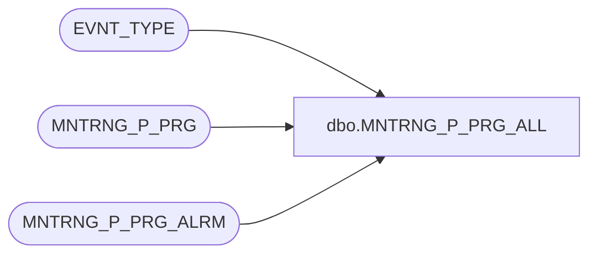

# dbo.MNTRNG_P_PRG_ALL

**Database:** foundation_event  
**Server:** bedrockdb01  

## Architecture Diagram



## Table Dependencies

| Referenced Table |
|---|
| EVNT_TYPE |
| MNTRNG_P_PRG |
| MNTRNG_P_PRG_ALRM |

## Stored Procedure Code

```sql
/**************************************************************** 
 Name           : MNTRNG_P_PRG_ALL 
 Purpose        : Purge the event, the statistic and the history tables all at once              
 Parameters     : @BATCH_SIZE: number of record purged at a time
                  @EVNT_TYPE_ID: Event Type ID 
 Returns        : Nothing
 Created by     : Philippe Lanthier 
 Creation Date  : Jan-13-2005
****************************************************************/ 
CREATE PROCEDURE [dbo].[MNTRNG_P_PRG_ALL]
@BATCH_SIZE int,
@EVNT_TYPE_ID int

AS

DECLARE @NUM_STSTC_KEEP_YEAR int
DECLARE @NUM_STSTC_KEEP_MNTH int
DECLARE @NUM_STSTC_KEEP_WEEK int
DECLARE @NUM_STSTC_KEEP_DAY int
DECLARE @NUM_STSTC_KEEP_HOUR int
DECLARE @CONT_INCTVTY_DLY int
DECLARE @NUM_DAYS_KEEP_EVNT int

SELECT @NUM_STSTC_KEEP_YEAR = ISNULL(NUM_STSTC_KEEP_YEAR, 0), @NUM_STSTC_KEEP_MNTH = ISNULL(NUM_STSTC_KEEP_MNTH, 0), 
       @NUM_STSTC_KEEP_WEEK = ISNULL(NUM_STSTC_KEEP_WEEK, 0), @NUM_STSTC_KEEP_DAY = ISNULL(NUM_STSTC_KEEP_DAY, 0), 
       @NUM_STSTC_KEEP_HOUR = ISNULL(NUM_STSTC_KEEP_HOUR, 0), @CONT_INCTVTY_DLY = ISNULL(CONT_INCTVTY_DLY, 0),
       @NUM_DAYS_KEEP_EVNT = ISNULL(NUM_DAYS_KEEP_EVNT, 0)
FROM EVNT_TYPE
WHERE EVNT_TYPE_ID = @EVNT_TYPE_ID

--Purge alarms
EXECUTE MNTRNG_P_PRG_ALRM @BATCH_SIZE

--Level: 0-Event, 1-Continuous, 2-Hour, 3-Day, 4-Week, 5-Month, 6-Year

IF @NUM_DAYS_KEEP_EVNT > 0 and @NUM_DAYS_KEEP_EVNT IS NOT NULL
   EXECUTE MNTRNG_P_PRG @BATCH_SIZE, @EVNT_TYPE_ID, 0, @NUM_DAYS_KEEP_EVNT

IF @CONT_INCTVTY_DLY > 0 and @CONT_INCTVTY_DLY IS NOT NULL
   EXECUTE MNTRNG_P_PRG @BATCH_SIZE, @EVNT_TYPE_ID, 1, @CONT_INCTVTY_DLY

IF @NUM_STSTC_KEEP_HOUR > 0 and @NUM_STSTC_KEEP_HOUR IS NOT NULL
   EXECUTE MNTRNG_P_PRG @BATCH_SIZE, @EVNT_TYPE_ID, 2, @NUM_STSTC_KEEP_HOUR

IF @NUM_STSTC_KEEP_DAY > 0 and @NUM_STSTC_KEEP_DAY IS NOT NULL
   EXECUTE MNTRNG_P_PRG @BATCH_SIZE, @EVNT_TYPE_ID, 3, @NUM_STSTC_KEEP_DAY

IF @NUM_STSTC_KEEP_WEEK > 0 and @NUM_STSTC_KEEP_WEEK IS NOT NULL
   EXECUTE MNTRNG_P_PRG @BATCH_SIZE, @EVNT_TYPE_ID, 4, @NUM_STSTC_KEEP_WEEK

IF @NUM_STSTC_KEEP_MNTH > 0 and @NUM_STSTC_KEEP_MNTH IS NOT NULL
   EXECUTE MNTRNG_P_PRG @BATCH_SIZE, @EVNT_TYPE_ID, 5, @NUM_STSTC_KEEP_MNTH

IF @NUM_STSTC_KEEP_YEAR > 0 and @NUM_STSTC_KEEP_YEAR IS NOT NULL
   EXECUTE MNTRNG_P_PRG @BATCH_SIZE, @EVNT_TYPE_ID, 6, @NUM_STSTC_KEEP_YEAR
```

